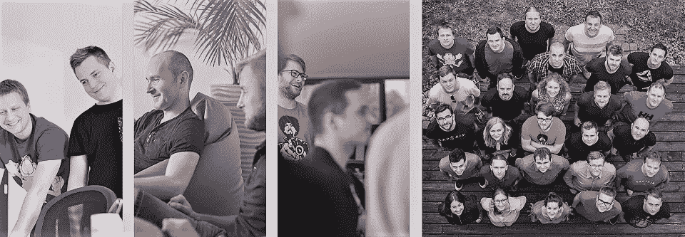

# 与 7 星级产品开发团队一起工作会是什么样子？

> 原文：<https://medium.com/swlh/what-it-would-be-like-to-work-with-a-7-star-product-development-team-af8d9f49a802>

Pragmatic Coders

受雷德·霍夫曼对 Airbnb 首席执行官布莱恩·切斯基的著名采访的启发，他描述了一个 11 星级的设计流程，这导致了对平台背后真正用户体验的发现，我们决定做同样的事情——但在一个完全不同的领域。

在我们的例子中，我们问了这个问题

**“和一个 7 星级的产品开发团队一起工作会是什么样子？”**

更有趣的是:

*   我们将从企业家、创业公司创始人、业务发展经理的角度来回答这个问题
*   牢记企业的最终目标是通过为客户创造附加值来赚钱
*   请记住，业务需求会随着时间的推移而变化(一开始是关于上市时间，一旦上市，就是关于假设验证，最后是关于扩展)

为了让你对这篇文章背后的思维过程有所了解，请听完整集的[音阶大师](https://mastersofscale.com/brian-chesky-handcrafted/)，或者直接跳到 10:35 秒，花几分钟时间来听。由你决定。

那么，和…一起工作会是什么样子呢

## **一星产品开发团队**——很明显从一开始你就失去了所有的钱

*   他们不了解你的领域，也不愿意学习
*   他们不具备交付工作软件的能力
*   他们不善于交流
*   他们不认为这种情况是个问题，也不会采取行动去改善它

**二星级产品开发团队——这将是一段艰难的旅程，但你成功的可能性很小**

*   他们不了解业务和它的目标
*   他们使用新技术只是为了学习它，而不是解决问题
*   他们无法达成一致意见
*   他们避免面对面的会议，而喜欢闲散的电子邮件
*   他们视你为不可避免的邪恶
*   他们对建议和忠告没有反应
*   事情通常都过期了
*   技术解决方案是幼稚的，难以维护，过度工程化是常见的事情

*在实践中，如果你偶然发现 1-2 星级团队，你真的很不走运，因为他们很快就要倒闭了，不幸的是，你也可能和他们一起倒下。*

**三星级产品开发团队——没有什么本质上的好与坏，又是一个表现不错的团队**

*   他们知道产品的用户是谁，他们为什么使用它，但他们从未见过他们
*   他们需要企业的关注来实现正确的目标
*   他们能够提供有意义的估计
*   他们按时交付高质量的软件
*   他们在合理的时间内达成共识，但并不总是如此
*   他们建议更容易/更简单的解决方案，但这不是他们通常所期望的
*   他们反思错误并实施改进，有时会成功

**四星级产品开发团队——终于有一个人经常超出预期，总是愿意推荐他们**

*   他们理解并教导他人什么是商业价值
*   他们了解产品的哪些部分是关键的，并相应地平衡技术解决方案
*   他们快速、早期和增量地交付商业价值
*   他们经常为特定的问题和功能提出更简单的解决方案
*   他们可以很快适应不断变化的业务目标，这是自然而然的事
*   他们渴望见到并了解用户
*   他们能够提前发现团队中缺失的能力，发出需求信号，并帮助填补缺口
*   他们使用商业语言与利益相关者交流
*   他们很快达成共识(最多几个小时)

*三星级产品开发团队是一个团队的典型代表，有能力交付产品，但不能取悦他人。四星级团队是多年来有意识地投资软硬技能的结果，但如果你环顾四周，你会发现它。*

**五星级产品开发团队——如果你曾经和这个团队一起工作过，我敢肯定这是一个巨大的成功，发展这种方法需要时间，但这是值得的**

*   他们总是寻找更好、更快、更简单、更便宜的解决方案
*   他们不断主动地提出变革建议，以最大限度地提高投资回报率
*   他们与用户交谈，衡量事物，并根据数据而不是猜测做出决策
*   他们了解产品如何赚钱，并优化它
*   他们确实是跨职能的

**6 星级产品开发团队——现在变得有趣了，团队中的每个成员都是独立的小 CEO，超越了他们的舒适区**

*   他们在那里，所以业务人员不需要在短期内考虑产品开发
*   他们定义适当的目标，并靠自己实现目标
*   他们能够扩大规模，自己掌握新的能力
*   他们积极参与销售、营销和其他“商业”活动

**7 星级产品开发团队——这是它的终点，好得不能再好了，最有可能的是，这个团队在这个阶段应该被认为是一家初创公司**

*   他们能够为产品创造愿景和战略，并执行它
*   如果需要，他们可以将产品推广到另一个国家

五星、六星、七星团队听起来可能有点不现实，但它们确实存在。想想那些取得非凡成就的小初创公司——看看 insta gram——13 名员工，两名联合创始人，以 10 亿美元的价格出售。

*现在问问自己——“****你现在是什么水平？”*** *。我们每天都在做* [*实用主义编码员*](https://pragmaticcoders.com) *。*

## 这篇文章发表在 [The Startup](https://medium.com/swlh) 上，这是 Medium 最大的创业刊物，拥有+444，678 名读者。

## 订阅接收[我们的头条](https://growthsupply.com/the-startup-newsletter/)。

