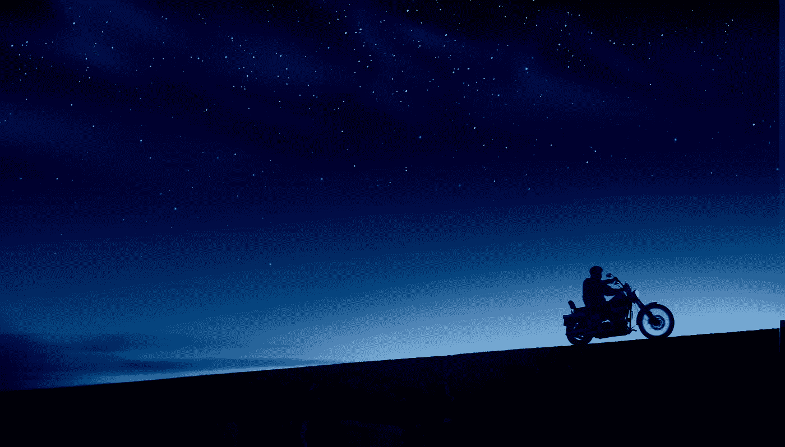

# 穷游是什么感觉…流浪世界丑陋的一面

> 原文：<https://medium.com/swlh/what-its-like-to-travel-poor-the-ugly-side-of-wandering-the-world-22d978b48b28>

Photo by [Harley-Davidson](https://unsplash.com/@harleydavidson?utm_source=unsplash&utm_medium=referral&utm_content=creditCopyText) on [Unsplash](https://unsplash.com/search/photos/travel?utm_source=unsplash&utm_medium=referral&utm_content=creditCopyText)

社交媒体有一个可怕的习惯，那就是展示事物的本来面目。找到任何一个正在环游世界的年轻人，在社交媒体上寻找他们。

你会看到什么？

你会看到美丽的海滩，与朋友聚会，与佛教僧侣、虔诚的印度教徒和牧师一起度过奇妙的文化经历…