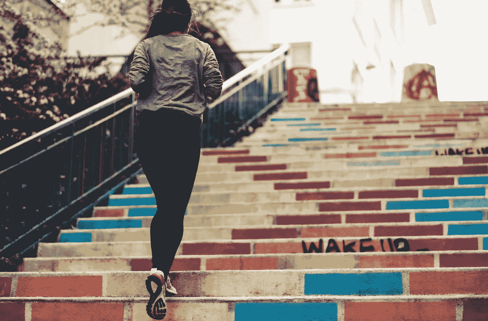

# 我从 6 个月的健康生活中学到了什么

> 原文：<https://medium.com/swlh/what-ive-learned-from-6-months-of-healthy-living-310c9e13d3e9>

# 我新年决心的半年回顾

Onwards and upwards (Photo by [Ev](https://unsplash.com/@evstyle?utm_source=unsplash&utm_medium=referral&utm_content=creditCopyText) on [Unsplash](https://unsplash.com/search/photos/fitness?utm_source=unsplash&utm_medium=referral&utm_content=creditCopyText))

我最近收到了几封来自我过去加入的各种邮件列表的电子邮件。他们的主题似乎是提醒我今年已经过去了一半，并质疑我是否正在实现年初为自己设定的目标。