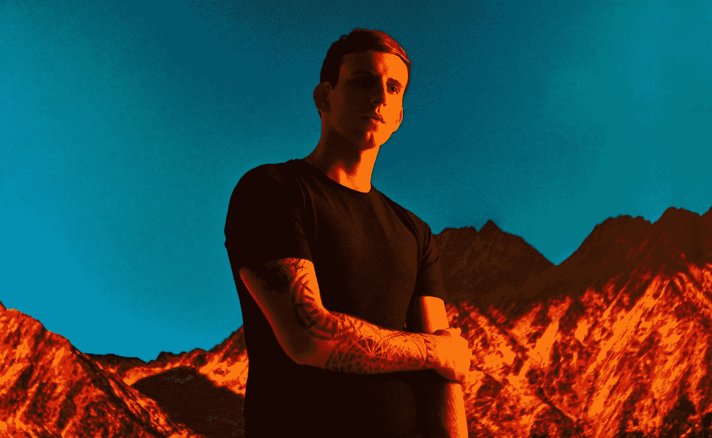

# 到目前为止，我在 30 岁时学到了什么:过好生活的经验

> 原文：<https://medium.com/swlh/what-ive-learned-in-my-30-s-so-far-lessons-towards-living-the-good-life-fb092c509d91>

Image Credit: [Alexandra Gavillet](http://www.alexandragavillet.com/)

我的 20 多岁是一个爆炸，不幸的是，我不记得太多了，这要归功于酒精和我避免的与精神疾病的斗争。现在我 30 多岁了，我发誓不会再犯同样的错误，并找到我的美好生活。

这个星期是我的生日，有一个每年一度的传统，我分享我人生中最有价值的经验…