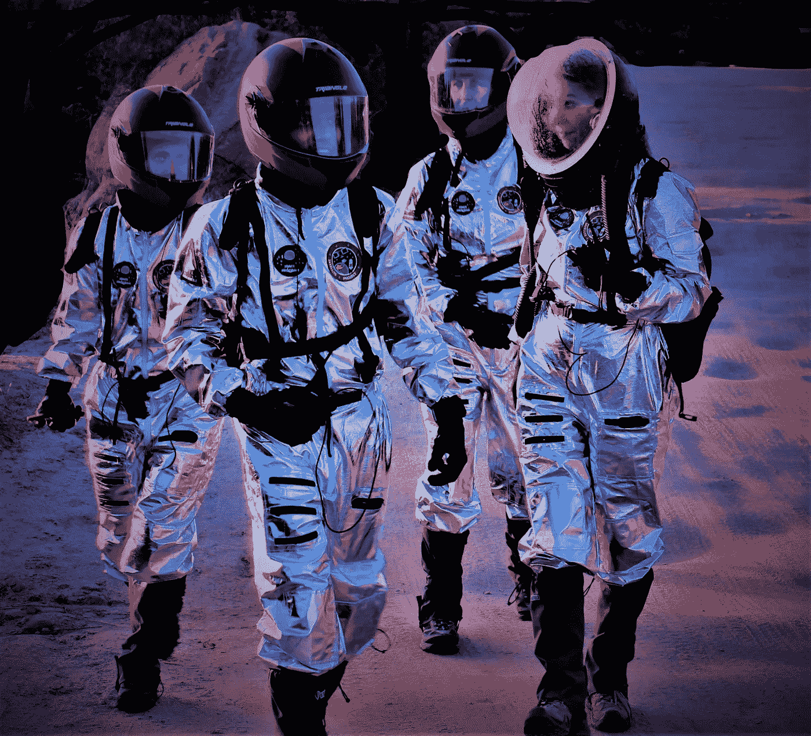

# 在‘火星’上生活教会了我什么关于地球上的经验未来和社区弹性

> 原文：<https://medium.com/swlh/what-living-on-mars-taught-me-about-experiential-futures-community-resilience-on-earth-1889a1fd50a1>

MAU Crew 1121 on a scouting mission (left to right) Aimee Valliere, Health & Safety Officer, Tarun Bandemegala, Engineer, Janet Biggs, Executive Officer/Crew Journalist, Ksenia Benifand, Commander. Image Source: Mars Academy USA

现在是火星上的 Sol 17，2050。第一批定居者中的一个刚刚完成了地形侦察和监视任务，他们也完成了他们栖息地周围的工程检查。他们现在准备返回:

*“伊娃通向 HabCom，允许进入气闸。完了。”*