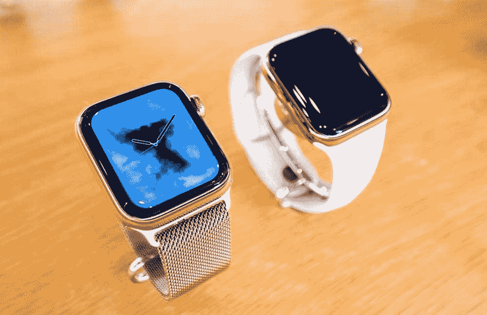

# 是什么让 2018 年成为杰伦科技不平凡的一年？

> 原文：<https://medium.com/swlh/what-made-2018-a-remarkable-year-in-gerontech-3c9ebf237d7b>

Photo by [Steven VanDesande Jr](https://unsplash.com/@swviiphotography?utm_source=medium&utm_medium=referral) on [Unsplash](https://unsplash.com?utm_source=medium&utm_medium=referral)

*原载于 2019 年 1 月 15 日*[*【thegerontechnologist.com】*](http://thegerontechnologist.com/2018-gerontech-recap)*。*

2018 年对 gerontech 来说是个好年景。从 GreatCall 退出，到苹果发布第四代 apple watch，再到致力于健康的 monster round，瞄准老年人市场的公司度过了忙碌的一年！

世卫组织被收购了？

2018 年最大的新闻绝对是 [GreatCall 被百思买](https://www.theverge.com/2018/8/16/17697952/best-buy-greatcall-acquire-purchase-jitterbug)收购。这既是百思买迄今为止最大的收购，也是 Gerontech 历史上最大的退出。

GreatCall 是老龄化技术行业的资深人士，成立于 2005 年，旨在为老年人提供无障碍技术和服务。他们最出名的是创造了最畅销的“Gitterbug”手机，但他们的产品线还包括一款老年人智能手机，以及几款联网健康产品，如移动医疗报警器和健身追踪器。我们这些一直关注百思买(Best Buy)在老年人领域的努力的人，听到 GreatCall 以 8 亿美元被收购并不感到惊讶。

另一个值得注意的收购是 PillPack，它被亚马逊以不到 1B 美元的价格收购。 PillPack 是一家提供全方位服务的网上药店，它将药物按剂量分类，并送货上门。老年人市场是这种服务的明显市场，因为去药店和整理所有药物对老年人和家庭护理人员来说是一件耗时的家务，更不用说将药物相互混淆的危险了。

最后， [CareLinx，](https://www.crunchbase.com/organization/carelinx)一家护理市场，被 Generali Global Assistance 以[未披露的金额收购。](https://www.crunchbase.com/acquisition/generali-global-assistance-acquires-carelinx--8f49e49f)向老年人出售活动跟踪珠宝的初创公司 WiseWare 被 [CarePredict 以 11 万美元](https://venturebeat.com/2019/01/02/carepredict-raises-9-5-million-for-ai-wearable-that-monitors-seniors-health/)收购。

苹果的重大声明

9 月，苹果宣布 [Apple Watch 4 获得 FDA 许可](https://www.forbes.com/sites/jeanbaptiste/2018/09/14/apple-watch-4-is-now-an-fda-class-2-medical-device-detects-falls-irregular-heart-rhythm/#4fb5b6622071)，将能够检测跌倒和心律不齐。如果用户在设置 Apple Watch 或健康应用程序时输入了他们的年龄，并且他们是 65 岁及以上，则该功能会自动打开。当我创建 2018 年 [Gerontech 市场格局时，](https://www.thegerontechnologist.com/)我预测 apple watch 有一天会取代移动医疗警报，因为它已经有了硬件。这将是笨重的移动医疗报警器的末日吗？考虑到价格因素，近期可能不会。然而，苹果已经在和医疗保险提供商讨论[补贴高危老年人的手表。](https://www.cnbc.com/2019/01/15/apple-talking-to-private-medicare-plans-about-subsidizing-apple-watch.html)对于买得起的老年人来说，如果他们能买到苹果手表，就真的没有理由买普通的移动 PERS，苹果手表将提供更多功能，而且看起来很棒。

引人注目的融资回合

2018 年最大的一轮融资是[致力于健康的 3 亿美元怪物轮](https://www.cnbc.com/2018/10/17/devoted-health-is-valued-at-1point8-billion-in-funding-led-by-andreessen.html)。专注健康公司向老年人出售健康保险，由安德森·霍洛维茨领导的这轮融资使该公司的估值达到 18 亿美元

排名第二的是 PointClickCare，它募集了 1 . 86 亿美元，现在的市值为 1 . 86 亿美元 1B。其他值得注意的几轮是 [Orcam 的 3000 万美元](https://www.bloomberg.com/news/articles/2018-02-19/a-1-billion-valuation-for-mobileye-founders-latest-venture)、 [K4Connect 的 1200 万美元](https://www.k4connect.com/k4connect-closes-12-million-series-b/)和 [CarePredict 的 950 万美元](https://venturebeat.com/2019/01/02/carepredict-raises-9-5-million-for-ai-wearable-that-monitors-seniors-health/)，

世卫组织更名了？

2018 年，两家健康监测初创公司更名。前身为 [Aifloo 的可穿戴制作初创公司变成了 Noomi，](http://www.aifloo.com/)智能家居初创公司 [Curo 变成了 Billy](/@rob_48758/curo-is-becoming-billy-5c130be27a64) 。

这是我 2018 年的 gerontech 总结，如果你喜欢阅读或觉得有一些重要信息被遗漏了，请随时通过 [linkedin](https://www.linkedin.com/in/keren-etkin-7082a784/) 或 [twitter](https://twitter.com/KerenEtkin) 联系我！

## 这篇文章发表在[《创业](https://medium.com/swlh)》上，这是 Medium 最大的创业刊物，有+418，678 人关注。

## 在这里订阅接收[我们的头条新闻](http://growthsupply.com/the-startup-newsletter/)。

