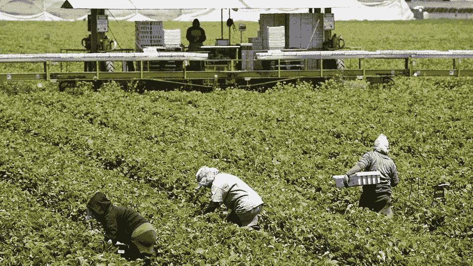

# 什么是“高质量的工作”？:我们如何重视工作和思考经济正义

> 原文：<https://medium.com/swlh/what-makes-a-quality-job-how-we-value-work-and-think-about-economic-justice-57974555ccbb>

我们理解和谈论工作，尤其是工作的方式，与我们作为一个社会如何想象经济公正有很大关系。它告诉我们如何设想组织一个旨在满足我们这个世界的集体人类需求的经济的可能性，以及我们如何制定经济政策来实现这一目标。