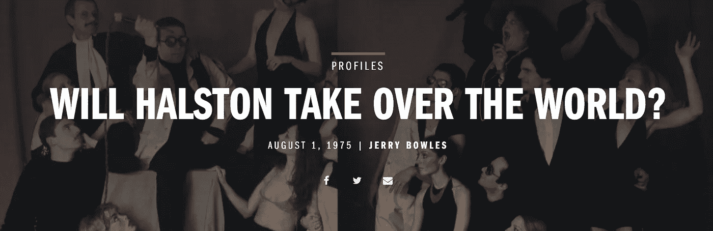

# 媒体作家能从老新闻记者身上学到什么

> 原文：<https://medium.com/swlh/what-medium-writers-can-learn-from-an-old-new-journalist-ae8b877d8f5a>

不要指导。不要说教。观察和揭示。

Cover, Esquire, August 1, 1975

“你可以通过观察观察到很多东西，”健谈的约吉·贝拉可能说过，也可能没有说过。没关系。在我 50 多年的写作生涯中，我逐渐相信观察的能力，更重要的是，认识到你所看到的东西的重要性，是作家最有价值的财富…