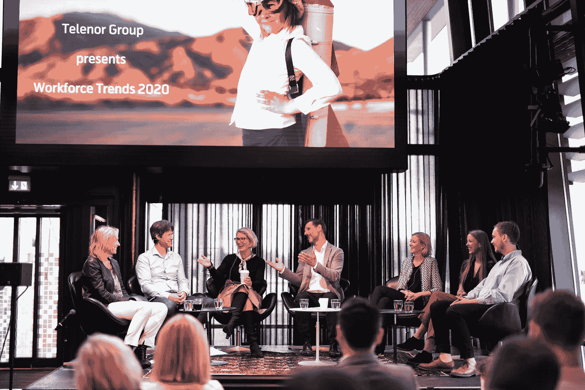

# 千禧一代对工作的真实想法。

> 原文：<https://medium.com/swlh/what-millennials-think-about-work-388b913c2339>

Panel debate about the future of work, with [Mette Krogsrud](https://www.linkedin.com/in/ACoAAAphYNIBtueHvhbz1Tx1NJf1XfrPQWjM_Mo/) (Schibsted Media Group), [Geir Glømmi](https://www.linkedin.com/in/ACoAAABC11cBWzyFlkboxUBT8Osc4Oc6dILJKgc/) (Aker Solutions), [Cecilie Heuch](https://www.linkedin.com/in/cecilieheuch) (Telenor), [Thomas Øivind Andresen](https://www.linkedin.com/in/thomasoa/) (Telenor), [Karoline Hjelmtvedt Rohde](https://www.linkedin.com/in/ACoAABvuUWMBRdJW9C_rDdftFdFRDn0GyL3u5RM/) (Kluge Law Firm), [Silje Marie Vatne](https://www.linkedin.com/in/ACoAABCdlcoBAFzAV-OpFdQjsklpSipj3YfciZI/) (Telenor Norge) and [Haakon Berge Wiken](https://www.linkedin.com/in/ACoAABNTRkMB0n7jTrG65Eq6hZGqHHJ4JKw8XIc/) (Deloitte Digital Edinburgh). Photo credit: Martin Fjellanger @ Telenor

在日益增加的全球挑战、学校罢工和分裂的政治中，是什么让千禧一代选择做什么以及在哪里做？当你面对如此广阔的潜在雇主时，选择工作可能是一项艰巨的任务，每个雇主都在推销自己的愿景、职业道路和福利待遇，以吸引人才。千禧一代和 z 世代有时被称为“被宠坏”或“挑剔”，但随着我们成为劳动力的主导部分，满足我们的需求是必要的。

## **处理不是我们造成的问题**

千禧一代和 Zs 一代是在一个全球问题变得更加严峻的世界中长大的一代，在这个世界中，我们许多人都感到无法影响全球舞台上正在发生的事情。也许因为我们年轻，但也因为权力不在我们手中——直到现在。随着我们的声音开始变得更有分量，我们能够塑造自己的职业生涯，并把我们的努力引向我们想要有所作为的地方。有目的地工作，无论是环境影响、社会影响还是政治影响，都是我们选择继续工作的主要原因，也是我们选择工作的首要原因。

当然，关于特权也有一些东西要说，千禧一代可以被视为有权享受，并面临一系列“奢侈问题”。虽然由于各种潜在的因素，就业并不总是一个广泛的选择，但我们如何优先考虑就业而不是薪水，这是我们关心的问题。有一个目标很重要，因为我们敏锐地意识到全球体系的许多潜在危机，而这些危机并不是我们帮助建立的。我们对未来的悲观是影响我们做出选择的关键因素。为什么我们这么多人选择不要孩子？同样，如果你认为经济(或地球)无法生存，你为什么要毫无目的地寻找工作呢？

## **我知道你去年夏天做了什么**

就像雇主可以让我们为我们在社交媒体上的罪过负责一样，我们也可以。消息像野火一样传播，我们看到的公司违背我们的信念将被追究责任。本着有目标的原则，没有坚持这个目标的公司将会是我们选择离开的公司。我们厌倦了在公司网站上看到光鲜亮丽的“价值观”和“使命宣言”。它们只是文字。更重要的是，这些价值观是公司的一部分，它们在公司文化中得到反映，并通过公司员工讲述的故事得到回报。

就像人一样，公司的价值观也可以是广泛的，从社会影响到对多元化的承诺。总的来说，我们在寻找那些展现出我们能产生共鸣的价值观的公司。任何营销部门都可以让它们听起来不错，但如果它们不可追踪，那么我们就不太可能上钩。平等、多样性、问责制、创新和同情心是我们关心的价值观，尽管这份清单绝非详尽无遗。

## 我们工作是为了生活，生活不是为了工作

决定做什么很重要，但如何做也很重要。与前几代人不同，我们不想在一个要求比回报更多的工作场所工作。我们希望我们的工作支持我们的生活，而不是剥夺它。我们的优先考虑事项与其他几代人不同，我们想多旅行，投资体验，一旦我们到了那一步，就有机会进入房地产市场。

因为我们通过社交媒体不断看到世界上最好的工作场所的照片，受到全球的影响，所以我们知道好的外表是什么样的。因此，我们也认识到相反的情况。动态的工作环境、可管理的工作量、灵活的工作安排，这些都是让我们享受工作的重要因素。这使得我们能够保持健康的工作生活平衡，因为工作并不是我们关心的全部。

我们中的许多人都是在一个或多个父母为了完成他们的工作而不得不为我们做出牺牲的环境中长大的。有人说这是成功的代价，但话说回来，我们中的一些人仍在为此付出代价。因此，我们要求事情有所不同，要求我们被视为多面性的人类——因为我们都有很多事情要做。我们希望在需要的时候做出让步，希望雇主明白我们是为了生活而工作，而不是为了工作而生活。

## 不要问你能为你的公司做什么，问问你的公司能为你做什么

我们对自己的工作有着不同于以往其他人的期望。就像在我们的个人生活中，我们知道什么事情花费了太多的时间，而它们其实不应该。这就是为什么我们会涌向能为我们提供更好做事方式的创新公司，无论是银行业、移动业务还是零售店。就像我们对我们使用的服务有更高的期望一样，我们也对我们工作的公司有更高的期望。

首先，我们想真正做好我们被雇来做的工作。在治理、请求批准和其他管理任务上花费大量时间会扼杀我们的生产力。我们希望公司勇于尝试，支持我们的工作方式。不用说，技术在其中起了很大的作用。公司应该投资于千禧一代可以有效利用的技术。如果你花 8 个小时在一个比你在家里用的慢得多的设备上，你会觉得有效率吗？大概不会。

其次，我们希望身处一个鼓励学习的环境中。我们不想扮演同样的角色，日复一日地做同样的事情。我们希望能够在职业上得到发展，并在工作中学习。因此，公司当前的结构有时不能反映公司当前的需求，这是一件好事。缺乏面向未来的、通常是数字化的能力，千禧一代显然有兴趣学习以填补这些空白。通过这样做，公司可以鼓励我们重新掌握技能，发展成为未来需要的职位。鼓励多学科团队，让个人可以建立彼此的技能，也是一个很好的开始。

第三，我们雄心勃勃。这在千禧一代的高跳槽率中显而易见。如果我们觉得自己不再被开发，我们很可能会离开。事实上，我们很多人都在睁大眼睛寻找下一个大机会。解决这个问题的一个方法是通过指导，并辅以清晰的发展路径。能够向资深员工(通常是他们领域的专家)学习是我们所珍视的。这是我们现在向我们的领导人提出的要求，同时还有机会被赋予过去常常是留给领导人的责任。告诉我们怎么做，我们会抓住机会证明我们可以被委托。如果还没有这样做，公司应该开始讨论这个问题。

## 来自上方的声音

幸运的是，许多公司都加入了讨论，并愿意倾听我们的意见。Telenor 的《2020 年劳动力趋势》是最近在挪威福尔内布举行的一次小组讨论的焦点，三位首席人事官(CPO)与三位千禧一代就工作以及什么对人和大公司重要进行了坦率的讨论。事实证明，观点并没有那么不同。有目的地工作、持续学习、敏捷方法和新的领导职责(如指导)是首席采购官和千禧一代都能认同的工作内容。

[2019 年德勤全球千禧调查](https://www2.deloitte.com/global/en/pages/about-deloitte/articles/millennialsurvey.html?id=gx:2sm:3li:4millennialsurvey19::6abt:20190606140819::2387312543&utm_source=li&utm_campaign=millennialsurvey19&utm_content=abt&utm_medium=social&linkId=68644308)是让下一代参与未来工作的对话的又一个例子。它凸显了对我们千禧一代至关重要的许多方面，特别是关于我们为什么工作和我们如何工作，这两个方面在让我们留在身边时都发挥了作用。

Source: 2019 Deloitte Global Millennial Survey, n=13,400

现在是公司真正倾听对他们的要求的时候了。公司必须思考他们为什么存在，如何实现这一点，以及他们可以做些什么来让千禧一代在工作场所脱颖而出。这样做，公司可以保持相关性并吸引人才。否则，他们将会听到一首相当悦耳的“谢谢你，下一位”。

## **资源:**

 [## 我们的工作方式正在快速改变:Telenor 主持关于未来的跨代辩论…

### Telenor 集团主办了一场关于全球劳动力未来的跨行业、跨代辩论，并讨论了…

www.telenor.com](https://www.telenor.com/media/announcement/the-way-we-work-is-changing-fast-telenor-hosts-inter-generational-debate-on-the-future-of-the-workforce)  [## 德勤全球千禧调查 2019

### 乐观和信任今年变得越来越少，我们看到乐观情绪明显恶化，各种各样的…

www2.deloitte.com](https://www2.deloitte.com/global/en/pages/about-deloitte/articles/millennialsurvey.html?id=gx:2sm:3li:4millennialsurvey19::6abt:20190606140819::2387312543&utm_source=li&utm_campaign=millennialsurvey19&utm_content=abt&utm_medium=social&linkId=68644308) 

## 注意:

本文仅代表作者个人观点。