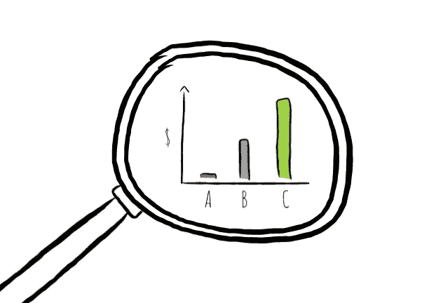

# 我们大多数人在衡量营销时的错误

> 原文：<https://medium.com/swlh/what-most-of-us-get-wrong-about-measuring-marketing-819296324b1c>

假设你经营一家网店。你用一系列不同的营销渠道——谷歌搜索、脸书、YouTube 等等——为商店做广告。如果有人在所有这些渠道看到广告后从你的商店买东西；你认为这是谁的功劳？

这是你如何衡量营销的根本问题。在数字世界中，消费者…