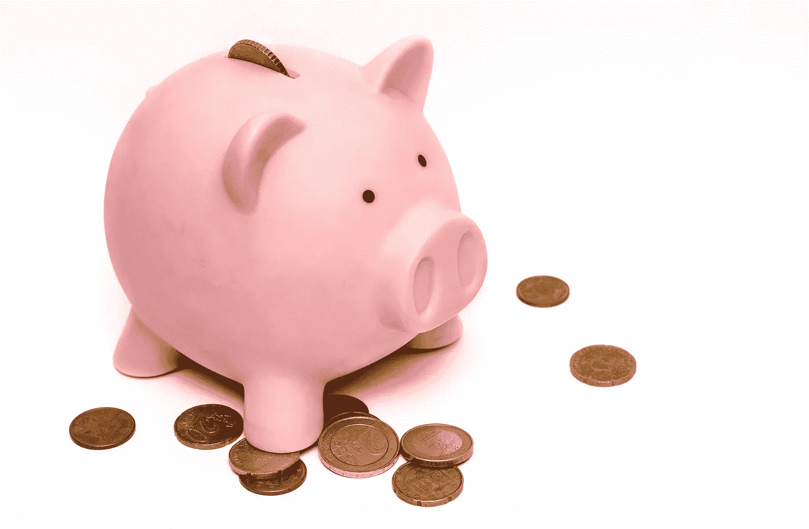

# 我爸爸教我的关于金钱的知识

> 原文：<https://medium.com/swlh/what-my-dad-taught-me-about-money-cd1b7c18dde2>

## 为什么我要试着忘记这一切

Photo by [Skitterphoto](https://www.pexels.com/@skitterphoto?utm_content=attributionCopyText&utm_medium=referral&utm_source=pexels) from [Pexels](https://www.pexels.com/photo/money-pink-coins-pig-9660/?utm_content=attributionCopyText&utm_medium=referral&utm_source=pexels)

当你在贫困中长大，钱总是在你的脑海里。

麦当劳是一种享受。

披萨和冰淇淋蛋糕是为生日预留的(我不记得在我长大一点后得到了这个)。