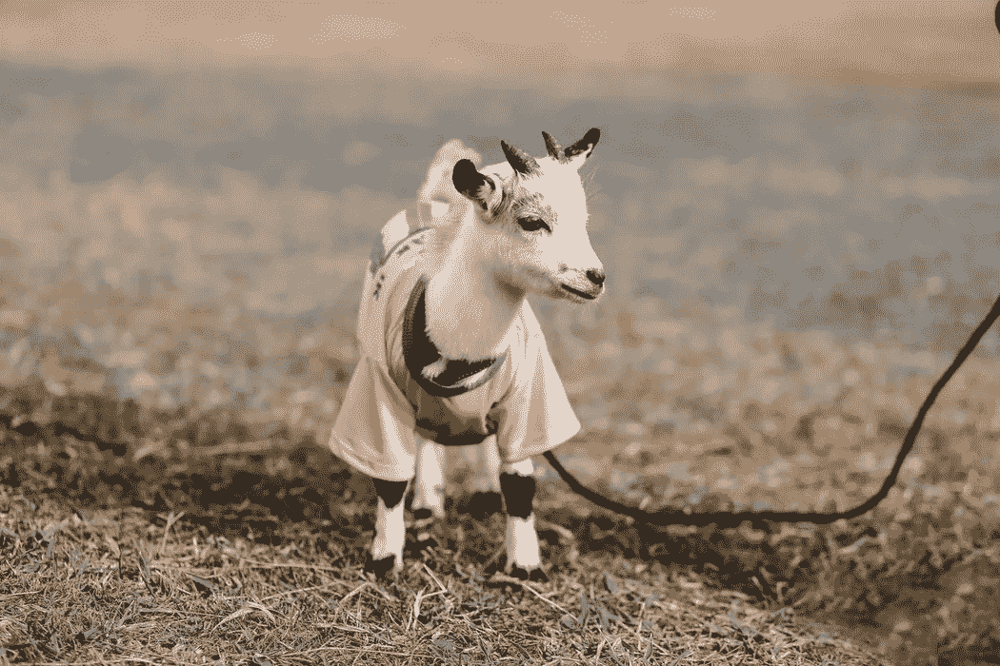

# 我女儿没钱的时候做了什么

> 原文：<https://medium.com/swlh/what-my-daughter-did-when-she-didnt-have-any-money-a9c420833ebd>

> 她想让女儿上芭蕾课，但负担不起。

Photo by [sergio souza](https://unsplash.com/photos/2jXkA7GAz9M?utm_source=unsplash&utm_medium=referral&utm_content=creditCopyText) on [Unsplash](https://unsplash.com/search/photos/nubian-goats?utm_source=unsplash&utm_medium=referral&utm_content=creditCopyText)

> “尽你所能，用你所拥有的，在你所在的地方。”罗斯福

我女儿习惯了没钱。当她决定在经济衰退期间留在家里带着三个孩子时…