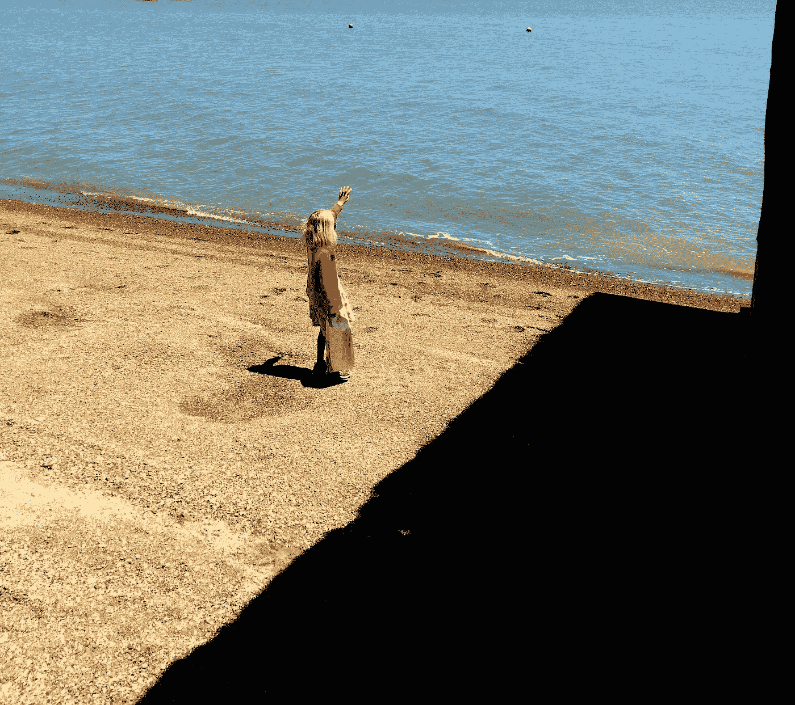

# 我垂死的狗教会了我什么

> 原文：<https://medium.com/swlh/what-my-dying-dog-taught-me-a06263c85829>

We can go so far, but not further. Photo: Stephen Nett

在她 15 岁生日的第二天，我的金色大拉布拉多看着我的眼睛，咽下了最后一口气。她没有死，确切地说，不是以浪漫的方式，不是以我们想的方式。

因为，实际上，我让兽医杀了她。

你不需要知道她的名字。这张纸条不是关于她，也不是关于她对我、我的家庭或她所做的任何事情的意义。那些东西不会…