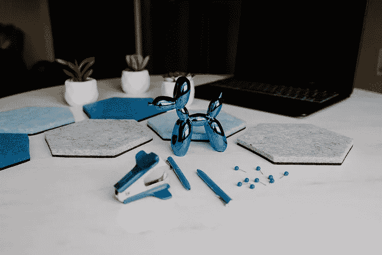

# 我从商的第一年教会了我什么是品牌

> 原文：<https://medium.com/swlh/what-my-first-year-in-business-taught-me-about-branding-9c1a50e4a60d>

刚入行一年半，我就有了三种截然不同的品牌美学。(对，三个！)一开始我是想独树一帜。然后我想要一些我认为会在我的空间里突出的东西。最后，我决定抛弃所有的伪装，去做一些我觉得好的事情。

你准备好坐过山车了吗？这是我的旅程，以及我一路走来对品牌的了解。

# 不要让品牌影响你的起步

我们在开始时都很兴奋，我们想搞清楚品牌的部分，因为它很有趣。我们想发展这种视觉存在。我也没什么不同。

我试图创造一个品牌，老实说，只是用一个独特的标志和配色方案。诚实的事实是:我花了太多时间才弄明白。我想我对我实际上应该从事的活动有点不知所措，因为我以前从未拥有过这家企业。所以我被这个造型吸引住了。

但一开始，品牌并不重要。没人知道你是谁。这并不是说品牌是无用的，因为从长远来看，这是拼图中非常重要的一块。但是新企业主犯的一个大错误——包括我自己——就是太专注于视觉效果，而没有把时间花在真正带来收入的活动上。

# 不要走极端

可以从 Fiverr 上的一个 logo 开始。你可以在 Squarespace 上建立一个快速网站。你可以用一张自己的照片来简化你的名片，不要大的品牌元素。关键是不要过度，因为不仅品牌会改变，它也无助于你开始朝着目标采取行动的能力。

[免费业务清晰工作表](https://www.shaunaarmitage.com/business-clarity-worksheets)

# 介入

在生意场上，我可以是一个相当有进取心的人。我知道自己喜欢什么，也期待结果。我发现，当你从事品牌工作时，这是一项资产，因为设计师无法读懂你的想法。只有有了清晰的反馈，他们才能做出调整，形成你喜欢的审美。

如果你想让别人看到你的品牌，就不能害怕让别人听到你的声音。

# 获得反馈

我在开始的时候几乎是即兴表演，那是一个错误。虽然你永远不希望品牌的发展拖慢你的脚步(例如，分散你的注意力，让你无法正确地专注于其他事情)，但你需要明白，品牌视觉不仅仅是为你准备的——它们应该与你的受众交流。

我选择的最初的品牌方案是“独特的”。是的，我确实很突出，但是它确实对任何人都没有吸引力。不是女人。不是男人。没有人看到我的品牌，就像，“是的，这是我的部落。”

这是个问题。从与你服务的顾客交谈开始。如果你还没有，从朋友和家人那里获得诚实的反馈开始吧。这是确保你闪亮的新品牌不会彻底失败的重要一步。

# 让它成为独一无二的你

反馈对你在营销中所做的一切都很重要。(让我们明确这一点。)但是就像生活中的其他事情一样，你的品牌绝对会吸引每个人——所以让它成为独一无二的你。

当我进行第三轮品牌推广时，我绝对不想要粉红色。硬停。似乎任何想与女性交流的品牌或有影响力的人都喜欢粉色。我不柔软也不蓬松。(嗯，可能有点蓬松。)虽然我想吸引女性，但我仍然需要我的品牌来代表我。

所以我选了红色。很强烈，很大胆，也是我最喜欢的颜色。但最终，这一愿景从未实现。我无法让设计看起来干净。我来了个 180 度大转弯，换成了蓝色。这让我能够保持事情的最小化，同时又有影响力。它让我专注于内容，而不是颜色。你知道吗？我穿很多蓝色的衣服。

我想创造一个对男性和女性都有吸引力的品牌美学，它有一种女性的氛围，但仍然感觉强大和权威。

你怎么想呢?我完成了吗？

# 外卖食品

谢天谢地，我很长一段时间都不会更名了！但从商的第一年教会了我很多关于我个人和企业主的事情。我需要那些失败，我需要那些成功来告诉我，我实际上在建立一个什么样的公司。如果你可以在不深入品牌的情况下开始，我建议你从销售开始，一旦你更了解你服务的对象和你想要达到的目标，再回到美学。

除非你是可口可乐(我爱他们)，否则你的品牌会进化。虚心接受反馈，让你和你服务的人都感觉良好。

*原载于 2019 年 5 月 28 日*[*【https://www.shaunaarmitage.com】*](https://www.shaunaarmitage.com/blog/what-my-first-year-in-business-taught-me-about-branding)*。*