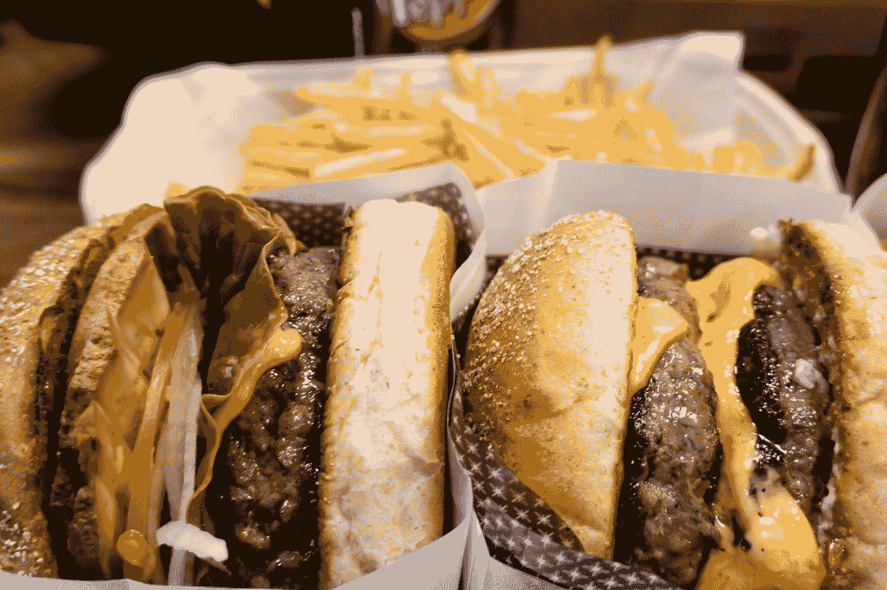

# 我高中在快餐店的工作教会了我营销

> 原文：<https://medium.com/swlh/what-my-high-school-job-in-fast-food-taught-me-about-marketing-3a0eea1b805>

Photo by [Changyoung Koh](https://unsplash.com/@kcy1019?utm_source=medium&utm_medium=referral) on [Unsplash](https://unsplash.com?utm_source=medium&utm_medium=referral)

我领导着一个敏捷营销团队，在这个团队中，我们每两周都为一个目标做出贡献，但我们每个人都通过自己的专长为这个目标服务。一个人发布社交帖子，另一个人撰写文案，几个人创建视觉效果，另一个人创建视频，还有人拉数字。我们经常越界，但每个人都有他或她的专长。