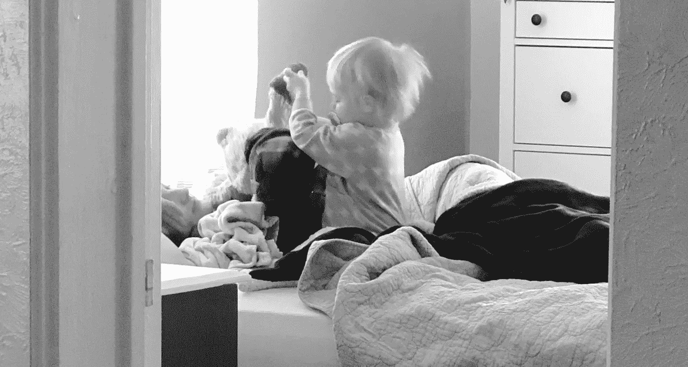

# 我的孩子教会我如何写代码…以及如何生活。

> 原文：<https://medium.com/swlh/what-my-kids-taught-me-about-writing-code-and-living-life-in-general-69c50f1b0877>

两个月前，我 18 个月大的女儿决定是时候知道如何穿自己的袜子了。这不是我或我妻子主动提出的，但我们鼓励了她的雄心。有半个小时，她会用尽全力把袜子穿在她的小脚上，这给了我一个教训，我没想到会从这个简单的小举动中学到。当她一次又一次尝试时，她的…