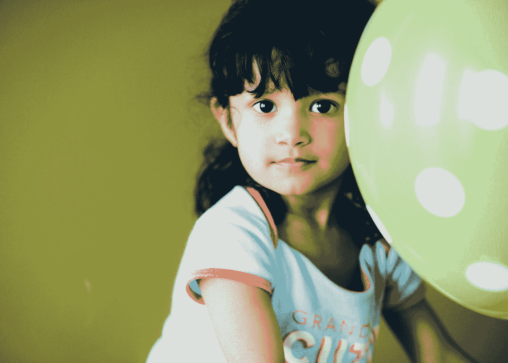

# 父母需要告诉孩子什么来保护他们免受虐待

> 原文：<https://medium.com/swlh/what-parents-need-toteach-their-kids-to-protect-them-from-abuse-4bd51627e48e>

Photo by [seabass creatives](https://unsplash.com/@sebbb?utm_source=medium&utm_medium=referral) on [Unsplash](https://unsplash.com?utm_source=medium&utm_medium=referral)

## 我希望小时候有人能教我些什么。

尽管我们的世界可能是美丽的，尽管我们希望我们的孩子除了美丽之外什么也看不到，但仍然有可怕的怪物在掠夺儿童的纯真。