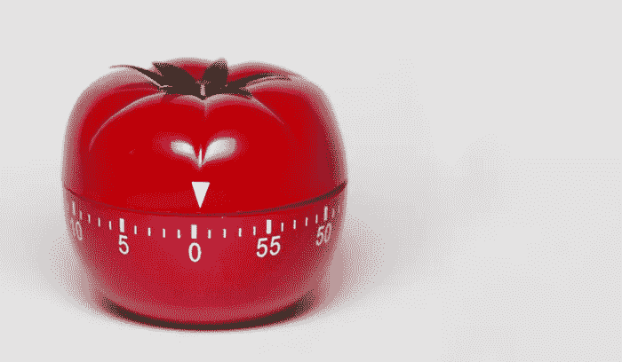

# 番茄工作法和人体周期有什么共同之处？

> 原文：<https://medium.com/swlh/what-pomodoro-technique-has-in-common-with-body-cycles-5e5ba8c9ba73>

谁没听说过番茄工作法？弗朗西斯科·西里洛在 20 世纪 80 年代末发明了这种方法，它很快就流行起来，因为它简单，能带来可见的结果，只需要一个计时器和一张纸。但是现在看起来我们终于有了科学证据来证明为什么番茄计时器可以帮助我们提高效率。最近的研究表明，连续的“工作和短暂的休息”周期是人体保持专注的自然方式。

# 快速提醒:什么是番茄工作法？

无论你是以老派的“计时器和纸张”格式使用番茄红素，还是通过多个网络和移动应用程序使用，T2 的规则都是一样的:

1.  决定你需要完成什么任务。
2.  将计时器设置为 25 分钟——番茄时间间隔。
3.  做你的工作。
4.  当计时器响起时停止工作，并在一张纸上打上勾号。
5.  休息一会儿(3-5 分钟)。
6.  在吃了四个 25 分钟的番茄后，休息一段时间(20-30 分钟),进入第一步。

这些时间管理技巧的力量在于清晰的作息时间，它能提高生产力，帮助保持精力充沛。分割成短距离冲刺的工作会刺激注意力——因为你没有时间分心。有规律的短暂休息能给大脑提供能量，让它重新充电。

# 番茄定时器和自然人体周期

根据最近的[研究](https://www.forbes.com/sites/kevinkruse/2017/02/06/want-to-get-more-done-try-taking-more-breaks/)，我们的身体和大脑被设计成以脉冲和停顿周期工作。经过一段时间的努力工作和全神贯注，注意力和精力会下降。由此产生的心理疲劳是身体需要休息的信号。

我们通常会忽略这个信号，或者用咖啡和能量饮料来取代它——但这会耗尽我们的身体和精神资源，导致疲劳和倦怠。这就是为什么把我们的工作安排成短时间的积极工作，然后休息几分钟，可以自然地保持身体和精神的能量水平，让我们完成更多。

根据能源项目的创始人托尼·施瓦茨的说法，人类能量循环的自然持续时间等于 90 分钟。在这个区间，我们从完美的专注和充沛的精力走向心理疲劳。Schwartz 看到了工作流程优化的机会，使我们的工作周期适应 90 分钟的身体周期。他称这种方法为“脉动和停顿”。其他人将这一活跃期限制在 52 分钟甚至 25 分钟。就像在体育运动中，你可以从较短的时间开始，当你觉得你可以更长时间地保持完全专注时，慢慢地增长。

但是不要错过停下来给你的身心充电的时刻。听起来令人惊讶，多休息是完成更多工作的有效方法。让日常生活适应自然的身体循环，而不是超越和打破它们，是提高生产力和改善表现的一种简单而自然的方式。

这正是番茄工作法的原理。

# 番茄和创造力

当涉及到需要不断决策的创造性任务时，这些工作模式表现得更加明显。创意工作者大脑中最受挑战的部分是[前额叶皮层](https://www.psychologytoday.com/intl/blog/changepower/201704/how-do-work-breaks-help-your-brain-5-surprising-answers)，这是负责注意力、逻辑思维和决策的“思考”部分。它的工作涉及到很多责任，并且关注最终结果，所以难怪它会被耗尽。这就是为什么创意工作者，比如作家、开发者、设计师等。，被信息淹没，面临注意力分散的挑战，经常受到意志力问题的困扰，并经历决策疲劳。

番茄工作法如何帮助解决这个问题？它创造健康和富有成效的工作循环，防止意志力耗尽，帮助处理分心的事情，并允许找到完成工作任务所必需的创造性流动。

短时间的工作增加了注意力，使努力更有针对性的最终结果。它们还可以防止大脑分心:知道未来没有多少时间，更容易专注于工作，而不是浏览网页，与同事聊天等。

休息可以给大脑充电，帮助找到更好的解决工作任务的方法。停止工作可以释放大脑资源，找到更好的解决方案，激发灵感。这也有助于以一种新的方式看待这项任务，并找到更好的方法。

# 休息时做什么？

首先，记住:休息是为了脱离工作，而不是为了切换任务。因此，开始另一项工作任务可能不是休息的正确选择。避免在休息时做任何工作，因为这破坏了遵循“脉搏和停顿”身体周期的想法。

改做什么？事实上，有很多选择。这里有一些关于 3-5 分钟短暂休息的想法，你可能会觉得有用:

1.  **伸展、呼吸和放松**——是的，就这么简单！收回你的能量和情绪平静。
2.  **沉思或听音乐**。这个过程将放松和情绪工作结合起来，有助于保护情绪健康和改善整体福祉。
3.  **去散个步**。运动有助于你的大脑充电，让你从正在进行的任务中解脱出来。
4.  **拿一杯咖啡**。然而，请记住，下午 3 点后喝咖啡会影响你的睡眠周期，让你更难坚持自己的时间表。
5.  **和同事聊天**。它有助于改变视角，以新的方式看待你的任务。

至于更长的休息时间，其他有用的选择是可能的:

1.  **锻炼**。正如研究人员所说，坐着是新的吸烟方式:它损害身体健康，并造成态度和动机问题。这就是为什么散步、拉伸、瑜伽或任何你喜欢的体育活动都是休息的好选择。
2.  **抢个午饭**。没有必要提及健康食物如何给我们的大脑充电并防止疲劳，那么为什么不把散步和健康午餐结合起来呢？
3.  **锻炼眼睛**。做一些对你有用的眼保健操，调暗灯光，减少屏幕眩光——休息时尽量不要使用智能手机！
4.  **试试** [**电力午睡**](https://www.verywellmind.com/power-napping-health-benefits-and-tips-stress-3144702) **。在工作场所打盹儿并不是到处都受欢迎，但是如果你的工作场所允许，用这种方法来恢复精力和注意力。**

# 摘要

正如我们所见，基于自然脉冲和暂停周期的技术，如番茄工作法，创造了一个健康的工作流程，提高了生产率。考虑在你的日常生活中实施它们，看着你的表现成长。希望提高团队生产力的经理和人力资源人员(因为谁不想呢！)可以帮助他们的团队使用这种技巧，欢迎短暂的休息，组织聊天和放松的暂停，或者在办公室创造一个体育锻炼的空间。

## 这篇文章发表在 [The Startup](https://medium.com/swlh) 上，这是 Medium 最大的创业刊物，拥有+424，678 读者。

## 在这里订阅接收[我们的头条新闻](https://growthsupply.com/the-startup-newsletter/)。

