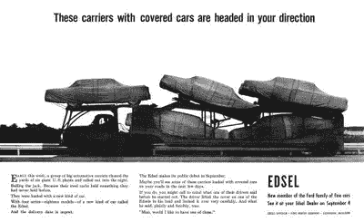

# 产品经理能从 32 亿美元的失误中学到什么

> 原文：<https://medium.com/swlh/what-product-managers-can-learn-from-a-3-2-billion-dollar-blunder-64ee09df1b0a>

在这个行业中，很少有名字能给人留下立即而持久的失败印象。埃德塞尔就是其中之一。

这辆 1958 年的福特汽车被认为是一个突破性的成功。它被设计成每个美国中产阶级都想要的汽车。正如你将看到的，福特完全有机会把产品做好。但是一个又一个错误的举动破坏了他们的计划。

## 过度投资和过度自信

在当今风险投资的世界里，大量的资金意味着一个成功的公司。但是大量的现金并不能保证成功。事实上，它往往会导致一个公司的灭亡。当资金似乎没有止境时，团队往往会失控，带来可怕的后果。

[CB Insights](https://www.cbinsights.com/research/biggest-startup-failures/) 列出了超过 150 家最大的失败案例。名列榜首的是 Solyndra，他投入了 12 亿美元开发太阳能电池板。Jawbone 筹集了 9.3 亿美元，却尝到了成功的滋味，最终每件产品都失败了。然后是 Theranos，7.24 亿美元的翻牌和欺诈。

这些失败让很多人损失了很多钱。但是埃德塞尔黯然失色所有这些…加起来！

当它结束时，福特已经损失了 3 . 5 亿美元。记住，这是 1958 年。按今天的美元计算，那将是 32 亿美元！这一切都是为了一辆上市才两年的车。

福特相信他们正在发起一场革命。正如你将看到的，这种过度自信是每个决定的潜台词，也是产品消亡的一个明确部分。

## 苹果风格的

阴谋诡计。保密。炒作。埃德塞尔营销团队拥有一切。如果是 2000 年的人，他们会把这种努力与苹果相比。

“埃德塞尔来了”是福特的战斗口号。这激起了消费者的好奇心，部分原因是他们从未展示过这款车。这一努力都是为了“E-day”的市场，这是该车在全国各地经销商处的正式亮相。

随着时间的推移，客户会对汽车有所了解，这有助于进一步激发他们的兴趣。但与苹果的比较也到此为止了。

Edsel Teaser Marketing

我们都知道，当人们在当地的苹果商店排队购买最新款的 iPhone 或 Mac 时，他们会提着包走出来，脸上带着笑容。

当人们排队观看福特的新奇迹时，他们没有购买，带着困惑的表情离开了。

毫无疑问，福特抓住了市场营销的要害。不幸的是，公司的其他人无法兑现产品的承诺。

## 缺乏对客户的关注和理解

福特决心将埃德塞尔打造为完美的汽车。他们想要年轻的买家。他们也想要中年爸爸。他们试图将汽车卖给尽可能多的顾客，从而击败竞争对手。我对这种渴望没有异议，但他们的做法被证明是致命的。

他们必须了解买家想要获得什么。在调查了数千名客户并完成大量市场调查后，他们做了一件不可思议的事情。他们把这些都归档了，忽略了这些数据。而是选择自己决定市场需要什么。

然后是下一个巨大的错误，很可能是由他们之前的失误造成的。该团队决定在发布会上发布 18 款车型！这种方法在 50 年代是闻所未闻的，在今天也是疯狂的。

他们并没有就此止步。他们出售的汽车在不同型号的基础上增加了 68 种选择。也有另外 12 个计划，但这些从未进入市场。

为了取悦每个人，福特错过了每个人的目标。

更糟糕的是，他们使得制造业无法提供高质量的产品。购买了 Edsel 的顾客喜欢“漏油、卡住的发动机罩、打不开的行李箱，以及……用锤子都敲不动的按钮。”

他们没有培养狂热的粉丝，而是拥有愤怒的顾客和更多的致命一击。

## 时机和价格

福特的使命是开发一个新的豪华品牌。不幸的是，当 Edsel 推出时，经济陷入衰退，需求转向了低价车型。

这一市场变化是福特忽视的一个领域，而是选择发布他们最昂贵的车型。

他们不是经济衰退的唯一受害者。事实上，尽管埃德塞尔，他们活了下来。豪华汽车制造商 DeSoto、Hudson、Nash、Packard 和 Studebaker 就没有这么幸运了。

## 那个名字

你可以原谅福特没有预测到经济衰退。但是他们 100%的拥有名字的失败。

这个过程如你所料开始了。福特聘请了一家顶级代理公司来开发这个完美的名字。团队带回来 18000 个名字供团队选择。

他们需要抓住奢侈品的本质，在顾客的头脑中创造一种欲望，并建立一个让人们谈论的品牌。

相反，他们摒弃了所有的建议，并以亨利·福特的第一个孩子命名这个品牌。一点也不酷。没有唤起任何情绪。最终，这个名字成为了一个笑柄，顾客们把它当作一个滑稽的缩写。"埃德塞尔——每天都有别的东西泄露出来."哎哟！

## 没有机会从市场中学习

对福特来说，失败不是一个选项。他们创建了一个全新的部门。一个非常昂贵的提议。然后他们将负担转嫁给经销商，要求他们在 Edsel 下线前预订一定数量的汽车。当然，现在我们知道这是怎么回事了。

随着市场自由落体，买家呆在家里，交易商被留下来收拾残局。《汽车新闻》报道称，“所有品牌的经销商都以历史上第二高的未售出汽车数量结束了他们的赛季。”

福特没有出路。尽管他们本可以采取更谨慎的方式度过难关，但他们从一开始就放弃了这一选择。

## 太自负了

也许这个故事中最疯狂的部分是领导这个项目的团队从来没有承认他们的错误。

Edsel 的经理 J.C. Doyle 说,“消费者几年来一直在购买的东西鼓励了汽车行业制造这种汽车。我们给了他们，他们不要。他们不应该那样做。现在公众想要这些小甲虫。我不明白！”

他指的是大约在同一时间推出并获得巨大成功的新大众甲壳虫。低成本，独特的设计和燃油效率，这是当时市场需要的一切。

## 最后的想法

当你在一个嗡嗡的泡泡里时，很难承认你没有所有的答案。很难抛开自我。作为产品领导者，我们的工作是在正确的时间为正确的市场制造正确的产品。

这不是一件容易的事，即使你采取了所有正确的步骤，也不能保证成功。然而，有一点是肯定的。忽略数据、你的客户、市场，假设所有的答案都在你公司的四面墙上，你可以保证一件事。失败。

如果您正在寻找工具来帮助更好地了解您的客户以及如何发现突破性的产品创意，请查看[我的新 Udemy 课程](https://www.udemy.com/how-to-discover-breakout-product-ideas/?couponCode=MEDIUM1)。如果你接受，我很乐意得到你的反馈。

## 这篇文章发表在[《创业](https://medium.com/swlh)》上，这是 Medium 最大的创业刊物，有+415，678 人关注。

## 订阅接收[我们的头条新闻](http://growthsupply.com/the-startup-newsletter/)。

