# 你会先学什么编程语言？

> 原文：<https://medium.com/swlh/what-programming-language-will-you-learn-first-e09e3bdb3c6f>

Photo by [Max Chen](https://unsplash.com/@maxchen2k?utm_source=medium&utm_medium=referral) on [Unsplash](https://unsplash.com?utm_source=medium&utm_medium=referral)

## 使用 2017–2019 stack overflow 开发者调查结果的基于数据的方法。

## 介绍

我仍然记得我 13 岁左右开始写第一行代码的那一天——在 FORTRAN 的课外编码课上。像现在这样可供选择的语言并不多，但从长远来看，选择好学习的重点可能会有所不同。

> 你会先学什么编程语言？

*Let’s import antigravity.* Photo by [Niketh Vellanki](https://unsplash.com/@thenikyv?utm_source=medium&utm_medium=referral) on [Unsplash](https://unsplash.com?utm_source=medium&utm_medium=referral)

根据我们想要实现的目标，可能有几种编程语言都可以很好地完成这项任务。为了更好地支持我们的决策，让我们看看近年来当前的开发人员都在使用什么语言。

在接下来的会议中，我使用了 StackOverflow 在 2017-2019 年期间的开发者调查数据，从统计的角度仔细研究了编程语言的不同方面。下面简单介绍一下各年的受访人数:

*   2017 年调查:超过 64000 名开发人员参与了调查。
*   2018 年调查:超 10 万开发者响应。
*   2019 调查:近 9 万开发者响应。

## 第一部分:最流行的编程语言是什么？

首先，我们感兴趣的可能是最流行的编程语言。我使用了以下调查问题的答案来找出答案:

> 在过去的一年中，您使用以下哪种语言进行了大量的开发工作？

下面的柱状图以降序显示了每年使用特定语言的人数比例。

近年来，JavaScript 一直是明显的领导者。接下来是 **HTML/CSS** ，自从它们被添加到回答选项后，已经从 **SQL** 那里抢了位置。超过 50%的受访者使用这些语言。

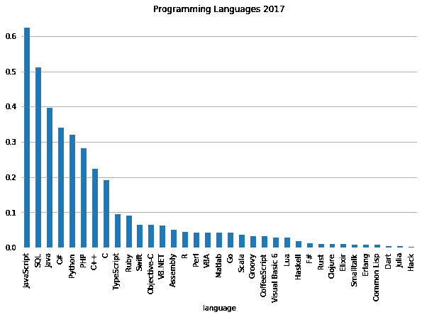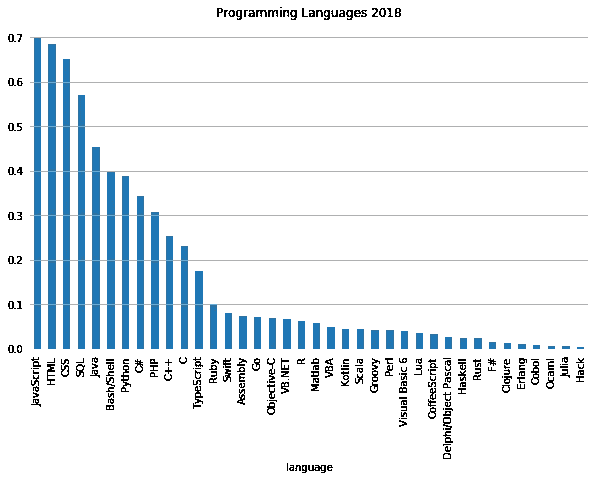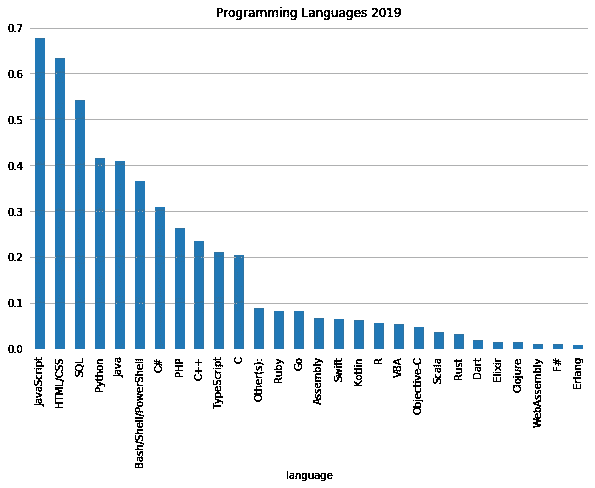

由于调查中提供的语言选项在不同年份略有不同，我挑选了 21 种在所有年份都通用的语言，并将它们的排名进行了比较，如下所示。

我们可以看到 **JavaScript** 多年来一直是赢家(特征图是个提示！).近年来，一些语言有很强的上升/下降趋势。上升趋势的语言有 **Go、Rust、Clojure、F#** 和**Erlang**；而下跌倾向强的语言有 **Swift** 和 **Object-C** 。
*在 2017-2019 年期间，排名随着最近的变化而上升/下降> 5。

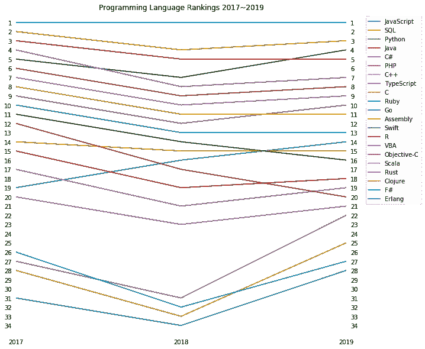

现在我们对这些编程语言的流行程度有了一个印象，但是使用特定语言的开发人员之间的工作满意度有什么不同呢？大多数人选择哪些语言作为起点？我们来看看这些。

## 第二部分:不同的语言与工作满意度有什么关系？

为了用一致的视觉比较不同语言的工作满意度，我将以下问题的答案转换为相同的尺度(从-2 到 2 的离散值，用正/负值表示满意/不满意，零表示既不满意也不不满意)。

> 工作满意度评分。(2017)
> 
> 你对目前的工作有多满意？(2018/2019)

同时，我也对编程语言的比例感兴趣，所以我在下面的图表中绘制了工作满意度的比例和平均值。

我们可以看到工作满意度的平均值主要在 0.4~0.7 之间，所以总体来说它在“稍微满意”和“既不满意也不不满意”之间。

这些年来， **JavaScript** 的工作满意度值有所下降，但是它的排名一直在下降。 **TypeScript** 和 **Bash/Shell** 这几年工作满意度排名都不错。2019 年 **Clojure** 和 **Go** 等几个占比小的语言，满意度都比其他占比大的语言高。

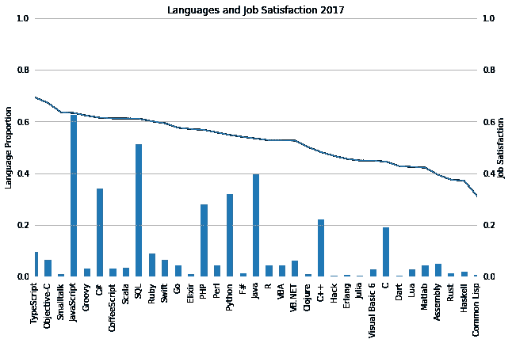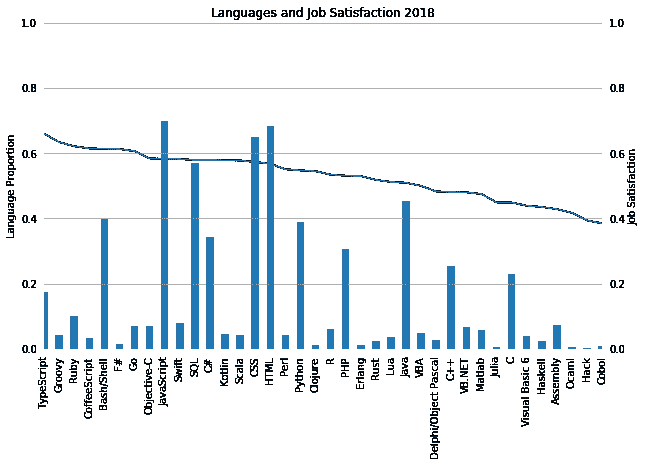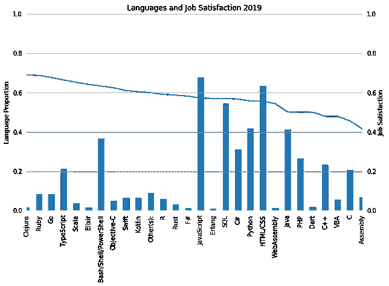

下面是一张图表，对比了所有年份常用语言的工作满意度。在 **Clojure** 、 **Ruby** 、 **Go** 、 **R** 、 **Rust** 和 **Erlang** 中可以观察到稳步上升的趋势。有下降趋势的语言有 **JavaScript** ， **SQL** ， **C#** ， **Java** ， **PHP** ， **VBA** 。

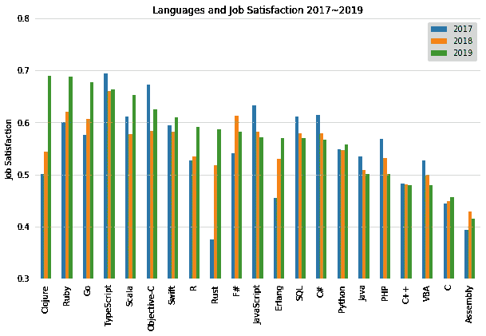

## 第三部分:大多数人选择的起始语言有哪些？

以下调查问题的答案用于回答此问题。请注意，与编码年份相关的数据被转换为相同的比例，以保持视觉一致性。

> 不同的语言和不同的编码年份有什么关系？

新来者(0-5 岁)的比例可以表明人们选择哪种语言作为他们的起点。与此同时，退伍军人的比例并不那么有用，因为这些人可能已经停止使用他们曾经工作过的语言。

在下面的图表中，我们可以看到，2017 年，新来者的比例普遍高于 2018-2019 年。**Matlab(2017–2018)**、**汇编**和 **Java** 拥有大比例的年度新人。 **Haskell** 曾在 2017 年新人比例较高，但在 2018 年数量明显下降。

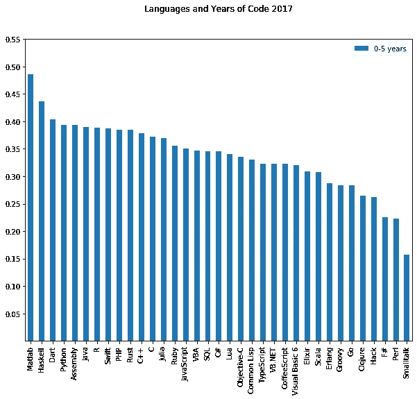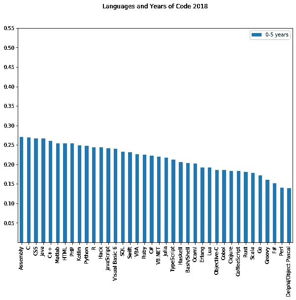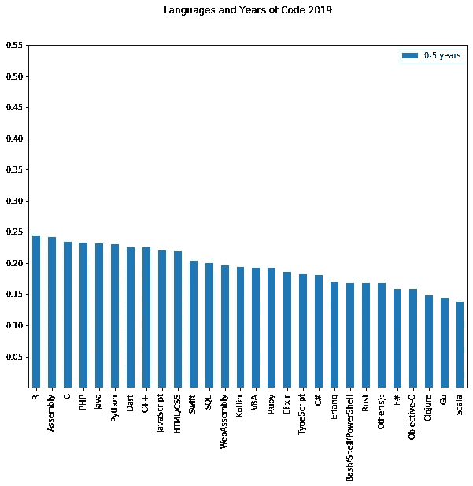

在所有年份中，大多数通用语言都有相似的新来者比例。历年保持在前 15 名的语言有 **R、汇编、C、PHP、Java、Python、C++** 和 **JavaScript** 。留在前十名的语言是**汇编、PHP、Java** 和 **Python** 。最后，唯一成功进入前 5 名的语言是**汇编**。由于 **Assembly** 经常被用作帮助我们了解控制流如何在最基本的层面上工作的介绍类，所以结果并不令人惊讶。

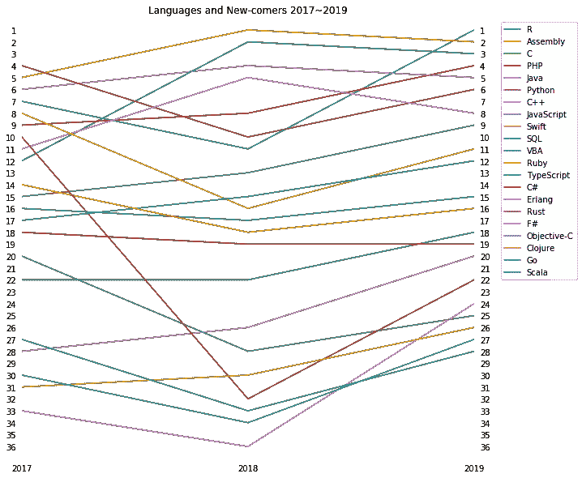

# 结论

在本文中，我们根据 stack overflow 2017–2019 调查数据，研究了几个问题，以获得关于首先学习什么编程语言的一些见解。

1.  我们统计了使用特定语言的个人比例，并比较了每年的排名。它表明最流行的语言是 JavaScript。上升趋势的语言有 **Go、Rust、Clojure、F#** 和 **Erlang** 。
2.  然后我们看了不同的语言与工作满意度的关系。我们发现 **TypeScript** 和 **Bash/Shell** 这几年在工作满意度方面都有不错的排名。在 **Clojure** 、 **Ruby** 、 **Go** 、 **R** 、 **Rust** 和 **Erlang** 中观察到工作满意度稳步上升。
3.  最后，我们通过统计具有 0-5 年编码经验的人的比例来调查大多数人选择哪种语言作为他们的起点。近几年排名前 5 的语言分别是**汇编**和**Matlab(2017–2018)**。

开发人员最终会学习不止一种语言，但他们可能会以不同的方式开始。本文试图做的是支持你对以下问题的选择:

> 你会先学什么编程语言？

要了解更多关于这个分析的内容，请点击这里的[链接。](https://github.com/silviaclaire/stackoverflow_survey)