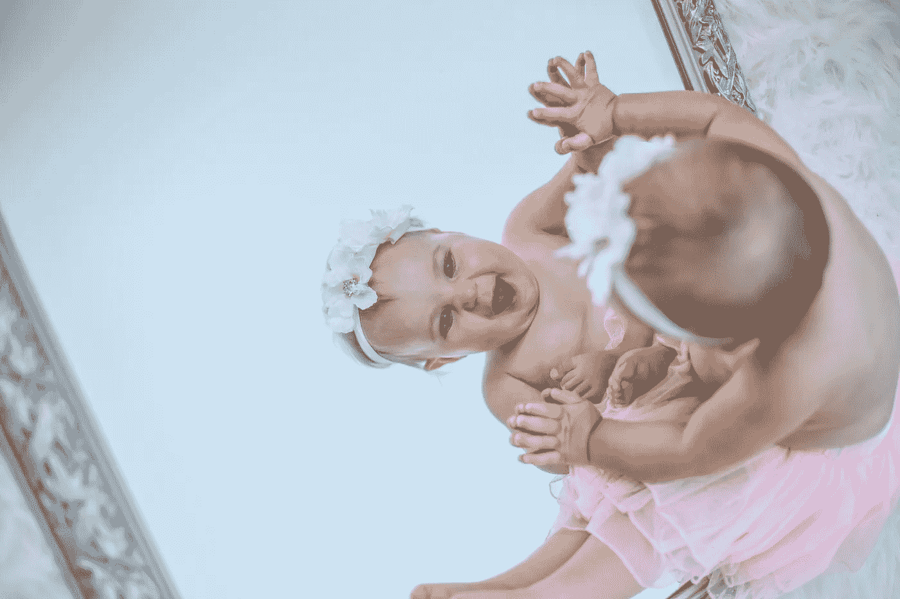

# “自爱”到底意味着什么

> 原文：<https://medium.com/swlh/what-self-love-is-really-supposed-to-mean-c179feac986b>

## 提示:这不全是关于你的

Photo by [Shot By Ireland](https://unsplash.com/@shotbyireland?utm_source=unsplash&utm_medium=referral&utm_content=creditCopyText) on [Unsplash](https://unsplash.com/search/photos/selfie?utm_source=unsplash&utm_medium=referral&utm_content=creditCopyText)

让我直截了当地说，我认为“自爱”这个词太令人生厌了。喜欢… *ew* 。但是现在到处都是。心理学文章、流行音乐歌词、书籍、博客和迷因充斥着这个话题及其绰号。这就引出了一个问题，在这个连蹒跚学步的孩子都知道如何自拍的时代，我们是否…