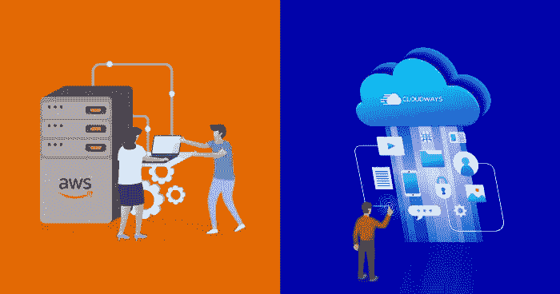

# 关于 AWS EC2 你应该知道什么

> 原文：<https://medium.com/swlh/what-should-you-know-about-aws-ec2-e6943dfe73cc>

亚马逊网络服务(AWS)是最受欢迎的云基础设施服务提供商之一。AWS EC2 云服务器绝对是独一无二的，已经帮助许多资源密集型商业网站在全球范围内无缝扩展。

# 什么是 AWS？

AWS 是一个全面的云计算平台，允许企业家为他们的业务基础设施提供动力，并变得更加敏捷。它是亚马逊内部基础设施的分支，于 2006 年推出，旨在加强在线零售业务的管理。

Cloudways 以提供托管 AWS 云托管服务而自豪。当谈到服务器管理和克服云托管的技术复杂性时，对于新手来说事情可能会变得令人沮丧。我们通过提供简化的解决方案来减轻他们的痛苦。

# 为什么选择 AWS 托管？

AWS 是一套各种云托管产品，比传统的虚拟主机解决方案更全面。如今，许多知名网站如 Dropbox、Reddit 等。使用亚马逊网络服务来扩展自己。

亚马逊的现收现付商业模式允许客户只为他们消费的资源和服务付费，不多也不少！不像其他云托管提供商。它们以指数级的速度提供无缝连接，这使它们比世界上许多私有数据中心更可靠。

即使在你面临速度问题的一天，它也不会让你的网站宕机。它会让你保持在线，但容量会减少。传统的主机环境在极低的速度下会出现 404 错误，但是像 AWS EC2 这样的云主机服务器会不断为你创造收入。

传统托管服务部署云服务器需要 48 到 96 个小时，而 AWS 只需几分钟即可完成服务器部署。这归功于亚马逊机器映像(AMI)——一台在短时间内准备好部署和接受连接的机器。

选择 AWS 托管的另一个原因是它的安全性。它们满足合规性要求并保护您的数据安全。他们的主动支持检测并响应安全问题，确保服务器始终安全。

# 流行品牌 AWS 增长图

到 2018 年底，AWS 的增长曲线图呈现指数级增长。AWS 营收增长 45%，进一步巩固了对微软和谷歌的领先优势。AWS 收入约占亚马逊季度总销售额的 10%。AWS 在营销其云基础设施方面击败了谷歌和微软。使用 AWS 的一些大公司包括:

*   **网飞**，最近已经完全转向 AWS 公共云。网飞有自己的弹性策略，因此在 AWS 大停电期间仍能继续工作。
*   **NASA** 通过 AWS 产品传输 NASA 好奇号火星车接收到的图像。
*   **Expedia** 使用 AWS 来支持其客户，尤其是亚太地区的客户。
*   早在 2009 年，Slack 就因其消息服务而转向 AWS。
*   **三星**打印应用最初部署在 AWS 上
*   **诺基亚**转向 AWS 以增强可扩展性
*   Adobe 使用 AWS 产品来提供不同的企业应用程序。
*   **康卡斯特**使用 AWS 产品来扩展其数据中心。
*   **Airbnb** 整个数据库使用 AWS，在亚马逊关系数据库服务上。
*   **时代公司**正在将五个数据库转移到 AWS 上。
*   **狮门影业**于 2010 年开始使用亚马逊 EC2 和亚马逊 S3 等 AWS 产品。
*   **Yelp** 使用 AWS 提高时间效率。
*   **道琼斯**使用亚马逊 EC2 以获得灵活性。
*   **辉瑞**使用 AWS 的两款产品，分别是亚马逊 VPC 和亚马逊 EC2。
*   **诺华公司**使用 AWS 筛选抗癌物质。

# 联合利华如何从 AWS 托管中获益？

谁不知道联合利华？自 1930 年以来，这家零售巨头在 190 多个国家销售食品、家庭护理用品、个人护理产品和茶点等各种商品。

联合利华使用 AWS 服务来改善他们的在线零售管理时间，以提高他们的业务潜力。重新设计整个基础设施以支持如此大规模的数字营销方法并不是一件容易的事情。因此，在审查了 16 种不同的云托管解决方案后，他们将信心放在了亚马逊网络服务上。

他们选择 AWS 主要是因为它的灵活性、全球基础设施、技术和丰富的成员生态系统。为了建立该平台，联合利华参加了 AWS 研讨会，以重新设计架构。

联合利华开发了一个利益相关方审查的试点平台。项目获得批准后，联合利华选择了 CSS Corporation 进行系统集成和应用程序开发，CSS Corporation 是亚马逊合作伙伴网络(APN)的高级咨询合作伙伴成员。CSS 公司提出了一个全球内容管理系统(CMS)。CMS 平台让代理商在全球范围内建立品牌网站，并在多个 AWS 地区发布。

联合利华在 AWS 服务器上存储备份、快照、产品和配方媒体文件。如果发生灾难，他们可以方便地恢复数据。它使用 EBS Snapshot copy 将亚马逊弹性书店(Amazon EBS)快照从美国东部地区(北弗吉尼亚州)复制到美国西部地区(北加利福尼亚州)。联合利华和 CSS 还创建了运行 Windows 和 Linux 的亚马逊机器映像(AMI)，用于 400 多个亚马逊弹性复合云(Amazon EC2)。

在 AWS 虚拟主机解决方案的帮助下，随着运营效率的提高，联合利华变得更加敏捷。凭借增强响应能力的优势，发起数字营销活动的时间从两周缩短到两天，速度比以前的架构快了大约 7 倍。

# 什么是 AWS EC2？

弹性计算云或 EC2 是一个虚拟服务器，帮助用户在 AWS 云基础设施上运行大量应用程序。

使用 AWS EC2，您可以获得具有不同 CPU、内存、存储和网络资源配置的实例。每种类型都有不同的尺寸，以便能够满足所需的工作量。

实例来自亚马逊机器映像(AMI)。这些机器映像充当配置操作系统和确定用户操作环境的模板。用户也可以配置自己的 ami。

一旦选择了实例，就可以开始部署服务器集群以及您选择的操作系统。在创建 AWS EC2 实例时，有三种流行的方法可以用于此目的。

*   **计算优化** —适用于要求高请求率和利用行业领先处理器的情况。
*   **内存优化** —这些实例提供了最有效的内存成本。
*   **存储优化** —这些实例能够极快地访问 SSD 存储，以满足数据检索请求。

亚马逊的 EC2 服务提供了灵活性和多种实例类型供您选择。您可以轻松定制操作系统、网络和安全设置。但是，您将负责监控虚拟服务器的运行状况和性能。

# AWS EC2 的优势

1.  **长期承诺—** 你按小时付费。您为您使用的任何东西付费，而不是为整个计算云付费。
2.  **Playspace** —您可以创建额外的负载测试实例(客户端和/或服务器)，测试新的架构、重写、版本等。
3.  **缩放**。您可以使用 Amazon AWS EC2 服务器轻松地进行垂直扩展(升级到更大的两个或四个 CPU 实例)或水平扩展。
4.  **备份** —您还可以利用它来备份、存储和提供大文件，甚至利用简单的数据库来实现持久存储。
5.  亚马逊 EC2 提供**出色的带宽**，提高了时间效率。
6.  **更少担心硬件故障** —故障确实会发生，但是，使用 AWS EC2，故障发生的频率比传统的专用服务器要低。此外，恢复更快更容易。
7.  **没有 CPU 窒息或其他使用限制** —这是一个常见的观察结果，许多主机提供商在意识到他们的服务器即将耗尽并可能崩溃时，会终止用户的长时间运行脚本。有了 AWS，就不再是问题了。
8.  **专用 IP 地址**——是你的，也是你一个人的。只要您保持实例运行，就可以增强安全性并增加内部网络的私密性。

# 如何启动并运行 AWS EC2？

AWS EC2 易于启动，部署时间也不长。它为您的计算提供了灵活性，并有助于高效管理业务数据和基础架构。

*   **账户创建&访问 AWS 控制台**

要使用 AWS EC2 机器，您必须首先在 [AWS 控制台](https://console.aws.amazon.com/)上创建一个帐户。AWS 控制台也称为 IAM，即身份和访问管理。

*   **AWS EC2 仪表板**

导航到 [AWS EC2 控制台](https://console.aws.amazon.com/ec2)来设置您的专用云机器。这个仪表板将提供 AWS EC2 运行资源中的所有信息。

您必须选择一个要安装 EC2 服务器的区域。通常，人们会选择离自己国家最近的地区来提高网络应用速度。

要选择 AWS 区域，请导航到仪表板的右上角，然后选择您想要设置服务器的区域。

现在，导航回 EC2 仪表板，并单击“创建实例”部分中的“启动实例”按钮(如下所示)。

*   **选择亚马逊机器镜像(AMI)**

为了设置您的机器，必须有一个嵌入式操作系统，作为 EC2 实例的基础。因此，第一步是选择合适的 AMI。在这里，您可以选择 Windows 或 Linux 驱动的操作系统。

*   **选择 AWS EC2 实例的类型**

一旦你选择了你的 AMI，你必须为你的机器选择硬件。AWS 将其称为 EC2 实例类型。因此，您必须选择最适合您的业务需求的实例类型。为您的机器选择 RAM 内存和处理器容量。

*   **配置实例**

现在，是时候按照以下方面配置您的实例了:

*   您将创建多少个实例(您可以一次创建 20 个实例)
*   配置基本网络详细信息，例如您是否想要创建新的虚拟私有云、设置 IP 并对其进行子网划分；或者您可以选择默认的现有 VPC。
*   您可以选择是希望 AWS 自动分配 IP，还是手动分配。您也可以在这里启用/禁用“自动分配公共 IP”功能。
*   您还可以选择关闭行为。AWS 有一层安全机制，如果您启用了意外终止保护，它将防止您的实例被删除。
*   您可以启用详细监控来获取实例的详细报告。通常，如果实例是业务关键型实例，用户会启用它。
*   **为您的 AWS EC2 机器添加存储**

一旦您对实例进行了所有必要的配置，现在您必须向您的机器添加存储。您可以添加新卷，更改其类型和大小以及其他功能。

*   **标记你机器的实例**

假设您已经创建了许多实例。现在，跟踪他们可能是一个挑战。因此，为了跟踪您当前的机器，您必须用一个键值对来标记每一台机器。

*   **为您的机器配置安全组**

为了限制实例端口上的流量，必须为实例配置安全组。可以把它看作是 AWS 提供的附加防火墙机制，与实例的操作系统防火墙分开。

*   **查看实例**

一旦完成了实例所需的配置，就必须再次检查所有内容，以确保一切正常。接下来，您必须创建一个密钥对来登录到您的实例。

最后，单击 launch state 让实例启动并运行。您还可以查看启动日志。考虑到实例已经从 AWS ips 池中接收了一个私有 IP，该 IP 在机器重启或关闭时可能会丢失，您需要附加一个静态 IP。

*   **创建一个弹性 IP 并连接到您的实例**

AWS 提供了一个弹性 IP，它是一个静态公共 IP。如上所述，默认情况下，您的实例将从池中接收一个私有 IP，当实例重新启动、暂停或关闭时，您可能会丢失该 IP。因此，要创建弹性 IP，请从 EC2 仪表板导航到弹性 IP。创建一个新的 EIP，并将其分配给当前实例。

*   **访问亚马逊 EC2 实例**

为了访问你的机器，安装 putty，这是一个免费的开源终端控制台和网络文件传输应用程序，如果它是 Linux 驱动的机器。输入您的 EIP 并附上您的私钥。您将访问基于 Linux 的 EC2 实例的终端。如果您的实例是基于 Windows 的机器，那么远程桌面可以连接您的实例。

# AWS 的可靠性与 Cloudways 的创新相结合

到目前为止，您已经花了大量的时间来尝试建立 AWS 架构。但是问问你自己，仅仅为了建立一个 AWS 实例就值得花费你的时间吗？您还必须学习如何部署您想要的应用程序。

为此，您必须用最新的补丁管理您的服务器，更新您的应用程序，并确保您的应用程序与您的 AWS 机器架构同步。

这是一项艰巨的工作。让像 Cloudways 这样了解云基础设施的所有技术细节的专门团队来负责您的服务器管理，而您将宝贵的时间投入到业务增长中，这样如何？

您可以选择 Cloudways[Managed AWS Hosting](https://www.cloudways.com/en/amazon-cloud-hosting.php),而不是自己经历设置服务器和管理安全性、性能和可靠性的所有麻烦，这将确保您永远不必面对服务器管理的麻烦或技术障碍来再次发展您的业务。

*原载于 2019 年 6 月 12 日*[*【www.cloudways.com*](https://www.cloudways.com/blog/what-should-you-know-about-aws-ec2/)*。*