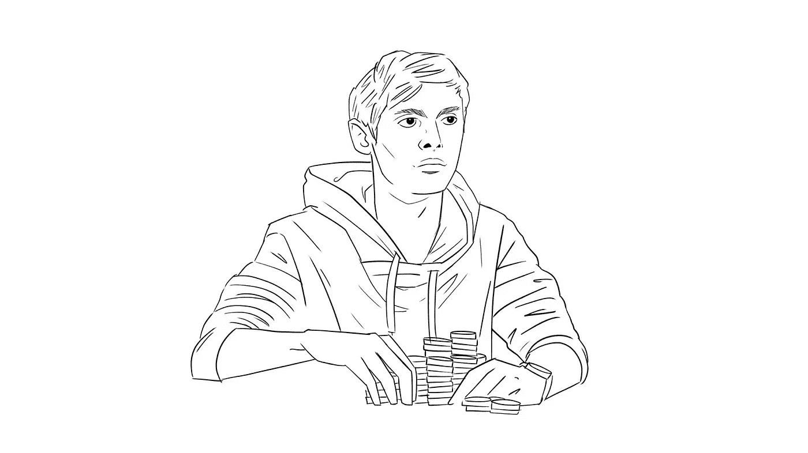

# 初创企业的创始人应该向世界上最好的扑克玩家学习什么

> 原文：<https://medium.com/swlh/what-start-up-founders-should-learn-from-the-worlds-best-poker-player-ad7137b42a9e>

## 一个关于同伴学习力量的故事

*由* [*费利克斯*](https://medium.com/u/a1cd4dd60864?source=post_page-----ad7137b42a9e--------------------------------) *和* [*费多尔【霍尔茨】*](https://medium.com/u/e4286c06f316?source=post_page-----ad7137b42a9e--------------------------------)

Illustrations by [Ariane Frida Sofie](https://www.arianefridasofie.de/)

拉斯维加斯七月的阳光通常很耀眼，但赌场的游戏室光线昏暗，只能看见牌桌和剩下的两名玩家。当庄家翻转牌时，需要…