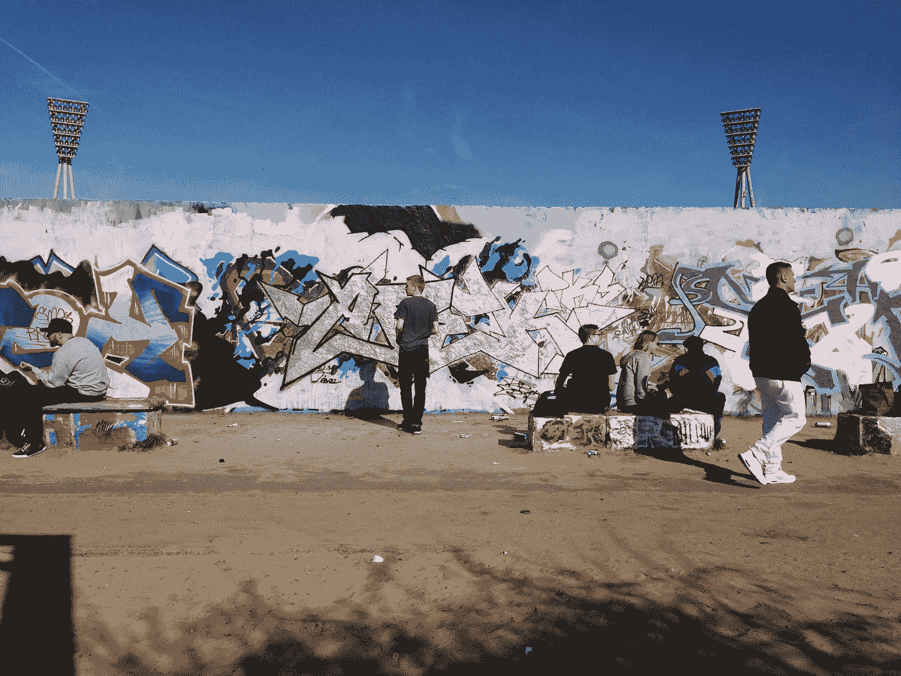

# 街头艺术家可以教你如何在社交媒体上脱颖而出

> 原文：<https://medium.com/swlh/what-street-artists-can-teach-you-about-standing-out-on-social-media-7913b2646392>

Street Artists in the Mauerpark in Berlin

## 你是如何在墙上的其他涂鸦(又名，饲料和溪流)中引起注意的？

社交媒体是一个嘈杂的市场。当你在脸书或推特上发帖时，它看起来就像是森林中的一片落叶。你的帖子只是发生在…