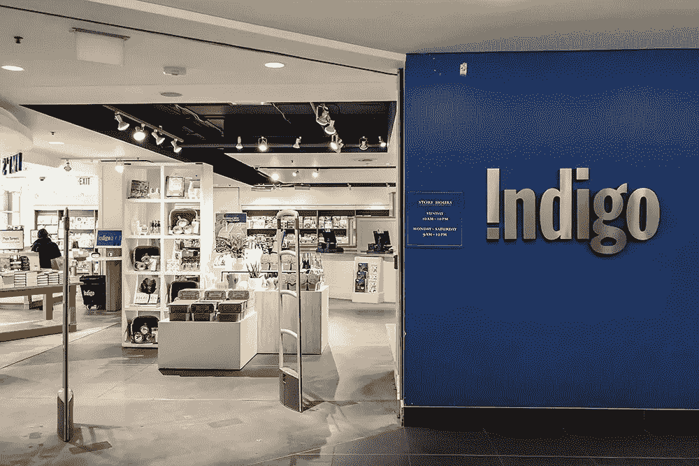

# 苦苦挣扎的零售商能从 Indigo 身上学到什么？Indigo 是一家战胜困难的连锁书店

> 原文：<https://medium.com/swlh/what-struggling-retailers-can-learn-from-indigo-the-bookstore-chain-beating-the-odds-98b822c3e5fc>

## “文化百货商店”刚刚经历了迄今为止最赚钱的一年，并且正在向美国扩张

Photo: [JHVEPhoto/Shutterstock.com](https://fokoretail.com/blog/2019/05/21/what-retailers-can-learn-from-indigo/)

许多零售商担心所谓的“零售末日”但说到实体零售，很少有人…