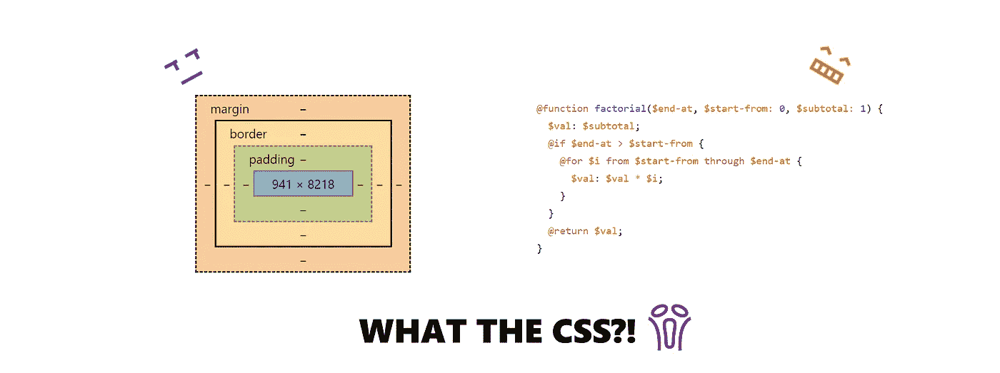

# 什么是 CSS——在 SCSS 实施三角学，以及学到的经验教训

> 原文：<https://medium.com/swlh/what-the-css-implementing-trigonometry-in-scss-and-lessons-learnt-15703e24e677>

## CSS 本质上是一种样式表语言。但是通过使用 Sass 的 SCSS 语法，我们可以做得更多。

Original image, source: [weiyuan](https://www.linkedin.com/in/liuweiyuan/)

# **前言(三角学**之前)

我喜欢解决 CSS 问题，♥️。