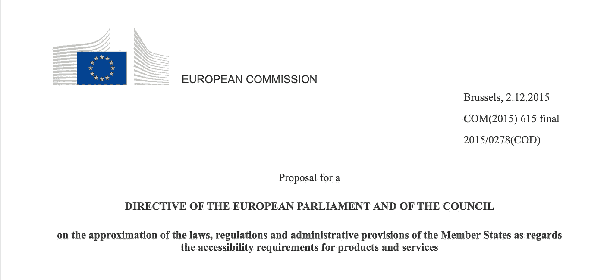

# 欧洲无障碍法案对移动开发意味着什么

> 原文：<https://medium.com/swlh/what-the-european-accessibility-act-might-mean-for-mobile-development-9de973d107d>

欧洲无障碍法案或 EAA 将于今年晚些时候成为欧洲的法律，它定义了手机的一些具体要求。据我所知，这是第一个明确涵盖移动应用的无障碍立法。

自……以来，欧盟一直致力于统一欧洲的无障碍立法