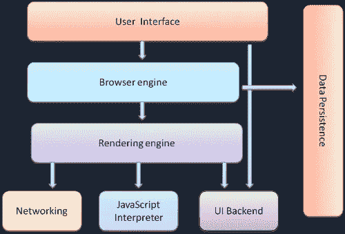
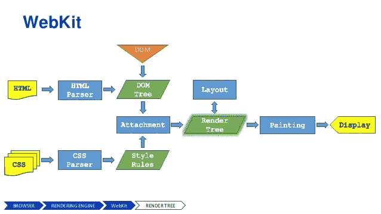

# 理解 JavaScript 中的重画和重排

> 原文：<https://medium.com/swlh/what-the-heck-is-repaint-and-reflow-in-the-browser-b2d0fb980c08>

最近，在研究是什么让 React 的虚拟 DOM 如此之快时，我意识到我们对 javascript 的性能知之甚少。所以我写这篇文章是为了帮助提高人们对重绘和回流以及 JavaScript 性能的认识。"


# 在我们深入挖掘之前，我们知道浏览器是如何工作的吗？

一张图胜过千言万语。所以，让我们从高层次上了解一下浏览器是如何工作的！



**嗯……什么是“浏览器引擎”和“渲染引擎”？**

浏览器引擎的主要工作是将 HTML 文档和网页的其他资源转换成用户设备上的交互式可视表示。
除了“浏览器引擎”之外，关于相关概念还有另外两个常用术语:“布局引擎”和“渲染引擎”。理论上，布局和渲染(或“绘画”)可以由单独的引擎处理。然而，在实践中，它们是紧密耦合的，很少分开考虑。

# 让我们来理解浏览器是如何在屏幕上绘制用户界面的。

当您点击某个链接或 URL 浏览器上的 enter 键时，向该页面发出 HTTP 请求，相应的服务器(通常)会提供 HTML 文档作为响应。(一个**地狱**T8 的[事情](https://cheapsslsecurity.com/blog/what-is-ssl-tls-handshake-understand-the-process-in-just-3-minutes/)发生在两者之间)



Step by step processing

*   浏览器解析出 HTML 源代码并构建一个 **DOM 树**一个数据表示，其中每个 HTML 标签在树中都有一个相应的节点，标签之间的文本块也有一个文本节点表示。DOM 树中的根节点是`documentElement`(`<html>`标签)
*   浏览器解析 CSS 代码，理解它。样式信息*级联*:基本规则在用户代理样式表中(浏览器默认)，然后可能有用户样式表、作者(如页面作者)样式表——外部、导入、内联，最后是编码到 HTML 标签的`style`属性中的样式
*   接下来是有趣的部分——构建一个**渲染树**。渲染树有点像 DOM 树，但并不完全匹配。渲染树知道样式，所以如果你用`display: none`隐藏了一个`div`，它将不会在渲染树中显示。其他看不见的元素也一样，比如`head`和其中的一切。另一方面，在呈现树状文本节点中，可能有多个节点表示的 DOM 元素，例如，`<p>`中的每一行都需要一个呈现节点。渲染树中的一个节点被称为*帧*，或*框*(如在 CSS 框中，根据[框模型](http://www.w3.org/TR/CSS2/box.html#box-dimensions))。每个节点都有 CSS 框属性——宽度、高度、边框、边距等
*   一旦构建了渲染树，浏览器就可以在屏幕上**绘制**(绘制)渲染树节点

下面是浏览器如何在屏幕上绘制用户界面的快照。

> *以后想看这个故事？保存在* [*日记本*](https://usejournal.com/?utm_source=medium.com&utm_medium=blog&utm_campaign=noteworthy&utm_content=eid7) *中。*

它发生在几秒钟内，我们甚至没有注意到这一切的发生。

**仔细看。**
浏览器如何绘制布局并试图检测根元素、同级元素及其子元素作为节点出现并相应地重新排列其布局。

让我们举一个例子

```
<html>
<head>
  <title>Repaint And Reflow</title>
</head>
<body>

  <p>
    <strong>How's The Josh?</strong>
    <strong><b> High Sir...</b></strong>
  </p>

  <div style="display: none">
    Nothing to display
  </div>

  <div></div>
  ...

</body>
</html>
```

*表示这个 HTML 文档的 DOM 树*基本上每个标签有一个节点，节点之间的每段文本有一个文本节点(为了简单起见，让我们忽略空白也是文本节点的事实) :

```
documentElement (html)
    head
        title
    body
        p strong
                [text node] p
            strong
                b
                    [text node]    		
        div 
            [text node]

        div
            img

        ...
```

渲染树将是 DOM 树的可视部分。它缺少一些东西 head 和隐藏的 div，但是它为文本行提供了额外的节点(也称为框架，也称为框)。

```
root (RenderView)
    body
        p
            line 1
	    line 2
	    line 3
	    ...

	div
	    img

	...
```

渲染树的根节点是包含所有其他元素的帧(盒子)。你可以把它看作是浏览器窗口的内部，因为这是页面可以传播的受限区域。技术上 WebKit 调用根节点`RenderView`，它对应于 CSS [初始包含块](http://www.w3.org/TR/CSS21/visudet.html#containing-block-details)，它基本上是从页面顶部(`0`、`0`)到(`window.innerWidth`、`window.innerHeight`)的视口矩形

弄清楚在屏幕上到底显示什么以及如何显示，需要递归地遍历渲染树。

# 重画和重排

总是至少有一个初始页面布局和画图(当然，除非你希望你的页面是空白的:)。之后，更改用于构建渲染树的输入信息可能会导致以下一种或两种情况:

1.  渲染树的部分(或整个树)将需要重新验证，并且节点维度需要重新计算。这被称为**回流**，或布局，或布局。请注意，至少有一次回流，即页面的初始布局
2.  屏幕的某些部分需要更新，这可能是因为节点的几何属性发生了变化，也可能是因为风格发生了变化，例如更改了背景颜色。这种屏幕更新被称为**重绘**，或重绘。

重画和重流可能会很昂贵，它们会损害用户体验，并使用户界面显得迟钝

**Repaint**
顾名思义 Repaint 就是当元素的皮肤发生变化，影响元素的可见性，但不影响布局时，在屏幕上重新绘制元素。
举例。
1。更改元素的可见性。
2。更改元素的轮廓。
3。改变背景。会触发重画。

根据 Opera 的说法，重画是一个昂贵的操作，因为它迫使浏览器验证/检查所有其他 dom 节点的可见性。

**重排** 重排是指重新计算文档中元素的位置和几何形状，目的是重新渲染部分或全部文档。因为回流是浏览器中的用户阻止操作，所以了解如何改进回流时间以及了解各种文档属性(DOM 深度、CSS 规则效率、不同类型的样式更改)对回流时间的影响对开发人员是有用的。有时回流文档中的单个元素可能需要回流其父元素以及跟随它的任何元素。

# 虚拟 DOM VS 真实 DOM

每次 DOM 改变浏览器都需要重新计算 CSS，做一个布局，重画网页。这是真正需要时间的事情。

为了最小化这个时间，Ember 使用键/值观察技术，Angular 使用脏检查。使用这种技术，他们只能更新已更改的 dom 节点或在 Angular 情况下标记为脏的节点。

如果不是这样，那么当你在 Gmail 中写新邮件时，你就不能马上看到新邮件。

但是，现在浏览器变得足够聪明，他们试图缩短重新绘制屏幕的时间。可以做的最大的事情是最小化和批量化进行重画的 DOM 更改。

React 的虚拟 DOM 背后的思想是减少 DOM 变化并将其转换到另一个抽象层次的策略。

# 是什么让 React 的虚拟 DOM 这么快？

React 并没有真正做什么新的东西。这只是一个战略举措。它的作用是在内存中存储一个真实 DOM 的副本。当您修改 DOM 时，它首先将这些更改应用到内存中的 DOM。然后，使用它的不同算法，找出真正改变了什么。

最后，它对更改进行批处理，并调用一次将它们应用到真实世界中。因此，最大限度地减少了重新流动和重新油漆。

*资源:* [*https://www . phpied . com/rendering-repaint-reflowelayout-restyle/*](https://www.phpied.com/rendering-repaint-reflowrelayout-restyle/)[https://gist . github . com/fares soft/36 cdd 64 faae 21 ed 22948 b 458 E6 BF 04 D5](https://gist.github.com/faressoft/36cdd64faae21ed22948b458e6bf04d5)

**我也写了**

[](https://suhas010.medium.com/how-to-create-your-own-url-shortener-add734d5eb80) [## 如何创建自己的网址缩写？

### 网址缩短器是一个工具，它把一个长网址转换成一个短网址，在这篇博文中，我们将看到如何…

suhas010.medium.com](https://suhas010.medium.com/how-to-create-your-own-url-shortener-add734d5eb80) [](https://suhas010.medium.com/understanding-scope-and-context-in-javascript-suhas-more-8f765e3867ba) [## 了解 JavaScript | Suhas 中的范围和上下文

### 如果你已经不知道 JavaScript 的作用域和上下文是什么，那么就不要再往下看了。我有…

suhas010.medium.com](https://suhas010.medium.com/understanding-scope-and-context-in-javascript-suhas-more-8f765e3867ba) [](/darrja-दर्जा/demystifying-class-in-javascript-ce5ec771e7f4) [## 揭开 JavaScript 中类的神秘面纱

### JavaScript 中的类对许多人来说是一个障碍。许多人抱怨 JS 中一个类的不同行为。在这个…

medium.com](/darrja-दर्जा/demystifying-class-in-javascript-ce5ec771e7f4) [](/darrja-दर्जा/here-is-how-i-wrote-python-script-to-wish-my-colleague-happy-birthday-cdbef26d7b8b) [## 下面是我如何写 Python 脚本祝我的同事生日快乐

### 重复多次的任务/事情值得自动化——匿名

medium.com](/darrja-दर्जा/here-is-how-i-wrote-python-script-to-wish-my-colleague-happy-birthday-cdbef26d7b8b) 

如果你喜欢它，请在下面留下评论——它鼓励我写更多。
如果你不喜欢，仍然可以发表评论——解释我如何改进。

关注我的推特[了解更多更新。](https://twitter.com/suhas0101)

📝将这个故事保存在[日志](https://usejournal.com/?utm_source=medium.com&utm_medium=noteworthy_blog&utm_campaign=tech&utm_content=guest_post_read_later_text)中。

👩‍💻每周日早上醒来，你的收件箱里会有本周最值得关注的科技新闻。[阅读科技简讯](https://usejournal.com/newsletter/noteworthy-in-tech/?utm_source=medium.com&utm_medium=noteworthy_blog&utm_campaign=tech&utm_content=guest_post_text)中值得注意的内容。