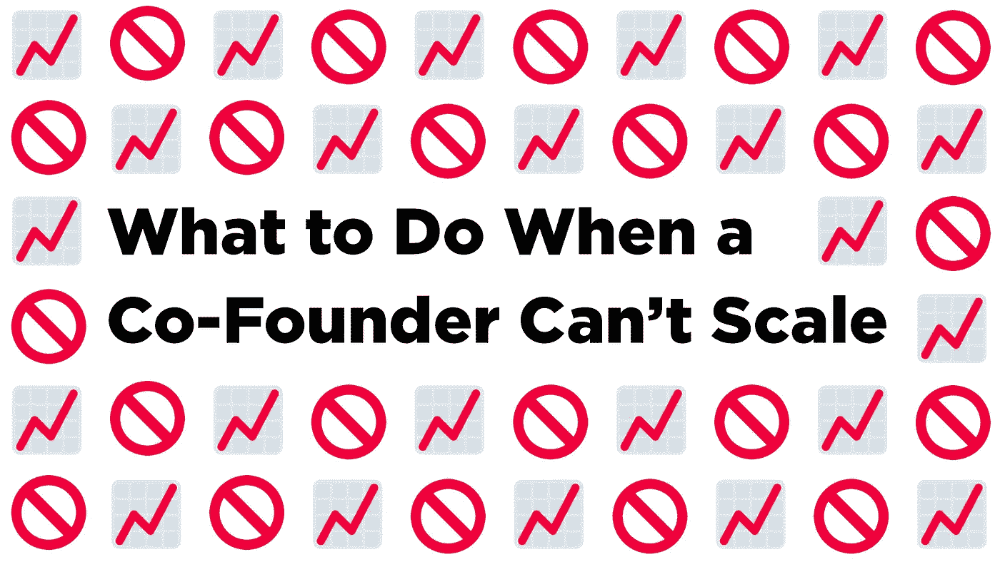

# 当联合创始人无法扩大规模时该怎么办

> 原文：<https://medium.com/swlh/what-to-do-when-a-co-founder-cant-scale-feec9570f10a>

## 帮助企业家同理心进化的清单

一个高质量的创业问题是，当公司开始扩大规模，但其中一位联合创始人无法与另一位同步增长。这是一个好问题，但仍然是一个真正的挑战。下面是一些我认为处理得好(和不好)的想法。