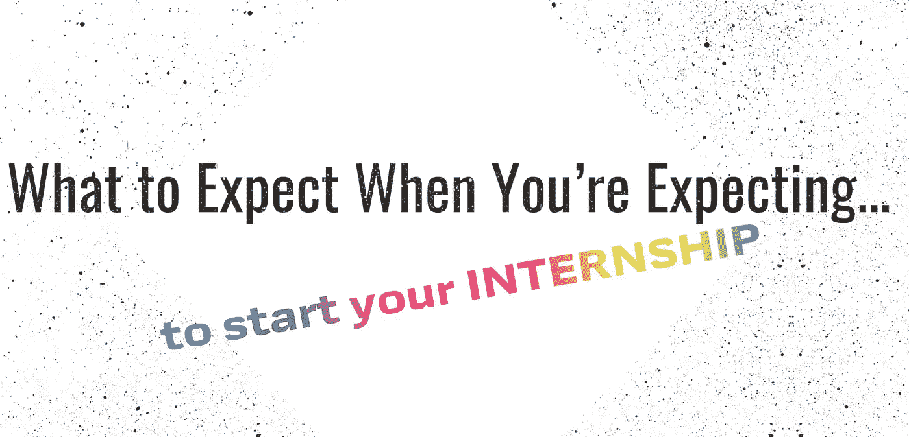
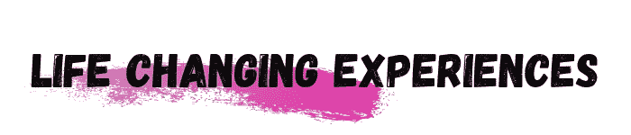
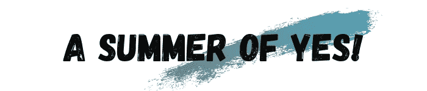

# 当你期待(开始实习)的时候，期待什么

> 原文：<https://medium.com/swlh/what-to-expect-when-youre-expecting-to-start-your-internship-47150f460b3a>

你期待已久的那一天终于到来了。你要开始你期待已久的实习了！但是，如果你没有像你想的那样准备好呢？如果他们希望你每天早上 6 点去上班怎么办？你第一天上班应该穿西装吗？如果你的经理不喜欢你怎么办？

实习第一天之前的几周或几天会产生很多焦虑。这是你的第一份“真正的”工作&也许你不知道该期待什么。好吧，别再找了。作为一名实习项目经理，我自始至终帮助规划我所在组织每年的暑期实习。根据我参与校园招聘和从其他组织分享的知识，我总结了一些你应该预料到的事情。

实习可能是一项繁重的工作——但是是以一种好的方式！实习为公司提供了一个向组织输送初级人才的绝佳渠道。有什么比 10-12 周的预演更好的方法来确定一个人是否在文化和职业上适合一家公司。作为一名实习生，你将有在你被分配的团队中工作的第一手经验。你将对工作量、你的经理的沟通风格以及如何成为你部门的高绩效员工有所了解。大部分工作对你来说可能是新的，让你觉得比实际情况更复杂。我肯定这不是你第一次被这样建议，但是不要害怕问问题&不要害怕寻求帮助。重要的是，你拥有成功所需的所有资源，尤其是当你的工作开始堆积如山的时候！

你被选中成为一个惊人机会的一部分——击败数百甚至数千名其他申请人。这是一个令人印象深刻的成就，但现在你可能会觉得你的新雇主对你&你作为实习生的工作有很高的期望。人们期望你做好自己的工作，但是要相信你的雇主选择雇佣你是正确的选择。公司尽最大努力创建具有挑战性的实习项目，但这些项目适合刚刚开始职业生涯的学生。

我在实习期间的一些经历&我遇到的人，我仍然记得&甚至今天还保持着联系。(这么说吧，我完成暑期实习已经有相当一段时间了，所以作为参照系，这是令人印象深刻的！).日复一日的生活很容易让你陷入困境，但是试着花时间去吸收一切。这是一生只有一次的机会——不要让它从你身边溜走，尽一切努力享受#实习生活。

我把这个话题作为你作为一名新实习生应该做的更多事情:答应！对新的机会、新的经历和新的责任说“是”( T4)。利用你独特的地位去冒险——不要错过学习新事物的机会，或者志愿参加一项你通常会回避的活动。如此多的学生进入他们的新角色时过于谨慎，导致他们错过了发展他们崭露头角的事业的机会。现在，确保你的“是的夏天！”不会过多影响你作为实习生的上述期望。

过去，我曾有实习生向我吐露，他们在工作的头几周就被分配的大量责任压垮了。一些业务单位和团队可能会让他们的实习生从事一些高调的项目，这些项目可能会在未来几年对组织产生影响。这是很故意的。经理们希望看到他们的实习生在必须做出判断时的反应。这是一种很棒的方式，不仅可以观察新团队成员的职业道德，还可以看到团队成员如何在压力下做出艰难的商业决策。这并不是说你应该对做出任何重大决定感到焦虑，而是说当这些决定出现时，你应该尽最大努力做好准备。

让我们面对现实吧，你真正想知道的是你是否得到了一份全职工作。毕竟，这就是你为什么要实习的原因。根据你的实习项目的结构，全职职位的数量可能有限，或者全职机会可能比实习生多。无论哪种方式，重要的是你要尽最大努力完成分配给你的工作和项目。这是你大放异彩的时候了——向你的雇主展示你作为全职员工将会产生的积极影响。

如果你没有收到工作邀请，不必惊慌。美国失业率处于[历史最低点](https://www.marketwatch.com/story/unemployment-rate-near-or-at-record-lows-for-almost-all-groups-of-americans-2018-10-05)，这意味着就业市场已经成熟，大学毕业生可以开始他们的职业生涯。

作为一名实习生，这个夏天你可能会遇到无数的可能性，但这正是这种经历的乐趣所在！试着不要太担心将要发生的事情&尽你最大的努力专注于现在。允许自己带着坚韧开始这次冒险吧！💥