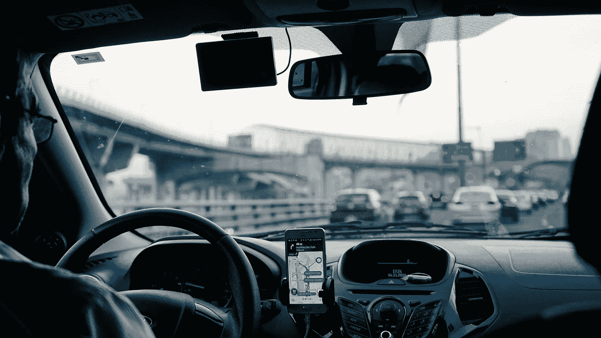

# 优步对城市做了什么

> 原文：<https://medium.com/swlh/what-uber-did-to-cities-97ac91cf504c>

## 优步规范了城市服务的数据驱动监控。代价是什么？

Photo by [Dan Gold](https://unsplash.com/photos/kARZuSYMfrA?utm_source=unsplash&utm_medium=referral&utm_content=creditCopyText) on [Unsplash](https://unsplash.com/search/photos/uber?utm_source=unsplash&utm_medium=referral&utm_content=creditCopyText)

2010 年夏天，TechCrunch 联合创始人兼投资人迈克尔·阿灵顿使用了一款名为 UberCar 的新应用。他很喜欢。在展望美好未来之前，[阿灵顿写道](https://techcrunch.com/2010/08/31/what-if-ubercab-pulls-an-airbnb-taxi-business-could-finally-get-some-disruption/)“这项服务……消除了打车体验中的一切不良因素”。