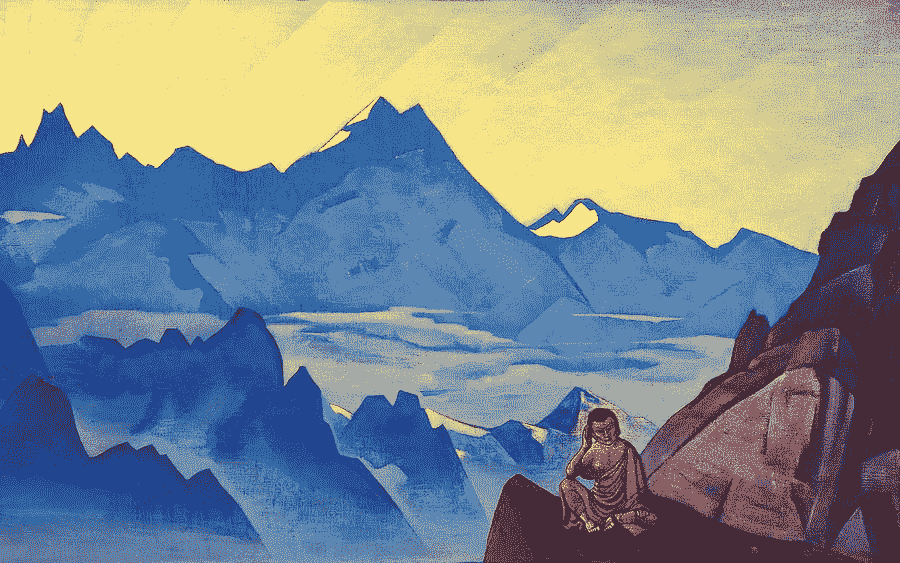

# 我们忘记了生活中的什么，以及如何记住它。

> 原文：<https://medium.com/swlh/what-we-forget-about-life-and-how-to-remember-it-5a51c2363e35>

在我开始写这篇文章的时候，我刚刚度过了一个充满阳光的复活节假期，回到了镇上。

太阳——延续着它的节日传统——跃过繁忙的街道，进入我的周边视野。

我心里想，“活着真好”。

这种感觉，我有时会忘记。

# 一个…的陷阱