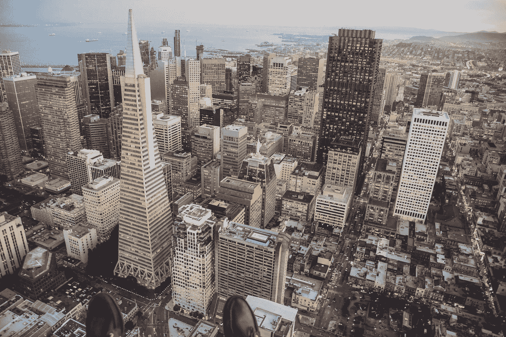
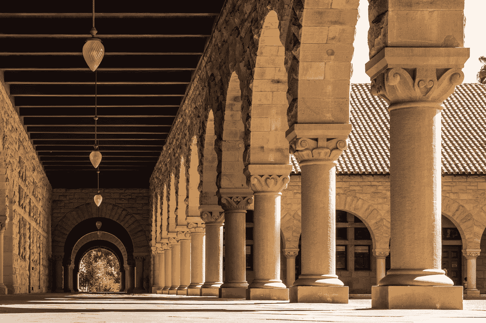
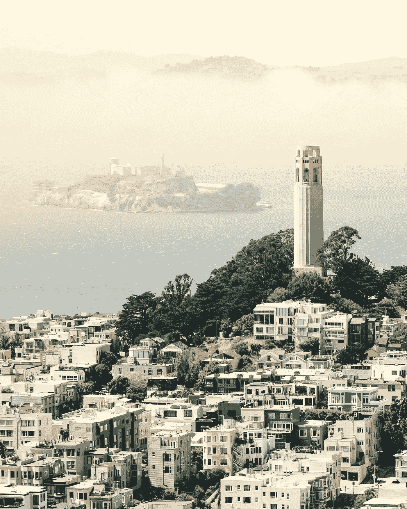
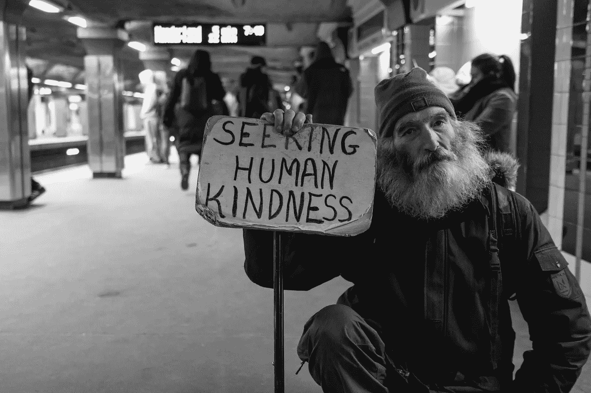

# 参观硅谷，你能为你的创业学到什么

> 原文：<https://medium.com/swlh/what-you-can-learn-for-your-startup-from-visiting-silicon-valley-f472987a91de>

## 我在加州创业朝圣的感悟

旧金山和硅谷对于企业家就像佛罗伦萨对于艺术爱好者或者好莱坞对于演员一样。就初创公司、数字技术和风险投资而言，这里是未来几十年的最佳去处。

Host of startup giants and investment moguls: San Francisco and the Valley — Photo by [Jared Erondu](https://unsplash.com/photos/1Fm_k4Ip7jM?utm_source=unsplash&utm_medium=referral&utm_content=creditCopyText) on [Unsplash](https://unsplash.com/?utm_source=unsplash&utm_medium=referral&utm_content=creditCopyText)

作为一名风险投资出身的企业家，我当然阅读了大量关于“硅谷”的书籍和博客，观看了纪录片，采访了那些曾经生活或访问过 SF/SV 的人，仿佛他们能够获得神圣的智慧。

在多年像科学家在显微镜下观察细胞生长一样分析美国西海岸独特的创新生态系统后，我突然发现自己在一架从巴黎飞往旧金山的法航荷航空中客车上，正在前往我的“麦加”的路上。

# 那是怎么发生的？

2018 年夏天，我和我的联合创始人斯文(Sven)被选中参加一个经过旧金山和硅谷的引导式创业之旅。这次参观是由德美商会和北莱茵-威斯特法伦州(NRW)经济促进部组织的，并得到了他们的大力资助，目的是促进美国的发展和企业家之间的国际交流。

只有 12 家来自 NRW 的有前途的早期创业公司被录取。我们紧凑的日程包括跨文化培训、法律咨询、创业辅导、推介培训、投资者讨论以及在硅谷专业人士面前展示德国技术。

# 突出

我们遇到了很多企业家和投资者，参观了几个不同阶段的初创公司。几个亮点是:

## 斯坦福大学访问记

*   作为湾区高素质人才的来源和创业教育的热土
*   斯坦福毕业生创办的公司包括 Alphabet、Coursera、Instagram、YouTube、SpaceX、思科、网飞[和更多的](https://en.wikipedia.org/wiki/List_of_companies_founded_by_Stanford_University_alumni)。

Just one of plenty fantastic sceneries of Stanford University’s campus — Photo by [Jason Leung](https://unsplash.com/photos/r93UZeT3AQE?utm_source=unsplash&utm_medium=referral&utm_content=creditCopyText) on [Unsplash](https://unsplash.com/search/photos/stanford?utm_source=unsplash&utm_medium=referral&utm_content=creditCopyText)

*   在那里，我们还见到了出生于斯图加特的工程师兼创始人 Andreas，他毕业于斯坦福大学，获得博士学位，并创办了一家软件公司。当被问及为什么选择了一个最昂贵的地区学习时，他回答说在德国学习会更贵，因为有才华的学生在斯坦福会获得全额奖学金。最重要的是，你从教授、斯坦福校友网络和相关投资者那里获得的支持是非常出色的。

## 游览 LinkedIn、Google 和 SAP 园区

*   硅谷大公司的办公室文化是独一无二的。建筑和周围环境的设计就像一个小村庄，包含了让员工生活尽可能愉快的一切，从健身房到餐厅、按摩室、洗衣房、班车服务和自行车租赁店等等。

At the headquarter of a daily companion — Photo by [Paweł Czerwiński](https://unsplash.com/photos/fpZZEV0uQwA?utm_source=unsplash&utm_medium=referral&utm_content=creditCopyText) on [Unsplash](https://unsplash.com/?utm_source=unsplash&utm_medium=referral&utm_content=creditCopyText)

*   显然，这些昂贵的额外津贴符合公司的最大利益，因为员工不会浪费时间在午休或交通堵塞上，并尽可能保持高效率。然而，我想知道，这种无忧无虑的环境是如何导致员工对公司的更高依赖的。尽管如此，脸书、谷歌等公司员工的平均留任时间应该在 1.5 年左右。

## 会见 HoloBuilder 的创始人兼首席执行官 Mostafa

*   Mostafa 是一个杰出的人，他成功地将他在亚琛出生的初创公司转变成了一家硅谷公司，并成功地从 SV 风险投资家那里筹集了资金。
*   由于硅谷到处都是自称的先知、教练和顾问，听到他对所有这些被炒作的话题发表更理性的观点令人耳目一新。
*   这位亚琛工业大学的计算机科学毕业生现在为来自建筑领域的 17，000 多名用户提供服务，并拥有一个跨洲的开发人员和销售团队。令人印象深刻的成就！

## 在硅谷投资者面前推销

Office view on Coit Tower and “the bay”, San Francisco — Photo by [Sasha • Stories](https://unsplash.com/photos/IkpC4BZILCo?utm_source=unsplash&utm_medium=referral&utm_content=creditCopyText) on [Unsplash](https://unsplash.com/search/photos/san-francisco?utm_source=unsplash&utm_medium=referral&utm_content=creditCopyText)

*   我在硅谷风险投资家面前的推销显然是一次特殊的经历。由于 SV 投资者理应通过他们的交易流程看到更多的趋势和商业模式，并且似乎什么都知道(“去过那里，做过那些”)，他们似乎更难被说服。
*   总的来说，我们收到了关于我们的商业模式的大量反馈和意见，并为未来在美国的扩张建立了有益的联系。
*   在德国技术竞赛(German Tech Match)上，我们还会见了经济事务、数字化、创新和能源国务部长 Andreas Pinkwart 教授的外交代表团，并有机会就德国的创新和融资挑战进行了讨论。平克瓦特部长似乎有一个直截了当的方法，让“他的”省成为创新公司的好去处。

## 观光

*   当然，我和斯文还增加了一些旧金山、拉斯维加斯、大峡谷、死亡谷、约塞米蒂国家公园的观光活动，以便获得整体印象，解放思想。我一定会回到加利福尼亚和公司，以后会有更多的时间。
*   虽然我没有回到拉斯维加斯的冲动(它看起来有点垃圾)，但我确实爱上了旧金山，它是一个非常多元化的城市，有海滩、老城区、商业区、嬉皮士区、很棒的餐厅和酒吧以及阳光！如果不是这么贵的话…

Breathtaking trip to Grand Canyon after an urban marathon — Photo by [Sonaal Bangera](https://unsplash.com/photos/XuQGqCBpNGk?utm_source=unsplash&utm_medium=referral&utm_content=creditCopyText) on [Unsplash](https://unsplash.com/?utm_source=unsplash&utm_medium=referral&utm_content=creditCopyText)

# 学习

硅谷不是一个地方，而是一种思维定势。这是一个经常被理解的短语。它代表:人们在运动，网络，帮助你，但也要考虑“我有什么好处”，努力，冒险，失败，重新开始，成功。这种心态包括一种相当以美国为中心的观点，还带有一点“欧洲是什么？”投资者希望每一家初创企业都搬到美国，如果它们希望获得资金的话，这一点就突显了这一点。

然而，漫步旧金山，似乎有两个平行的世界混合成一个二元的现实:闪亮的初创公司-投资者-创新世界，有六位数的起薪，办公室班车和免费按摩——以及“无名氏”世界，其中“正常”的人在贫困线上挣扎，同时由于疯狂的租金和生活成本而赚取 10 万美元。结果是旧金山无家可归者的人数相对较高。

Photo by [Matt Collamer](https://unsplash.com/photos/8UG90AYPDW4?utm_source=unsplash&utm_medium=referral&utm_content=creditCopyText) on [Unsplash](https://unsplash.com/search/photos/homeless?utm_source=unsplash&utm_medium=referral&utm_content=creditCopyText)

拜访我每天使用其产品的公司(如 Gmail 或 LinkedIn)时，我感受到了很多尊重。与此同时，我很高兴地看到，硅谷巨头也在处理类似于小型创业公司的问题，例如正确的翻译或响应迅速的移动应用程序。最后他们也是“一次一条腿穿裤子”谁也不是神一样的。

也许硅谷的创始人并不比其他地方的企业家更聪明，但他们无疑能更好地获得资本，因为美国的风险投资比整个欧洲多五倍。最终，一个资金雄厚的平庸想法总能战胜一个资金匮乏的绝妙想法。

> 一个重要的问题仍然存在:硅谷最终会不会过热，重要性会不会下降？

我相信，在德国，我们有技术能力，但我们缺乏能够将创新成功推向全球市场的资金。看看美国和[中国](/swlh/a-glimpse-into-the-future-5-insights-from-traveling-china-cad376a9caaa)，我目前不认为欧洲共同体能够赶上海外的经济发展。

# 结论

我很高兴我终于停止阅读和谈论这个山谷，并最终去看了看。我之前的一些想法被证实了，其他的被证伪了，我获得了新的见解。我遇到了令人印象深刻的人，扩大了我的职业网络，使我们公司受益，并且玩得很开心。

对于我在我们的人工智能初创公司 Taxy.io 的未来工作，我学到了:

*   如何计划在美国的扩张，应该联系哪家风险投资公司
*   当管理两个时区的人员和流程时，9 个小时的时差是很困难的，下次我们最好试试东方成本
*   更大的市场和更高的风险资本量伴随着激烈的竞争和高昂的成本——在美国上市本身并不理想。
*   德国在合格的人力资源、一般成本、竞争格局和获得资本方面实现了良好的平衡。从这里开始，然后在一个稳定的基础上进行扩展是有意义的。

> 下一次硅谷创业之旅的申请已经开始。[申请此处](http://www.gaccny.com/dienstleistungen/innovation-startup-relations/step-usa-application-form/)。

Golden Gate Bridge, the entrance to (and exit from) San Francisco — Photo by [Jakub Gorajek](https://unsplash.com/photos/xC41_fGtp6A?utm_source=unsplash&utm_medium=referral&utm_content=creditCopyText) on [Unsplash](https://unsplash.com/?utm_source=unsplash&utm_medium=referral&utm_content=creditCopyText)

# 奖金:

美国人不知道如何制造但也不关心的东西:

*   防风门窗
*   淋浴电枢
*   厕所
*   在它们的价格标签上包括增值税

## 这篇文章发表在 [The Startup](https://medium.com/swlh) 上，这是 Medium 最大的创业刊物，拥有+446，678 名读者。

## 订阅接收[我们的头条新闻](https://growthsupply.com/the-startup-newsletter/)。

