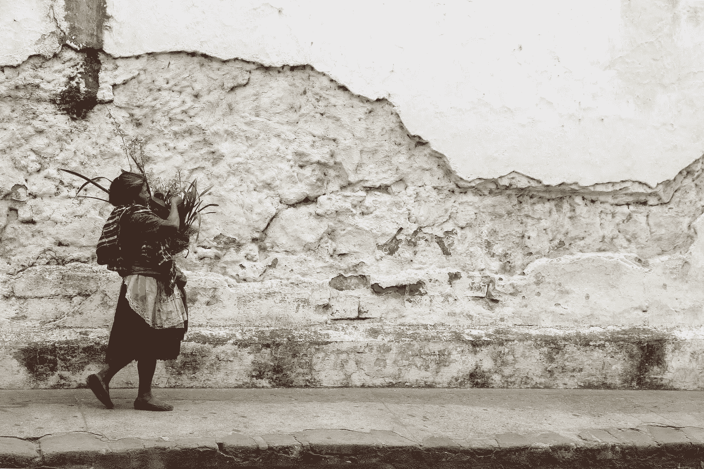

# 你选择做什么

> 原文：<https://medium.com/swlh/what-you-choose-to-do-5b3f112e6862>

比你想象的影响更大。

Photo by [Scott Umstattd](https://unsplash.com/@scott_umstattd?utm_source=unsplash&utm_medium=referral&utm_content=creditCopyText) on [Unsplash](https://unsplash.com/search/photos/indigenous?utm_source=unsplash&utm_medium=referral&utm_content=creditCopyText)

我有时会盯着别人看，但当我盯着的人回头看我时，我会移开目光，脸上泛起一丝红晕。对我来说，盯着看是件大事。来自亚洲文化，我们被认为是顺从的，作为一名亚洲女性，我总是被告知，当我小声说话时，男人会觉得我更有吸引力…