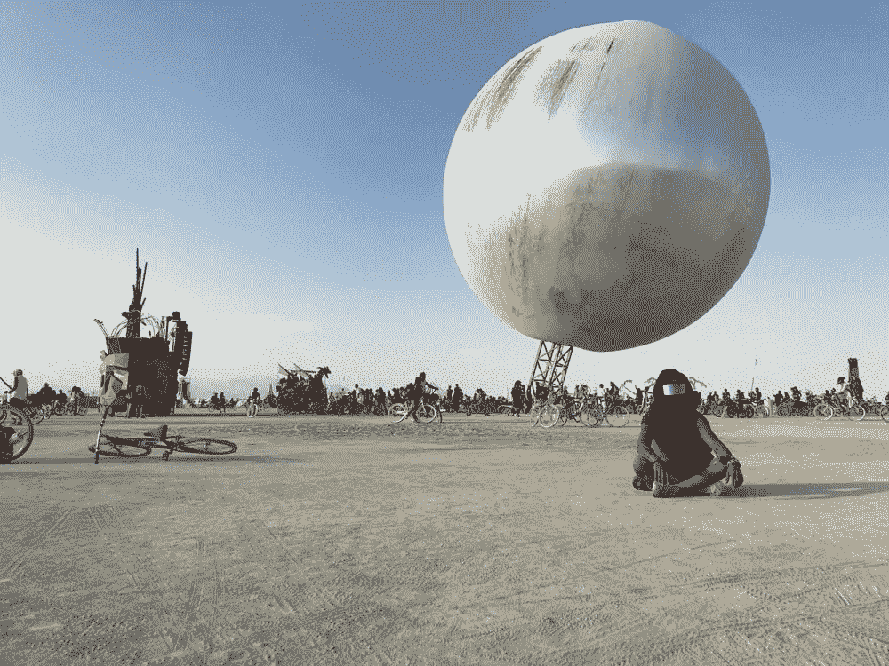

# 你需要停止做什么来改变现状，变得更加高效——10 件重要的事情

> 原文：<https://medium.com/swlh/what-you-need-stop-doing-to-make-a-big-difference-and-be-more-ultra-productive-809c2ecfe588>

*Photo credit:* [*Elena Ger*](https://twitter.com/elenitager)*.*

## 超高效改进的“不做”清单

标题可以是你应该停止做一些事情来改变现状，但是我永远不会接受像我这样的人的命令或指导。所以，如果你想在你所做的事情上有所作为，考虑一下这十件重要的事情。如果你避开它们，你会成为一个更好的 [**高效的**](/swlh/how-to-be-ultra-productive-in-30-days-17-basic-practices-40303a525cbd) 人。

# 如何做出重大改变，变得更加高效

避开这每一点，你就会更接近 [**做重要的**](https://isragarcia.com/i-made-it-happen) ，为了自己。

# 1.浪费 5 分钟

每天偷懒五次五分钟，意味着一周 25 分钟。一年就是 9125 分钟。很遗憾，我认为你浪费了不止五分钟。

# 2.不要看重一欧元

理解欧元的价值就是认识到时间的重要性。想象一下，你每花一欧元，就花一次。

# 3.相信那些成功的人

90%都是门面。不用麻烦了。你已经成功了，可能是——你的成功。除非你感激你所拥有的，否则你的生活不会更好。

# 4.认为你还没有准备好迎接挑战

我没有准备好参加铁人三项，或者机动奥特曼，或者泰坦沙漠。我最终完成了我面临的每一个测试。当——有意识地——你适应压力、恐惧、不确定性、不可能、神奇的事情发生时，你就进化了。

# 5.追求幸福

你永远达不到它；太难以捉摸了。想想过程，担心把所有的精力都沉淀在那里。结果来自享受、努力和意图，而不是相反。

# 6.低估你所拥有的

如果你欣赏你已经拥有的，接下来发生的一切都将是一个很好的额外收获。如果你觉得需要拥有更多的东西来补偿你生活中错过的东西，你会一直感到空虚。无论你得到什么或拥有什么。

# 7.最小化你已经取得的成就

不管你愿不愿意，你都处在一个可以有所作为的绝佳位置。你已经出生了；这个概率已经决定了。一切都把你带到了现在这个地步。世界是你的平台，人的自然状态就是发光。你所要做的就是站出来。

# 8.与他人竞争

与他人竞争导致人们每天都在追求不属于他们的目标。我还没见过比这更好的浪费资源的方式。然而，社会迫使我们这样做。你可以投入你所有的一切去追赶别人，一些令人沮丧的事情。或者，你可以根据自己的价值观来定义充实，让自己远离外部噪音。

# 9.试着拥有一切

每个人都需要选择什么重要，什么不重要。然后，执着于重要的事情。如果一开始，我们试图成为一切，我们最终将一无所有。内部冲突是地狱。

# 10.忘记你从哪里来

谦逊、感激和认可你喜欢的事情是必不可少的。很多时候，没有别人的帮助，你无法有所作为。你非常幸运能够以这种方式做出贡献。

# 旅程还在继续

能够了解这十个事实对我来说是一件幸事。

我已经在世界各地旅行了十个月，下一站是以色列，在这次旅行中，我遇到了一些知道如何超越他人的人，他们以自己的方式做出了改变，变得更加高效，我从他们所有人身上学到了东西，就像我从我每天远程工作的人身上学到的一样。所以更容易做出重大改变，更容易让**超高效，或者至少尝试一下。**

***图片来源:* [*伊莲娜 Ger*](https://twitter.com/elenitager) *。***

**【本帖最早出现在[**isragarcia.com**](https://isragarcia.com/how-to-go-beyond-your-limits)】**

# **只有当你觉得值得的时候，才让这个故事震撼吧！如果你发现任何有价值的东西，请鼓掌。**

> **Isra Garcia = 56 位客户，49 家企业咨询，401 次发言，3.690 篇帖子，24 个项目，6 本书，380 场讲座，6 家公司，18 次冒险，27 次实验，∞失败。到目前为止…**
> 
> **[营销人员](https://isragarcia.com/wp/marketer)。顾问。扬声器。作家。教育家。经理。在 [IG](http://thisisig.com) 的负责人。博主。企业家。颠覆性创新。数字化转型。高绩效者和生活方式实验者。**

# **行动号召>>点击订阅更多类似的文章！**

****

## **这篇文章发表在 [The Startup](https://medium.com/swlh) 上，这是 Medium 最大的创业刊物，拥有+419，678 名读者。**

## **在这里订阅接收[我们的头条新闻](http://growthsupply.com/the-startup-newsletter/)。**

****