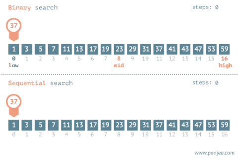

# Javascript 101 中的二分搜索法

> 原文：<https://medium.com/swlh/what-you-need-to-know-about-binary-search-in-javascript-f4c2ef9f87a2>

## 关于二分搜索法基础知识的初学者速成班

[Comparing Binary Search vs Sequential (linear) Search](https://www.interviewbit.com/courses/programming/topics/binary-search/)

# 像我五岁一样解释

如果你刚刚涉足编程领域，你可能听说过[二分搜索法](https://en.wikipedia.org/wiki/Binary_search_algorithm)。二分搜索法是一种算法，用于使用“分而治之”的方法在**排序的**数组中查找特定元素。许多消息来源解释说…