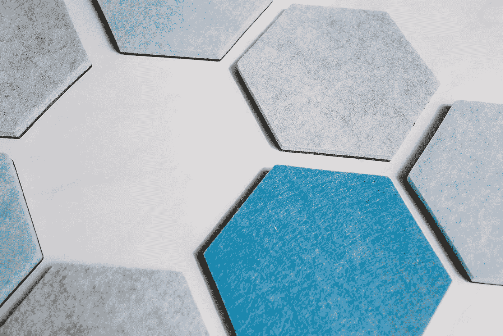

# 关于建立网站你需要知道什么

> 原文：<https://medium.com/swlh/what-you-need-to-know-about-building-a-website-3af22d84e694>

当你意识到你的想法不仅仅是一个想法时，你做的第一件事是什么？我猜，当你发现这个东西将成为一个合法的生意，你去寻找一个企业名称，然后购买了一个网站域名。

这个过程很常见，但是在域名被购买后，大多数企业家不知道下一步该去哪里。我需要在我的网站上放些什么？请人创建这个网站要花费我多少钱？我真的需要一个吗？

是的，你有，所以让我们从这里开始。

# 你需要有一个

出于对神圣事物的热爱，你需要一个网站。我见过一些人认为，你可以在社交媒体上建立强大的影响力，并从那里进行销售——这是正确的——但网站不仅仅是销售。

首先，它给你可信度。如果你在社交媒体上做得不错，关注你和消费你内容的人很有可能想知道更多。如果他们想知道价格，而你的社交资料上没有列出，该怎么办？也许他们会发个 DM。也许他们会去一家能更清楚地陈述事情的公司。

[自由竞争分析模板](https://www.shaunaarmitage.com/competitive-analysis-template)

# 不需要花里胡哨，但一定要明确

你的创业网站不需要花里胡哨，我向你保证。太多的人关注于创建一个突出的网站，而不是创建一个他们的访问者能够真正理解的网站。

你需要问自己的第一件事是:如果我对这家公司一无所知，当网站加载时会立即清楚吗？无论是通过图像还是一小段文字，折叠上方的任何东西都应该是明确的。(折叠上方表示某人在开始滚动之前在你的网站上看到的任何内容。)

这不是耍小聪明的时候；这不是花里胡哨或不寻常的图像的时候。保持基本。保持清晰。

接下来你应该关心的是你的主导航。你希望你的访问者在你的网站上采取的最重要的行动是什么？是否有明确的途径来采取行动？

草率的导航真的会毁掉一个网站。如果有人两三次点击都找不到他们要找的东西，你已经失去他们了。

# 不要失去捕捉线索的机会

毫无疑问，没有办法在网站上获得领先优势是我看到的创业公司犯的最大错误。没有电子邮件或电话号码或某种方式与他们联系并培养他们，你会错过一些大机会，因为他们可能在访问你的网站的那一刻就没有正确的购买心态。

你可以让你的电话号码或联系方式清晰可见，但还有另一种方法可以考虑:使用销售线索磁铁。简单来说，销售线索磁铁就是吸引你的销售线索向你发送电子邮件，以换取有价值的东西。大多数网站使用 pdf 格式，如清单、模板和指南，让访问者对分享他们的电子邮件感兴趣，但销售线索磁铁甚至可以是优惠券代码或免费服务。你必须选择对你的观众来说最好的。

# Wordpress 还是 Squarespace？

如果你不喜欢网络营销，你可能不知道该用 Wordpress 还是 Squarespace。别担心，这是一个超级常见的问题，事实是这对双方都有很大的好处。我简单说一下…..

我为我所有的新客户建立了 Squarespace 网站。界面非常容易理解，免费的模板多种多样，设计都是拖放式的，所以你不需要知道一点代码就可以创造出漂亮的东西。还有优化你的搜索引擎优化的能力。(虽然我不建议新企业投资搜索引擎优化，因为它竞争激烈、耗时且昂贵，但你也不希望像 WIX 这样的网站或不在你的图片中添加 alt 标签来反对它。)

另外，所有的功能都是内置的，所以你需要添加插件的可能性很小。如果你发现自己很困惑，你需要做的就是点击谷歌，因为有人已经在 YouTube 上发布了一个视频，向你展示如何做到这一点。大多数企业不需要更多，所以一般来说，我总是建议使用 Squarespace。

如果你确实需要花哨的设计或增加的功能，那么 Wordpress 就是你要去的地方。基础很容易管理，所以如果你想更新文案或者写博客，那部分很容易学。更有可能的是，你需要雇佣一个开发人员来管理剩下的部分。

# 外卖食品

启动你的网站是你创业的重要一步，即使事情感觉不尽如人意，你也应该尽早做这件事。最重要的是，确保你的信息是清晰的，访问者在开始滚动之前就知道会发生什么。无论你是创造一个真正的销售线索磁铁，还是提供一次免费咨询，都要确保你有办法捕捉到一封电子邮件，这样你就可以在以后联系到那个人。最后，建立网站有很多选择，但 Squarespace 可能是你可以自己管理的东西，它将是一个划算的解决方案。

*原载于 2019 年 5 月 10 日【https://www.shaunaarmitage.com】**。***