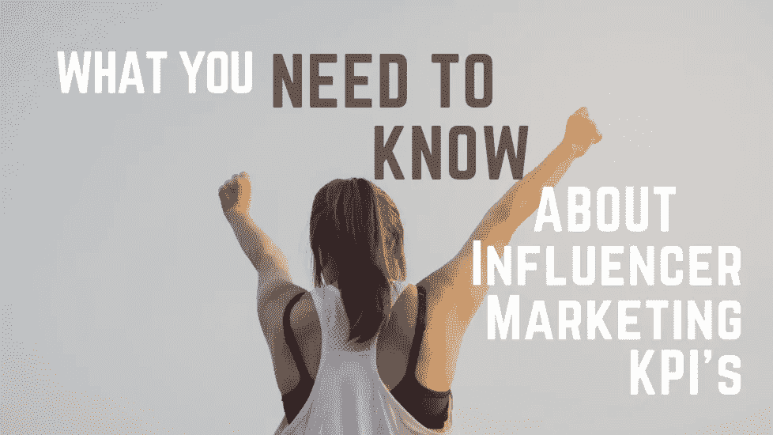
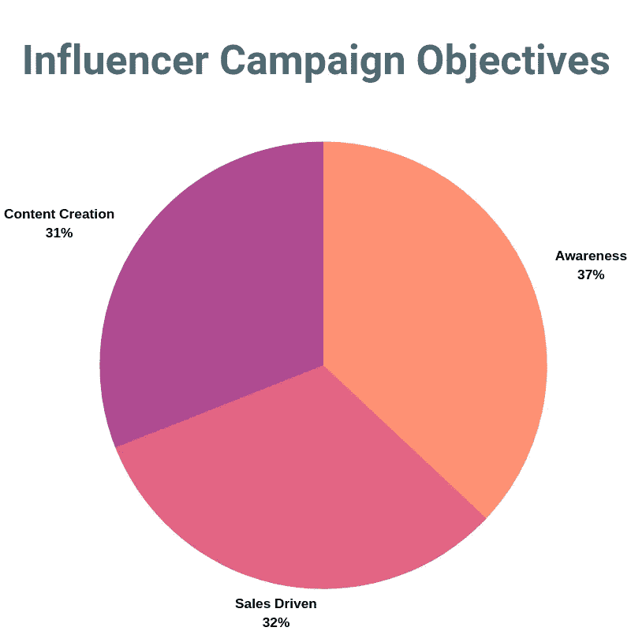
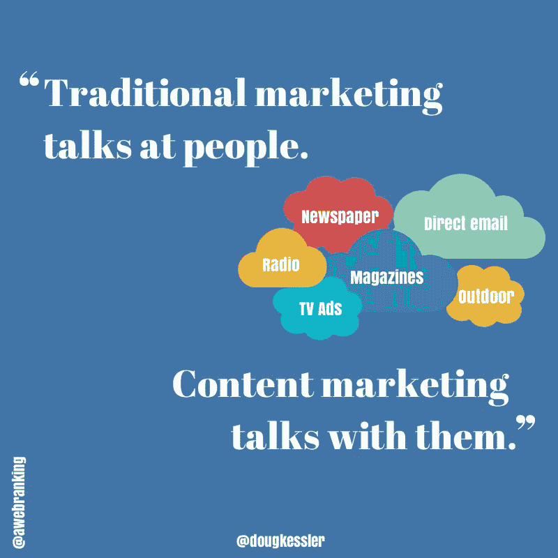

# 关于影响者营销 KPI，您需要了解什么

> 原文：<https://medium.com/swlh/what-you-need-to-know-about-influencer-marketing-kpis-f6ffd343f39a>

为了了解你的活动是否成功，你需要知道如何衡量成功。考虑到这一点，您的影响者营销活动将需要一套协调一致的关键绩效指标。KPI 会根据你的目标而有很大的不同。影响者营销活动的投资回报率可能难以准确衡量，因此许多品牌正在转向其他目标。

关于营销人员为什么开展影响者营销活动，出现了三个主要类别。最主要的类别是认知度，37%的营销人员表示他们为此使用影响者营销。仅次于认知度的是增加销售额，32%的受访者表示这是他们的主要目标。最后，31%的营销人员表示，他们发起影响者营销是为了建立一个用户生成内容的库。每个独特的目标都有自己独特的一套关键绩效指标。

# 认知驱动的影响者营销 KPI

在意识驱动的活动中，有四个标准指标需要你密切关注。

**社交范围**:每个发布帖子的影响者的所有追随者的总和。《出埃及记》10 个有影响力的人发表了帖子，每个人都有 10，000 名粉丝。总社会影响将达到 100，000 人。

**印象**:不幸的是，Instagram 不会直接给出印象数据。这里有一个变通办法:确保你的影响者有一个商业账户，在他们的赞助帖子上传七天后，你可以要求他们向你发送帖子见解，在那里可以找到印象。

**CPM** : CPM 是每 1000 次展示的成本。你会发现，微影响者营销 CPM 可能比其他漏斗顶端计划更昂贵。请记住，你是在为更高的质量买单。宏观影响者和名人可以看到低于 1 美元的 CPM，但目标印象较少。纳米影响者和微影响者产生一些最高质量的漏斗顶端流量。

**跟随者成长**:简单一个。竞选开始时你有多少追随者，竞选结束时你有多少追随者？这不是一个坚如磐石的指标，但它可以表明有多少新的人发现了你，喜欢你到想要进入你的内容世界。

Breakdown of influencer marketing campaign objectives

可以在谷歌工作表或 Excel 电子表格中手动跟踪所有这些。然而，使用像[这样的平台可能会允许自动内容录制。MightyScout 将捕捉你的赞助帖子，并给出用户友好的报告，详细说明社交范围、喜欢、评论和参与率。](https://mightyscout.com/)

通过认知驱动的活动，确保您的影响者使用适当的行动号召。如果你追求的是保持真实可信，就不要提供折扣代码或鼓励过度的促销信息。相反，你可以让你的影响者将流量引导到你自己的 Instagram 页面，这样他们就可以关注你的品牌，了解最新的信息。或者，你可以将流量发送到补充内容，如博客或网络研讨会，在那里你可以提供与你的产品相关的更多价值，同时收集像素数据以将其重新定位到 Instagram。

# 销售驱动的影响者营销 KPI

不出所料，销售驱动的影响者活动将会有不同于单纯关注认知的 KPI。你可以简单地为通过社交媒体渠道进行的销售建立一个基线，并在激活你的活动中的影响者后注意到差异，但有几个更好的方法可以做到这一点。

**优惠券代码**:如果你想单独跟踪任何给定影响者产生的销售，你可以简单地向他们提供你的产品 X%的折扣代码，你就可以轻松地跟踪他们产生的每一笔销售。这样做的缺点是，你得不到 UTM 电码提供的交通数据。此外，这会让标题不那么真实，并减少你的利润。如果您使用优惠券代码，请确保它们易于记忆并在结账时插入。像 RerR23Z 这样的优惠券代码几乎是不可能记住的——试试像 Emily10 这样简单的代码。Instagram 在应用外浏览的方式意味着客户必须退出应用内浏览器(当他们在结账时)并返回到标题以获得优惠券代码——然后再次重复整个销售和结账过程。

**使用 UTM 代码**:给有影响力的人一个特定的链接，跟踪他们发送到你网站的用户。 [UTM 代码很容易构建](https://effinamazing.com/tools/utm-tracking-code-builder/)，你可以马上开始使用它们。由于链接不能在应用程序的标题中点击，你可以让影响者将链接放在他们的简历中，在他们的 Instagram 故事中作为“向上滑动”链接(仅适用于 Instagram 上有 10K+粉丝的账户)，或者在 IGTV 视频描述中。然后你可以访问你的谷歌分析，跟踪你想要的每一个小细节。

关于销售驱动的影响者活动的第 22 条军规是，利用跟踪和测量方法可能会无意中降低活动的有效性。使用 UTM 代码或优惠券代码降低了赞助内容的真实性——感觉更像是被卖给了别人。

# 内容驱动的影响者营销 KPI

创建一个动态的、原创的、独特的内容库可能会非常昂贵，并且会使用大量的资源。许多品牌现在都在呼吁纳米影响者来帮助减轻负担。许多人认为纳米影响者[是影响者营销的未来](https://introfuel.com/2019/05/31/nano-influencers-who-they-are-and-why-they-matter/)，因为他们已经是创造大量内容的最有效方式。许多品牌还发现，与微观或宏观的同行相比，纳米影响者正在推动更高的投资回报率和更多的销售。

如果你的最终目标是建立一个惊人的内容库，那么你在寻找有影响力的人时要格外小心。评估影响者的传统标准被推到了一边。追随者数量变得几乎无关紧要，而对品牌的敏锐眼光走得更远。

在内容世界里，参与是王道。如果你的内容能引起观众的共鸣，他们就会参与进来。如果没有引起共鸣，每次都会滚动过去。确保每一条内容都有价值，并在你的[活动简介](https://introfuel.com/2019/05/28/how-to-increase-roi-w-influencer-campaign-briefs/)中给出方向，这样内容就可以很容易地用于其他营销媒体。以下是内容驱动型影响者营销活动中您需要了解的关键绩效指标。

总评论数:汇总来自你的影响者帖子的所有评论。

**总点赞数**:统计你所有影响者帖子的所有点赞数。

**参与度**:你可以使用在[工具&平台找到的参与度计算器，让你的生活更轻松](https://introfuel.com/development-kit/)，或者你也可以用老办法。

**点击量**:衡量访问你网站的新用户总数——这有助于衡量品牌认知度的提高。你需要一个 UTM 代码，它只能在某些地方使用(不是 Instagram 的网格帖子)，但它是一个很好的指标，表明内容是否能激发观众的行动。

**数量**:影响者上传和提供的内容的原始数量。确保在内容驱动的活动中，你有足够多的纳米影响者被激活，以真正创建一个强大的产品组合。

考虑到所有这些，你下一个活动的目标是什么？你会创造一个惊人的内容集合吗，你会比以往推动更多的销售吗，或者产生有针对性的意识吗？它是现成的，只是要确保在开始活动之前有合适的 KPI。