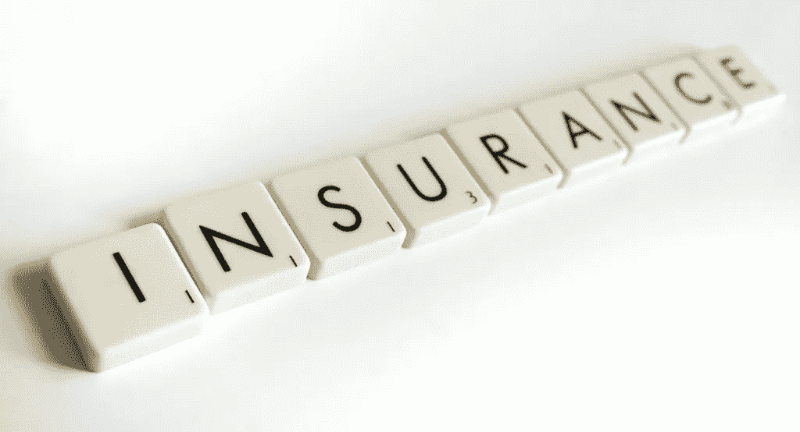
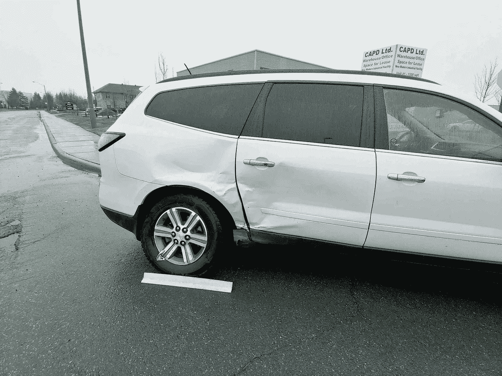

# 开始职业生涯时你需要了解的保险知识

> 原文：<https://medium.com/swlh/what-you-need-to-know-about-insurance-when-starting-your-career-3cd6b6ed6b00>

保险……你花钱买的东西，但希望你永远也不会用到！但更大的问题是你需要哪些，需要多少？

这是很容易避免和不计划的，尤其是当你年轻的时候。

大多数人宁愿把钱花在生活中的其他事情上。

这看起来很复杂，而且可能是情绪化的话题，尤其是讨论人寿保险或遗产规划……谁愿意谈论他们去世或生病时会发生什么，谁会得到他们的钱？

我不是说这很容易，也不是说在我 19 岁的时候我很关注它…但这应该是我开始的时候。

> 如果你选择简单的生活方式，生活会变得更加艰难。如果你从生活中走出来，生活会变得容易些。

想一想…早点开始会让你在将来比同龄人更有优势，这甚至不公平。

为什么我们首先要买或需要保险？在一个完美的世界中，没有人会需要它，但事实是，这个世界并不完美，大多数人在生活中的某个时候都会遇到一些事情，如果没有保护和准备，会对他们、他们的生活方式、他们的家庭和所爱的人造成严重的伤害。

保险是对不可预见事件的保护。你买这个是为了“最坏的情况”。这可能是你一生中唯一会购买的东西，希望你永远不会用到它！

例如，如果你想驾驶机动车，有些是法律要求的，如果你想买房，有些是人寿保险。

但是一些如医疗或残疾保险是可选的，许多人选择不购买。我强烈建议每个人都看看自己的现状，并通过适当的保险来规划自己的未来。这不是一项支出，但在我看来，这是对你未来的投资。

我不是保险顾问，也没有保险出售或以任何方式附属于保险公司。然而，我是一名教育工作者，我想通过我们的[职业年学院](http://www.careeryearacademy.com)和这些文章来教授重要的真实生活技能，这将改变人们的生活。

> 今天我将介绍你想了解和考虑的职业生涯中的 5 种保险。

# **1。** **车辆保险**

到目前为止，你有可能一直开着你父母的车，或者他们一直在为你支付保险。我相信他们已经告诉过你，或者你已经知道，当你年轻的时候，它并不便宜！

如果你想开车，或者有些人可能有摩托车或任何机动车辆，这种类型的保险是必需的。车辆保险是必要的，并且在发生事故时对你的车辆或与你相撞的车辆的损失都是有价值的。

此外，在实际车辆或车内贵重物品受伤、着火或被盗的情况下。

忠告…没有适当的保险不要开车！！只是不要，不值得冒险。关于车辆保险，你想知道的是，有一些具体的事情会影响你的费率。

保险公司基于历史数据和人口统计数据。

年龄:你越年轻，价格就越贵。年轻司机的平均事故率更高。

**性别:**男司机年轻时容易发生更多事故，因此他们的保险也更多。不要开枪打信使！不是说公平…只是这个时间点的情况。我很高兴在这部电影中有 3 个女孩和 1 个男孩！另一方面，老年男性的事故比女性少，所以随着年龄的增长，男性的事故率比女性略低。

**车型**——如果你购买一辆价格高得多的跑车。我记得我的第一辆车想要一辆鹰爪跑车…太棒了。我爸爸帮我改变主意，买了一辆道奇 Daytona，我以为它是一台割草机的发动机…但至少我的保险更低，也没有被开超速罚单的风险。

**驾驶历史。发生事故、超速罚单，甚至是没有保险或酒后驾车的糟糕驾驶，都会极大地影响你的费率，以至于有些人几乎无法承担驾驶费用。**

## **关于车辆保险的建议**

确保你在任何时候都有适当的保险。不要冒险不值得。

**货比三家了解价格。不同产品的价格差异很大，尤其是现在有了互联网，你可以在购物时找到更好的价格。**

**在购买跑车或豪华车之前，检查潜在利率。**根据您选择的交通工具，您会对费率的差异感到惊讶。

负责任地开车，最终会为你节省很多时间。驾驶是一种特权，在我们未来得到无人驾驶汽车之前，如果我们能到达那里的话……你会想继续上路。

Happy my wife and daughter escaped this collision safe and sound…and that we had proper insurance.

# **2。人寿保险**

为什么你在 18 岁、19 岁或 49 岁还需要人寿保险？好问题。首先，我们来看看人寿保险的设计目的是什么，它是如何工作的。

这个想法是，在一段时间内，你将支付一定数量的钱给保险公司。作为回报，他们会为你支付一定数额的钱，以防你去世。这是对不可预见事件的保护。

没有人打算明天就离开人世，思考和谈论这件事并不有趣。但是拥有适当的保护和保险是很重要的。

我会更进一步，并声称这可能是你能做的最无私的事情之一…把钱花在你个人永远不会得到的东西上(记住，你不会在那里),并保护你所爱的人免受额外的悲伤和压力，在这个时候，财务应该是他们头脑中的最后一件事。

人寿保险可以用来支付丧葬费用，这可能比人们想象的要贵得多。葬礼、埋葬和相关活动的费用高达 10，000 美元或更多，这并不罕见。

我今年 40 岁，我的许多朋友开始失去他们的父母，大多数人失去了他们的祖父母。不幸的是，许多人没有合适的人寿保险，只是让他们的孩子承担起为此筹钱的负担。

如果你有未偿还的债务，人寿保险也很重要，这样你就不会把债务留给你的父母、孩子或配偶。

如果你有配偶和孩子呢。想象一下，让我的妻子带着 4 个孩子，而我却没有收入来养家糊口！

想象一下，当她应该考虑的最后一件事是钱或如何支付抵押贷款，而只是专注于与孩子在一起时，必须独自支撑家庭的压力。

**年轻时购买保险的好处有 2 折:**

1.  **越年轻越便宜！**在你 20 岁出头的时候，如果你是一名健康的候选人，你可能会购买一份 25 万美元的定期保单，用于每月外出吃饭和看电影的费用。年龄越大，等待的时间越长，价格就越贵。

**2。你可能还是健康的。**随着年龄的增长，开始出现糖尿病或高血压的迹象，或者你发现自己患有退化性疾病，试图获得保险。

如果不是几乎不可能的话，获得未来的保险将是非常困难的。但是如果你已经买了一份保险……只要你继续支付保险费，你就可以继续投保。所以为什么要冒这个险。

人寿保险有 **2 大类，称为**定期和全**。**

现在我不会详细讨论哪种策略是最好的，因为这需要更长的时间和更多的细节。另一个原因是，我不是认证或注册的保险专家。

我们在这里的目的只是提供信息，让你了解更多关于这个主题的知识。

就这个问题和专家谈谈，找出最适合你的方法。但是为了让你有足够的知识来问这个问题，这里是他们是什么。

定期保险是一种在特定时间内为您提供保障的保单。比如说，你有一份 25 年期的保单。这意味着在 25 年的时间里，你将每月支付保险费。

如果在这 25 年里你发生了什么意外，你会受到保护。25 年后，两件事情中的一件发生了。保单终止，或者您的保费根据您的新年龄、健康状况等而上涨。

**整体保险**是一种你将支付预定时间的保单，但该保单将支付你一生的费用，不管你活了多少岁。

所以你可能也要为保单支付 25 年，但不像定期保单会在合同结束时终止……在这种情况下，你停止支付，但保单仍然有效。

定期保单的主要优势在于它更便宜，尤其是当你年轻的时候，你可以花更少的钱获得更多的保险。缺点是，随着年龄的增长，你可能需要更多的保险，这时候保险会变得更加昂贵。

整个保险的主要优势是你支付一定时间的费用，然后你就永远被保险了。**的主要缺点**是预先购买保险会更加昂贵。

利弊都有，这真的取决于你和一个专业的保险代表，看看在你人生的这个阶段什么是最适合你的。或许两者的结合也能奏效。再次与专家交谈。

# **3。住宅保险**

这种保险包括你的住所。房子或公寓。这是一个很重要的问题，因为太多的学生搬进了公寓，却忘记了投保。

众所周知，家庭保险为你提供盗窃、火灾和损害赔偿。你也要确保你投保以防洪水或地震，例如，如果你住在一个容易发生这种情况的地区。

如果有人在你的财产上受伤，你也要投保。一个送货员去你家，滑倒了，因为你没有把台阶上的冰拿出来或者你的狗咬了他什么的。在所有这些情况下，适当的保险都会为你提供保障。

如果你只是租了房子或公寓，你仍然希望保险覆盖你的个人物品。这就是所谓的**租房保险。**

即使房东/业主有自己的保险来保护建筑本身，你也希望有保险来保护你以防被盗、水灾、火灾、伤害等。

# **4。伤残保险**

这是在您因医疗或受伤原因无法工作的情况下提供的保险。

如果你遭遇事故或在工作中受伤，或生病无法工作，你希望能够继续为你和你的家人提供收入。

伤残保险就是为你设计的。你从事的工作类型风险越大，奖金就越高。

通常情况下，雇主会在你的福利包中包含这一部分，所以检查一下你是否包含在内，然后决定你是否应该自己购买额外的保险。

# **5。医疗保险**

这是我想谈的最后一个问题。这种保险旨在涵盖医疗和辅助医疗需求。

考虑处方药、物理疗法或按摩疗法、长期康复、视力保健、牙科保健、住院治疗，以防您在其他国家或如果您居住的州或国家不提供全民医疗保健。

年龄越大，价格越贵。许多雇主提供这种保险。一些政策提供了比其他政策更好的保障，所以在接受工作机会前检查一下。

有时拿更少的工资，但有更好的保障是值得的，这取决于你的情况。如果你的雇主没有医疗保险，那么你可以通过专门提供这类保险的保险公司自行购买。

再次，货比三家，因为他们的利率差异很大，只拿你需要的…大多数政策提供自助餐式的选择，所以获得专业意见，选择一个适合你的。

关于保险的最后一句话——没有人喜欢为它买单，你永远也不会用到它，但是如果你用了……你会很高兴你拥有它。