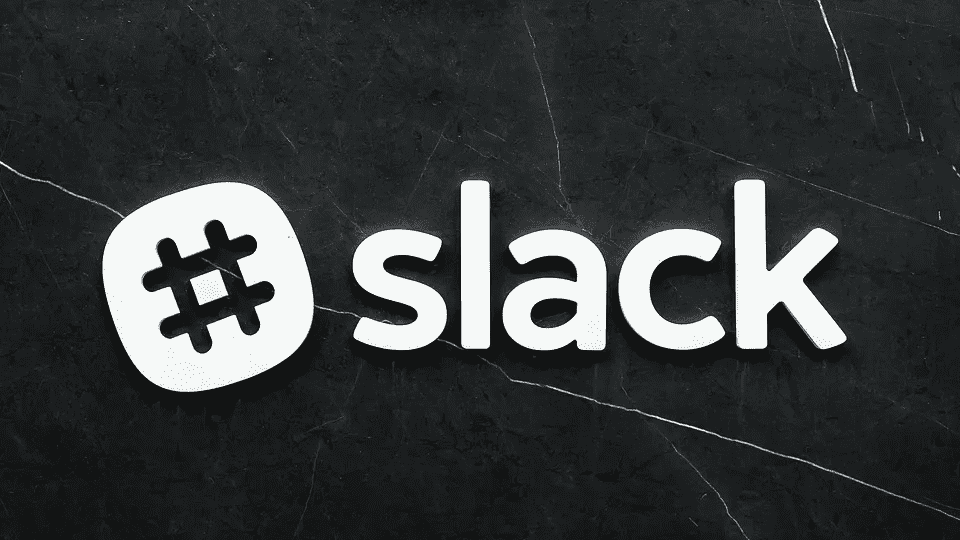

# 你需要知道的:Slack 的 IPO

> 原文：<https://medium.com/swlh/what-you-need-to-know-slacks-ipo-this-week-50a7125e72dd>

One of the Tech’s hottest IPOs of the year

今年最热门的科技 IPO 之一将于 6 月 20 日在我们家门口举行。随着 Zoom 和 Spotify 等大型科技公司今年占据了中心舞台，Slack 也很快加入进来。

Slack Technologies Inc .本周在纽约证券交易所以 SK 的名称上市时，投资者预计其估值约为 160 亿至 170 亿美元。