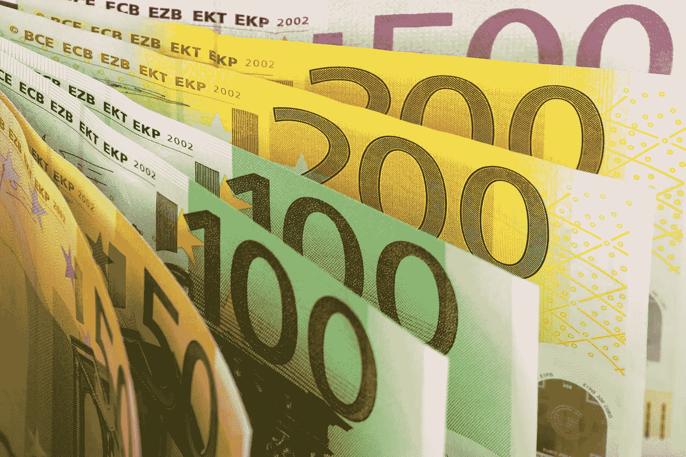

# Whatagraph 必须每月为其€3M 估值的 6250 份营销报告应用订阅开具发票

> 原文：<https://medium.com/swlh/whatagraph-must-invoice-6-250-marketing-report-app-subscriptions-per-month-for-its-3m-valuation-9eae24bcd540>

在其溢价计划中，荷兰/立陶宛初创公司 Whatagraph 向企业出售营销报告应用订阅，每月每订阅 200€T2。

他们刚刚从[开圈资本](http://www.opencirclecapital.lt/)等人那里募集了 [€60 万](https://twitter.com/whatagraph/status/1103243943389601793)。

# 估价

假设 Whatagraph 向 Open Circle Capital 出售了 20%的股权。

那么它们在€的估值为 60 万英镑/20% =€300 万英镑。

# 出口

假设这是一轮种子期。

开放圈资本想从赢家身上赚 10 倍。

他们需要 2 倍来补偿稀释。

然后，他们希望从投资中获得 10 * 2 = 20 倍的回报。

Whatagraph 需要一个€3M * 20 =€6000 万的退出价值，才能获得€300 万的估值。

# 收入

假设 Whatagraph 的交易价格是 12 个月收益的 4 倍。

没有现金和债务。

那么，他们需要€6000 万英镑/ 4 月 12 日=€130 万英镑的平均月收入，才能获得€300 万英镑的估值。

# 捐款

Whatagraph 向€的企业收取每月 200 英镑的订阅费。

然后，他们必须每月向企业开具€130 万/€200 = 6250 份订阅的发票，以获得€300 万的估值。

背景:[荷兰](https://ec.europa.eu/docsroom/documents/32581/attachments/21/translations/en/renditions/native)在 2018 年拥有 11000 家中大型企业。

# 自己动手

不同的假设？那当然有可能！

复制一份用于这篇文章的[电子表格](https://docs.google.com/spreadsheets/d/1dldayGUK5sLcpwp56FYYcUClgyNW5PDrHdv1UntvkJM/edit?usp=sharing)(文件>复制一份…)，加入你的假设并得出你自己的结论。

*原载于 2019 年 3 月 18 日*[*venturevalue.com*](https://venturevalue.com/whatagraph-must-invoice-6250-marketing-report-app-subscriptions-per-month-for-its-e3m-valuation/)*。*

## 这篇文章发表在 [The Startup](https://medium.com/swlh) 上，这是 Medium 最大的创业刊物，拥有+435，678 读者。

## 在这里订阅接收[我们的头条新闻](https://growthsupply.com/the-startup-newsletter/)。

