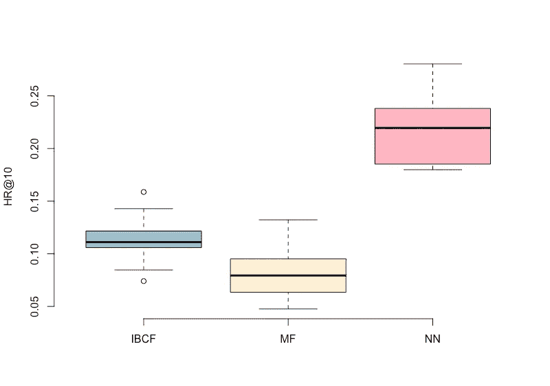

# 神经网络推荐器里有什么

> 原文：<https://medium.com/swlh/whats-in-a-neural-network-recommender-a6fb9fb8cb37>

基于项目的协同过滤(IBCF)算法[在 2017 年获得了](https://pdfs.semanticscholar.org/0f06/d328f6deb44e5e67408e0c16a8c7356330d1.pdf)的“时间的考验”认可，比 AlphaGo Master 晚了一年，谷歌可以学习下围棋的神经网络[赢了](https://www.computer.org/csdl/magazine/ic/2017/03/mic2017030012/13rRUB6SpQq)最聪明的人类围棋选手之一 Lee Sedol。

在工作中，我总是喜欢选择简单的算法，而不是更复杂的算法——当两者的性能相似时——简单的算法运行和实现所需的时间更少，但现在无法抑制地发现一个基本的神经网络自动编码器如何执行建议，特别是在神经网络和深度学习的所有宣传中，以及从训练到生产都可以轻松实现神经网络模型的软件包(read: tensorflow)的可用性。

让我们看看一个简单的自动编码器(一个输入和输出一样多的神经网络)如何与经典的 IBCF 算法竞争。

我们将使用 [MovieLens 100K](https://grouplens.org/datasets/movielens/100k/) 数据集，并且我们将在[隐式模式](http://www.cs.carleton.edu/cs_comps/0607/recommend/recommender/collaborativefiltering.html)中使用它，这意味着推荐器将基于每个用户的已知电影评级来预测一个人还会观看哪些电影(或者，严格地说，评级)。

为了使数据集对应于隐式表示，如果是任何评级，则评级被转换为 1，否则转换为 0。术语“交互”被进一步用来描述用户已经对给定电影进行评级的事实。

数据分为训练和测试，80%和 20%。

通过从每个用户的交互集合中隐藏一个交互，输出 *k* 个最佳推荐，并在 *k* (HR@k) *，* HR = TP / P 处评估平均 [*命中率*](https://en.wikipedia.org/wiki/Confusion_matrix) (在我们的设置中，P 总是 1，因为每个用户只有 1 个隐藏的交互，而 TP 可以是 1 或 0，这取决于隐藏的交互是否是推荐的集合【T2

所选的性能指标根据隐藏的项目而变化，因此对每个模型执行 10 次性能评估，并报告平均 HR@k。

几个辅助函数([此处可用](https://gist.github.com/dimalvovs/7b27b75159437ec2d1a6ab1008eb5e2e))用于格式化数据、评估性能和进行预测:

*   **makeRecommendlabTrainSets()**将数据格式化为用户项二进制矩阵，将数据拆分为训练集和测试集；
*   **mask interaction()**is**用于删除一个用户交互，以便能够稍后用模型重建它，这对评估模型性能很有用；**
*   ****assessGuess()** 将实际丢弃的交互与由模型——IBCF、NN 和简单预测提出的交互列表进行比较 *k* 最频繁出现的电影；**
*   ****netPredictOne()** 是一个包装器函数，使用 NN 模型进行一次预测，对本文来说有点多余，是我在另一个项目中使用的；**

**对于经典算法，来自 R 包[推荐器 lab](https://cran.r-project.org/web/packages/recommenderlab/index.html) 的项目-项目协作过滤算法用于所有默认设置，对于 NN 模型，它是一个简单的自动编码器，具有一个大小为输入大小 1/3 的隐藏层，用 [keras](https://cran.r-project.org/web/packages/keras/index.html) 训练。为了将这两种模型与最简单的替代方案进行比较，我们还评估了一种最常见的相互作用模型，即 MFM 模型。所有的模型都预测了 top *k* =10 个交互。**

**可重复结果的完整代码可在获得[。](https://gist.github.com/dimalvovs/d884ace8318b9a4e674d1ecc75b5ff6d)**

**神经网络模型是最准确的一个，其 HR@10 为 0.22，是 IBCF 模型(0.11)的两倍，几乎是最频繁相互作用模型(0.08)的 3 倍。**

****

**IBCF 模型推荐精度对应于由 [others](https://lyst.github.io/lightfm/docs/examples/movielens_implicit.html) 在相同数据集上获得的精度。正如所料，MF 模型的准确性最低。**

**在我们比较神经网络和 IBCF 模型的隐式推荐的小实验中，神经网络表现得令人惊讶地好，比经典的 IBCF 模型好得多。然而，根本没有发生数据清理，也没有为 IBCF 模型尝试各种距离度量。此外，除了隐藏层的大小或输入大小的 1/3 之外，没有进行超参数调整，这在以前的经验中效果最好。**

**当训练 NN 模型时，测试集和验证集是相等的，因为数据集非常小，但是在训练期间不使用测试集并且当训练误差没有改善时停止产生相同的结果。**

**通常，我对使用神经网络来学习机器生成的数据(图像/视频/声音)以外的任何东西持怀疑态度，但考虑到向神经网络提供辅助输入数据是多么容易，并且可能进一步提高推荐质量，神经网络似乎有机会成为更好的推荐器。**

*   **[Autoencoder 推荐文章](/@connectwithghosh/recommender-system-on-the-movielens-using-an-autoencoder-using-tensorflow-in-python-f13d3e8d600d)，可惜没有性能评估**
*   **[一篇关于去噪自动编码器的论文](http://www.cse.scu.edu/~yfang/ACDA.pdf)征求建议，由于某种原因结果大相径庭**
*   **[light FM python 模块中 IBCF 方法](https://lyst.github.io/lightfm/docs/index.html)的类似结果**
*   **另一篇 [autoencoder 文章](https://blogs.rstudio.com/tensorflow/posts/2018-01-24-keras-fraud-autoencoder/)是我用来获得灵感的，写得非常好**
*   **[多个输入和输出网络](https://keras.io/getting-started/functional-api-guide/#multi-input-and-multi-output-models)**