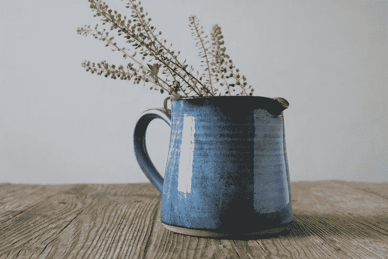
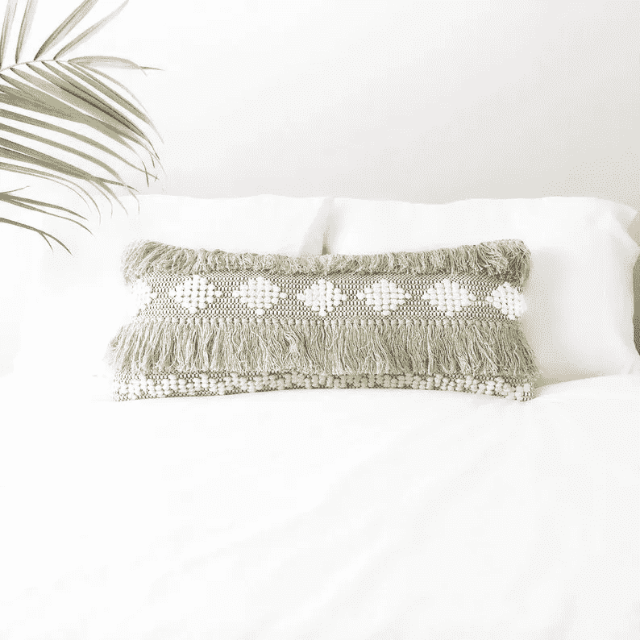
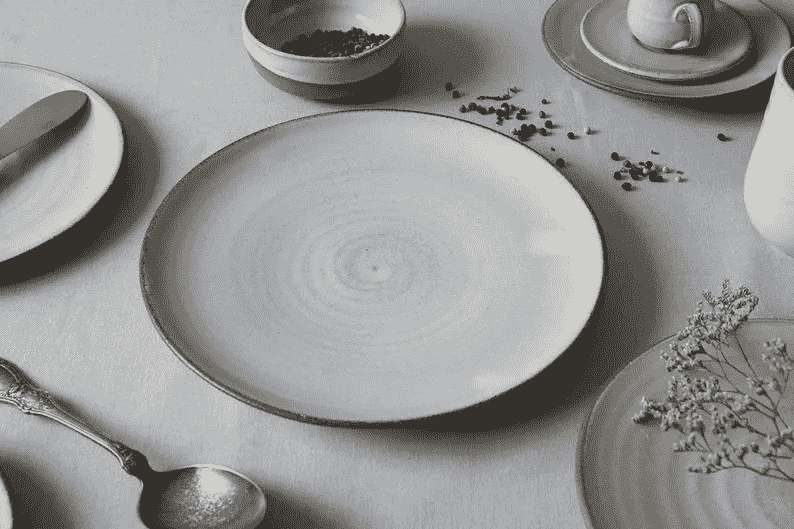
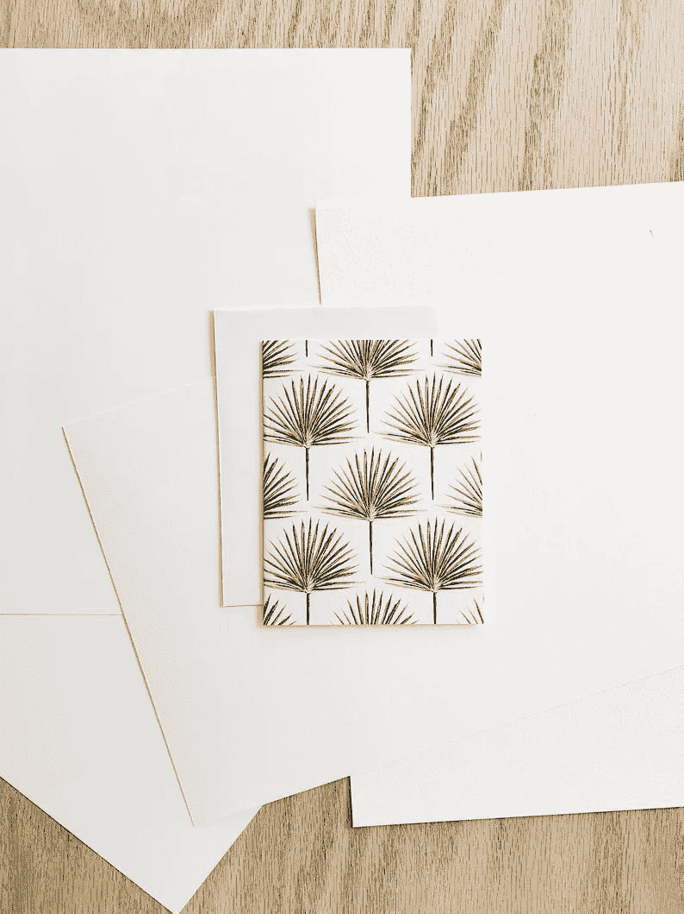
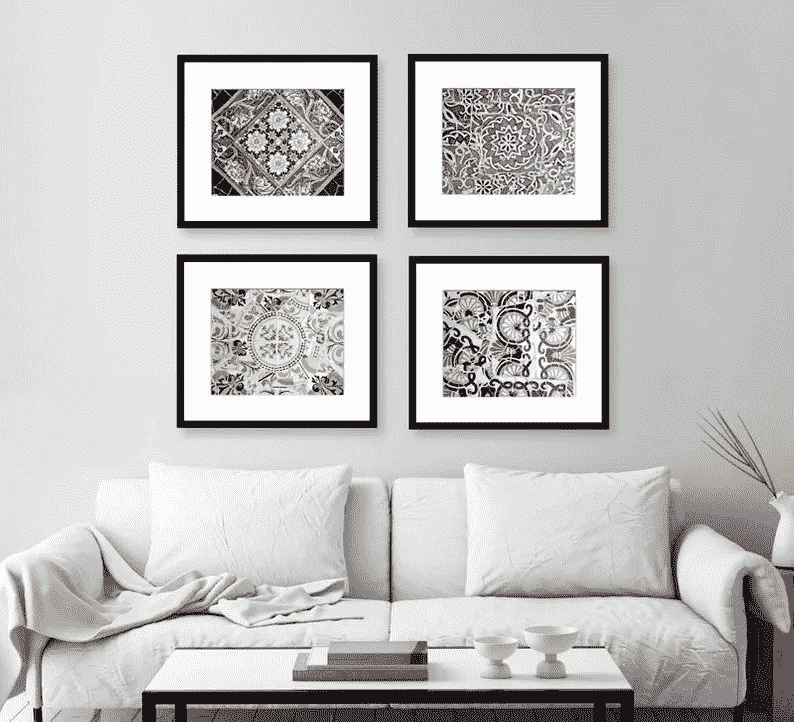

# 我的购物车里现在有什么

> 原文：<https://medium.com/swlh/whats-in-my-etsy-cart-right-now-43571875f3ab>

> 做伟大工作的唯一方法是做你喜欢的事情//史蒂夫·乔布斯

如果你没有花时间在 Etsy 上，准备好被打倒吧。如果你在 Etsy 上呆过，你就会明白，在浏览了一个允许近 200 万人在国际上分享他们的激情的不可思议的平台后，获得灵感是多么容易。最棒的是，86%的了不起的创客都是女性！下面，我有 4 个结合了工艺和实用性的优秀店铺。支持女性从未如此容易。

1.  [**哦小种子**](https://www.etsy.com/shop/OhLittleSeed)**——来自得克萨斯州达拉斯的杰基**

纹理很容易成为我在项目中最喜欢的设计元素。它可以像你希望的那样强大，成为人们开始设计之旅的好地方。哦，Little Seed 的抱枕、地毯和篮子是更加经典、整洁的房间的完美波西米亚风格。如果杰姬的商店还不够梦幻，她还会将每笔销售额的 10%捐给避难所城市，这是一个帮助人口贩运受害者的非营利组织。

**2。******—来自以色列特拉维夫的 Gigi****

****

**你能想象在一个陶瓷工作室里制作市场上最受欢迎、最实用的产品吗？Gigi 很幸运能有这样的生活。她从自然和时尚中获得灵感，这一点贯穿了她的整个店铺。手工陶瓷厨具是提升厨房和用餐体验的完美方式，彰显您的独特风格。**

****3。**[**Jaye Bird FL**](https://www.etsy.com/shop/JayeBirdFL)**—来自佛罗里达州塞布林的 Jaye****

****

**如果你问我最喜欢以下哪个:文具、包装纸或定制画，我会很难决定。Jaye 在 2017 年推出了她的水彩系列，扩展到图形资产和梦幻的定制家居肖像。她的 Etsy 商店激发了一种奉献和感恩的情感，这是互联网(和世界)更需要的。**

****4。** [**阿廖沙·布朗照片**](https://www.etsy.com/shop/AllysonBrownPhoto) **—弗吉尼亚州亚历山大市的阿廖沙****

****

**阿廖沙·布朗的照片在我心中有着特殊的地位。上面展示的西班牙瓷砖印花，是我在西班牙留学后，于 2017 年送给自己的大学毕业礼物。它们骄傲地挂在我们的卧室里，仍然是我最喜欢的作品！除了瓷砖，Allyson 的 Etsy 商店还有适合任何人风格的优质印花。我喜欢现实主义，并且一直渴望不要千篇一律的装饰。**