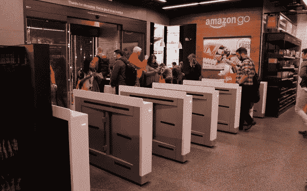

# 智能结账有什么新功能？

> 原文：<https://medium.com/swlh/whats-new-in-smart-checkout-66c56bd2d452>

Shoppers love the convenience but many state laws require retailers to sustain cash options.

没有收银员的商店(如 [Amazon Go](https://venturebeat.com/2018/12/12/amazon-go-cashierless-stores-get-compact-for-office-workers/) )标志着更多的零售中断，验证了 Forrester research 的一项发现，即 50%的买家不会返回结账时间超过[五分钟](https://www.supermarketnews.com/retail-financial/customers-waiting-hardest-part)的商店。

**智能结账的商业价值是什么？**

有了智能收银台，买家只需“T8”走出“T9”无收银台的商店，这些商店使用人工智能和计算机视觉技术来识别他们(和他们购买的商品)，自动收费并送他们上路。购物者表示，智能结账将他们的店内购物时间减少了一半。

智能结账从因无法接受的等待时间而放弃购买的客户那里挽回损失的销售额。此外，收银员将新腾出的时间重新分配给利润更高、以服务为主导的产品。

零售经理利用其他地方的技术。智能结账数据可用于推动更好的 POS [销售](https://hbr.org/1983/11/better-marketing-at-the-point-of-purchase)决策，同时为[商店设计](https://www.shopify.com/retail/120057795-how-to-create-retail-store-interiors-that-get-people-to-purchase-your-products)、个性化和有针对性的促销提供信息。智能结账技术还可以用于实时[商店监控](https://www.happiestminds.com/Insights/real-time-store-monitoring/)、库存管理[、损失预防](https://www.shopify.com/retail/retail-loss-prevention)和个性化促销。

智能结账是如何部署的？

大多数零售商通过移动应用程序提供这一功能，而其他零售商则为没有智能手机的买家提供设备。

在中国，部署最常见于杂货店和便利店，在这些地方，购物者不需要袋子，或者习惯于将自己购买的东西装袋。Bingo Box、阿里巴巴、京东和腾讯使用 Scan & Go 移动应用程序、RFID 和人工智能结账来实现无收银体验(他们在亚马逊之前部署了这些应用)。

一些供应商提供[白标](https://futureproofretail.com/platform)扫描& Go 应用程序，这些应用程序可以集成到零售商的应用程序中，也可以作为单独的扫描& Go 应用程序部署。

**挑战是什么，如何克服？**

全国零售联盟估计每年大约有 140 亿美元[损失在扫描规避上。这些方法并不完全防欺诈，如果手持产品的客户视线受到影响，计算机视觉可能会失败。零售商可以使用人工智能来解决这个问题(见下文了解更多)。](https://www.pymnts.com/news/retail/2018/nrf-orc-crime-fraud-scan-avoidance/)

在美国，费城禁止无现金商店，这需要现金支付选项。新泽西州刚刚通过了类似的禁令；华盛顿 DC 和纽约州也在考虑类似的立法，将无现金商店列为非法。零售商应该将现金作为一种选择(就像 EZpay 收费高速公路、桥梁和隧道上仍然存在现金线一样)。

在奢侈品细分市场，零售商应考虑整个顾客旅程(鉴于这些顾客期望高服务水平)。零售商应该在智能结账可能造成竞争劣势的场景中测试这个想法。

**了解更多:**

[AiFI 计划扩大免费结账店的规模](https://www.pymnts.com/innovation/2018/visa-aifi-checkout-free-grocery/):一家初创公司如何帮助杂货店确定在哪些日子和时间取悦和追加销售某些类型的顾客，同时减少他们的结账时间。

[中国在无收银商店方面领先于亚马逊，也落后于亚马逊](https://qz.com/1185081/amazon-go-china-is-both-ahead-of-and-behind-amazon-in-cashier-less-stores/)。尽管中国无收银商店的快速发展表明，中国正在以比美国更聪明的方式部署智能结账，但它在其他领域落后了。

[人工智能帮助零售商在自助结账时抓小偷。](https://newyork.cbslocal.com/2018/01/31/self-checkout-technology/)人工智能如何读取和标记结账行为，当场质疑可疑交易，并在任何人被贴上小偷标签之前纠正错误。

法律可能会成为无现金零售商的绊脚石。当前的智能结账技术排除了没有检查账户或信用卡的人，这在几个美国城市引起了立法行动。