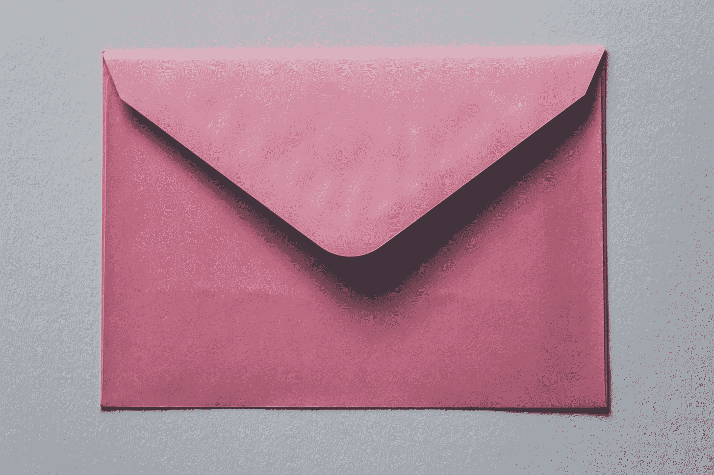

# 电子邮件到底有什么好的？

> 原文：<https://medium.com/swlh/whats-so-great-about-email-anyway-6ce89d67c305>

## *在这个社交媒体铺天盖地的时代，我们为什么需要拥有自己的平台*

Photo by [Siora Photography](https://unsplash.com/@siora18?utm_source=medium&utm_medium=referral) on [Unsplash](https://unsplash.com?utm_source=medium&utm_medium=referral)

我有点偏见，我首先承认。多年来，电子邮件一直是我最喜欢的销售渠道。虽然有更快的销售方式，但对大多数企业家来说，电子邮件是最好的均衡器。当我们使用电子邮件时，我们控制着信息，我们拥有自己的客户名单。