# SaaS 有什么好的？

> 原文：<https://medium.com/swlh/whats-so-great-about-saas-af5324cab20>

# 探索 SaaS，它意味着什么，为什么你可能需要打电话给你的母亲。

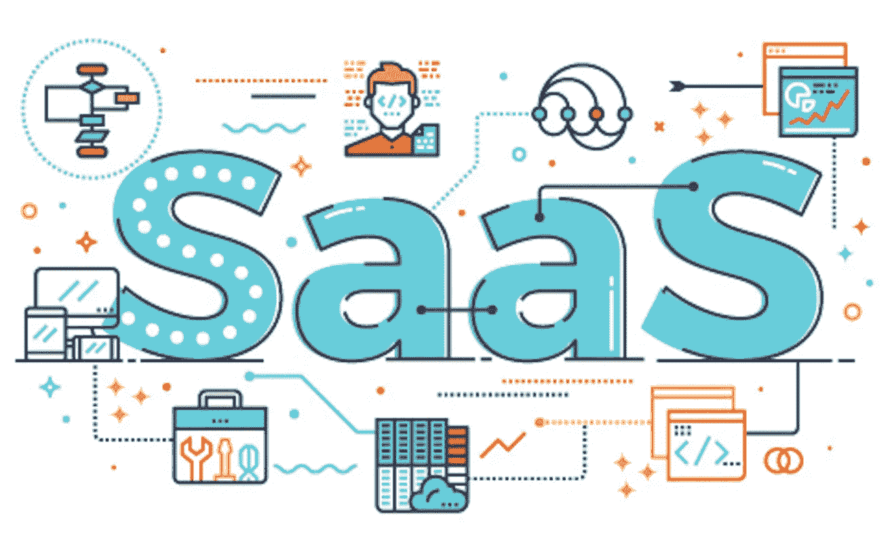

所以你决定要在一家很酷的科技创业公司里从事某种职业。你是一名工程师、设计师、产品负责人、文案或其他很酷的人，你对开放的公司文化、丰厚的津贴、充满活力的环境以及科技公司或初创公司带来的所有其他东西感到兴奋。太好了！很酷的职业选择，谁喜欢打领带上班？既然你已经做出了选择，那就意味着 SaaS。但这是什么呢？在 SaaS 工作意味着什么，为什么有这么多其他缩写，他们是什么意思？我听到了，你想坐在你的采访中，看起来你知道你在说什么。我可以帮你。我不仅会告诉你这些首字母缩写的意思，还会告诉你如何在一句话中使用几个首字母缩写来让人们惊叹，或者至少让他们认为你值得雇佣。

# SaaS:定义。

软件即服务。

嘣，搞定。告诉过你我知道那意味着什么。好吧，好吧，我可以给你更多。当决定一家公司是否是 SaaS 时，你需要看三件简单的事情。

1.是软件吗？

2.你每月支付订阅费吗？

3.它是集中托管在“云中”吗？

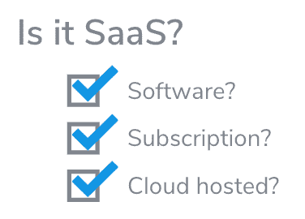

如果你勾选了这三个选项，那么恭喜你，你已经拥有了一家 SaaS 公司。

*   Salesforce？SaaS！
*   懈怠？SaaS！
*   谷歌文档？SaaS！

为什么这些很重要？一切都是关于过去。过去，并不是所有的软件都是 SaaS 的。

微软 Word 97？不是 SaaS。

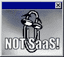

在云出现之前的黑暗日子里(讽刺的是，在云出现之前，世界要黑暗得多)，你为你的软件付费，它装在盒子里，你把它安装在服务器上，然后坐在那里看着它慢慢地但肯定地过时。如果你不知道我在说什么，问问你的父母。如果他们不知道，告诉他们我不认为博客是抚养一个蹒跚学步的孩子的有效工具。

今天，SaaS 占据了所有软件的 25%,而且这个数字还在上升。但是为什么呢？为什么投资者用如此巨额的资金资助 SaaS 的初创公司？为了回答这个问题，我不得不转向摇滚，耶，来吧！

好吧，这并不是像音乐一样的真正的摇滚，而是我给我的两个虚构的公司起的名字，因为我觉得我很有趣，我真的很喜欢齐柏林飞船(再次问你的父母)。

这是我的两家公司，它们都卖完全一样的软件，我不会告诉你是什么，因为这无关紧要。

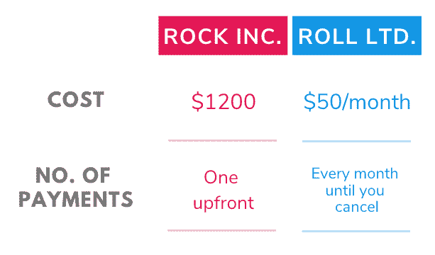

Cost comparison table of Rock Inc. vs Roll Ltd.

现在，作为购买者，请告诉我，您会选择哪一种？当然，你要和罗尔一起去。它现在只花你 50 美元，如果你不喜欢它，你就不用再为它付钱了。简单的决定。正确的决定。

这也是越来越多的公司选择这种模式的重要原因之一。经常性付款的另一个影响是，它会促使更多的购买者采用。如果你每个月为每个用户支付少量费用，那么每个付费的人实际使用他们所付费的东西的机会就更大。风险更低，采用率更高，个人和公司都喜欢这样。

# SaaS 的缺点。

我知道，我知道，扫兴鬼！但是 SaaS 模式有一个主要缺点，这与消费者更喜欢 Roll Ltd 选项的原因有关。是的，你得到了它，你必须等待你的钱。洛克公司预先得到所有的钱。然后，他们就有钱去制作他们软件的新的改进版本，当他们现有的版本过时时，他们可以在 3-4 年内出售。Roll Ltd 要等 24 个月才能得到同样多的钱，这意味着他们没有同样多的钱来改进他们的产品。

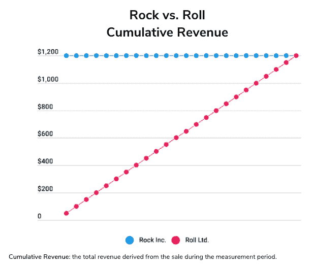

这个难题的答案当然是投资。

# SaaS 投资公司。或者，“现在找人给你现金！”

我最喜欢的 SaaS 首字母缩略词也是我将在这里解释的最长的一个。

CIMITYM！

现金比你妈还重要！

[给妈妈打电话:“嗨，妈妈，我爱你。我能为我的新生意得到一些钱吗？抱歉，但我真的需要它，没有它，没人会关心我的技术有多好，没有现金，生意就完了！”

停下来！除了你可怜的妈妈，你还可以向其他人要那些重要的钱。但是为什么会有人给你钱呢？很简单，这是因为他们将在几年内收回更多的钱。所以才叫“投资钱”，不叫“浪费钱”。如果你想浪费钱，那就搬到拉斯维加斯去，养成赌博的习惯。

但你怎么能确定投资一家 SaaS 公司就不等同于在轮盘赌桌上挥金如土呢？嗯，这个问题的答案，就像科技世界中的许多事情一样，是一大串大写字母，在这个例子中，特别是这些字母:

*   成都飞机公司（Chengdu Airplane Company 的缩写）
*   每用户平均收入
*   毛利润(为什么这个世界不把这个做成首字母缩略词？)
*   LTV

因此，让我们逐一定义它们，然后看看它们如何给你的投资者发出信号，告诉他们是否应该投资，或者你是否需要回到你可怜的妈妈身边。

# CAC。你的用户成本是多少？

客户获取成本。

本质上，你在销售和营销上花了多少钱来说服人们使用你的产品？这个数字越低越好。

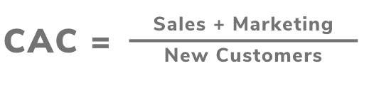

Cost of Acquisition equation

CAC 对一家 SaaS 公司来说尤其重要——还记得 Roll Ltd 如何不得不等上 24 个月才能获得与 Rock Ltd 相同的资金吗？这意味着他们获得客户的资金更少，客户意味着金钱。这里有两个图表来帮助你描绘它:

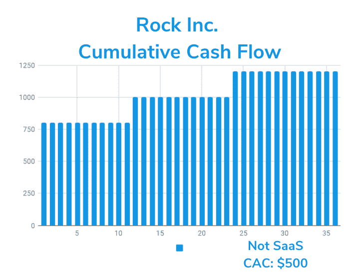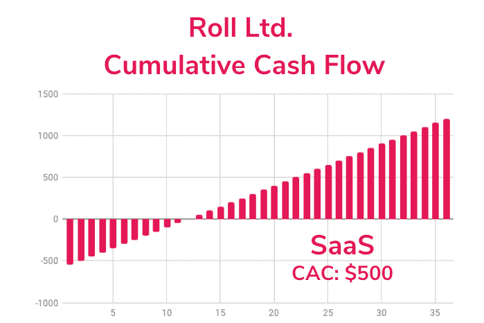

Rock Inc. & Roll Ltd. cumulative cash flow graphs.

注意右边的线在开始时实际上是负的(这是你要求投资的原因)，但是随着线向右移动，它以很快的速度上升？这种回报意味着妈妈可以保住她的积蓄。

# 增长悖论:

这对一家 SaaS 公司来说是个大问题。正如我们上面的图表所示，假设你的 CAC 保持不变，你在早期阶段获得的客户越多，你欠的债就越多。这意味着，你得到的顾客越多，你需要顾客，你烧的钱就越多。在这一点上，我要你接受 SaaS 工人的效忠宣誓。

“我知道多烧钱不是未来成功的指标。”

不这样想意味着你没有希望得到 SaaS 的那份工作。所以好的 CAC 是不够的。我们需要一些其他的东西来表明我们成功的机会。

# 恢复 CAC 的月数

ARPU-每用户平均收入。

因此，不言而喻，花更少的钱获得能给你更多的客户听起来很棒。但这对 SaaS 投资者来说尤其重要，因为这表明你何时能开始看到投资回报。你可以简单地用一个数字除以另一个数字，算出需要多少个月的时间。对罗尔有限公司来说是这样的。

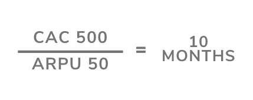

Time to recover CAC for Roll Ltd.

十个月，直到你拿回你的钱。对 SaaS 来说，这很好。有多好？好吧，看看这张图表。

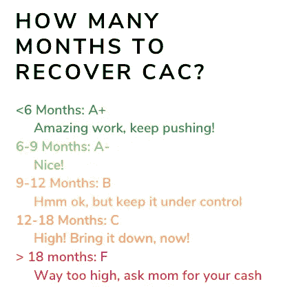

Months to recover CAC chart

所以，现在我们知道多久我们才能开始拿回我们的钱。酷，这是我们做决定需要的信息。等等，有件事我忘了告诉你。

# SaaS:另一个缺点。

再说一次，我扫了你的兴，我真的很抱歉。但是 SaaS 的另一个大问题也是它如此受欢迎的另一个原因。你可以随时离开，只要按下取消键，你就自由了。离开 SaaS 公司被称为流失。

# 搅动。SaaS 的白行者

客户流失让 SaaS 的每个人都做噩梦，因为这意味着我之前给你看的急剧上升的资金线的终结。基本上就像有印钞许可证，然后有人拿走了。如果人们终止订阅，那么你就必须去寻找新用户。这意味着你在花钱。流失率以百分比的形式出现，你必须保持低流失率。你如何做到这一点是我以后会写的另一篇文章，但是现在有三个基本原因会让用户离开你。它们与你的伴侣可能离开你的原因惊人地相似。

1.  他们找到了更好的东西。
2.  他们死了(停业了)。
3.  他们不再利用你了。

避免这些，你会保持你的门流失。

接下来，我们来看一些恶心的东西。

# 毛利润:你能保留多少钱？

什么，不好笑？好的，这个真的很简单，随着你的公司越来越大，你需要支付越来越多的东西，比如工资、培训项目、办公空间等等。这一个你要尽可能高，因为它意味着你和你的投资者更多的钱回来。而且，我们需要它来计算那些投资者真正寻找的长期盈利能力指标…

# LTV:一生中你的顾客给了你多少钱。

终身价值。

谁的一生？他们的！你的 SaaS 业务的 LTV 是用户和你在一起的整个时间里你能从他们身上得到多少钱。现在，有很多方法可以计算它，但为了简单起见，让我们将下面的公式应用到 Roll Ltd 的例子中。

如果每个客户的平均收入 X (1 /流失率)X 毛利润…

…罗尔有限公司拥有:

ARPU:50 美元

流失率:2%

毛利率:80%

50 X 1/0.02 X 80% = 2000

平均而言，罗尔有限公司将从每个客户那里获得 2000 美元

每个顾客 2000 美元？听起来不错。嗯，这取决于你有多少用户，你花了多少钱，以及我已经谈到的所有其他事情。要了解它到底有多好，让我们来看看我一直以来最喜欢的 SaaS 比率。请击鼓。

# LTV /廉政公署。黄金 SaaS 比率。

当我们用罗尔有限公司的 LTV 除以它的 CAC 时，我们得到一个数:

罗尔有限公司

CAC = 500 美元

LTV = 2000 美元

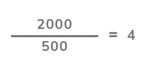

The Golden Ratio for Roll Ltd.

4 有多好？很高兴你问了这个问题，看看这张方便的图表。

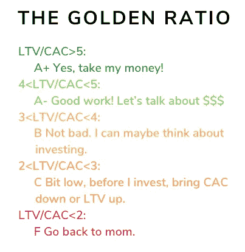

Golden Ratio chart

就是这样！简而言之，这就是 SaaS 的中期报告。到目前为止，你应该对 SaaS 的基本情况有了一个很好的了解。我希望你得到那份工作。你甚至可以尝试申请 TravelPerk，我们是 SaaS，我们正在招人。如果你觉得这篇文章有用，或者甚至喜欢它，一定要回来看看更多。

关于作者:

[JC Taunay-Bucalo](https://medium.com/u/b0faf9f9d0fd?source=post_page-----af5324cab20--------------------------------) 不仅自豪地拥有两个复合名字，他还是 TravelPerk(世界上发展最快的科技创业公司之一)的首席商务官。

在获得一个比他名字首字母少一个字母的头衔之前，JC 作为一名销售和营销主管领导了多家成功的 SaaS 公司实现指数增长，尽管不是同时进行的。那太惊人了。其中包括 EMS Cortex(后来卖给了 Citrix)、Vend HQ 和 Veeqo。

他在法国出生和长大(这使得名字更难说出)，他的职业生涯让他环游了世界，从新西兰到北美。当不在 SaaS 工作或写博客时，你会发现他要么在瑜伽垫上，要么在 60 英尺的水下潜水，要么和他的狗(Lomu)一起跑步，要么在各种文件上签下他的长长的名字。

## 这篇文章发表在 [The Startup](https://medium.com/swlh) 上，这是 Medium 最大的创业刊物，拥有+436，678 名读者。

## 订阅接收[我们的头条](https://growthsupply.com/the-startup-newsletter/)。

