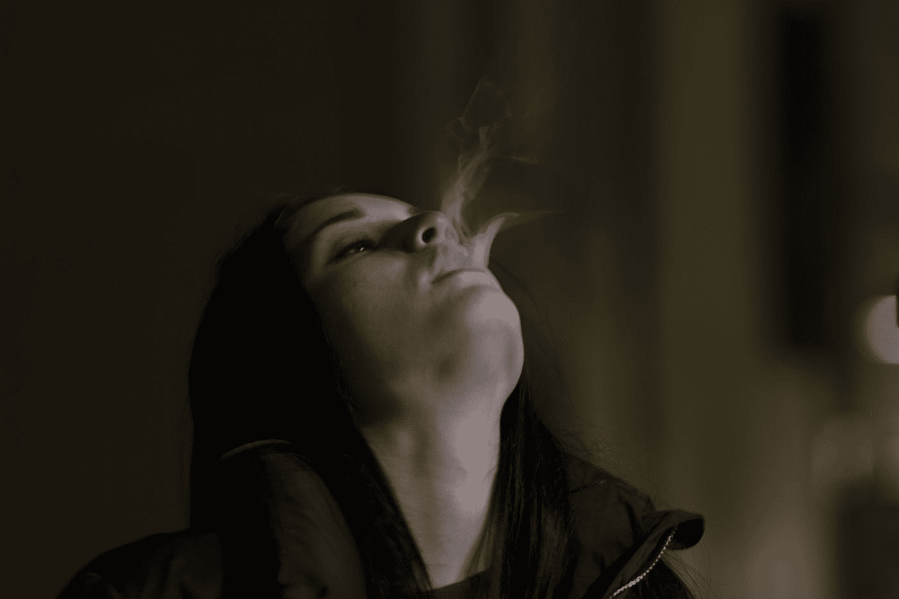

# 最能被社会接受的瘾是什么？

> 原文：<https://medium.com/swlh/whats-the-most-socially-acceptable-addiction-10d1310dd930>

## 为什么我们会指责一些上瘾者而不是其他上瘾者？

Photo by Alessandro Zambon on Unsplash

在她的书《脆弱的力量》(T2，T3)中，布伦·布朗将上瘾描述为“强迫性的和慢性的麻木”这个定义对我如何看待自己的应对机制产生了深远的影响。我们有很多方法可以忽略痛苦和脆弱。他们都以自己的方式伤害我们，干扰…