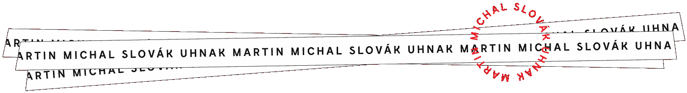

# 你不能不做的一件事是什么？

> 原文：<https://medium.com/swlh/whats-the-one-thing-you-cannot-not-do-cbf1beed0d49>

Photo by [Gabriel Matula](https://unsplash.com/@gmat07?utm_source=medium&utm_medium=referral)

## 相反的是什么都不做。

你有这么多想法。所有这些你在白天接收到的信号。他们准备好上场了。他们已经准备好成为什么了。

如果你准备好了，他们也准备好了。

坐下来让你成为创造者。日复一日，坚持不懈地坐下来。如果你出现了，想法也会出现。什么样的想法？没关系。重要的是你出现了。

如果你不做，他们也不会做。

好的想法，发展的想法，优雅的和有见地的，这些都是稀缺的。如果它们有效，如果人们关心，它们就更加珍贵。找到这些的唯一方法，就是拿出很多东西。

> 写着写着又来了。
> 
> 我们为什么要写关于写作的东西？

在我看来，它既简单又复杂。你不会相信作家是怎么把它写在空白页上的。他们在全世界寻找完美的笔记本。完美的笔，完美的纸张质量。他们订旅馆房间，他们把自己烦得要死，只是为了做一些他们毕竟想要和需要做的事情。

他们喜欢做的事情，他们非常擅长的事情。

做什么都一样。除了可能文字更容易被判断。文字无处不在，比较容易。你可以一直涂鸦，因为这只是涂鸦。但这句话谁都能判断。

如果你是一名作家，写作有很多动机。但最重要的是，你这么做是因为你不能这么做。

你想练习，你知道大部分都会是狗屎。80/20 法则。然而你一直都在追求美好。而且还是屎。那就是*的作品*。工作是你尽最大努力投入的时间，尽管你知道它可能会变成狗屎。最糟糕的事？就算不是屎，大多数时候，你也不会知道。

> 你这样做是因为你不能*不*这样做。

现在，我不知道如果我像这样把它展示出来会更好，还是我只是抑制对它的思考并完成工作。我不是一个人在思考这些事情。许多作家写关于写作的文章。我相信所有作家写的都是关于写作的。有的与人分享。

这是在公共场合练习。可能是狗屎。

*这篇文章于*[*martinuhnak.com*](https://martinuhnak.com/blog/)*发表在我的博客上。感谢阅读。*

*如果你喜欢这篇文章，请点击* [*这里*](https://mailchi.mp/a7d6819a370d/signupforletters) *考虑成为我圈子的一员。我喜欢听取别人的意见，我会回复所有人。*

## 这篇文章发表在 [The Startup](https://medium.com/swlh) 上，这是 Medium 最大的创业刊物，拥有+446，678 名读者。

## 在这里订阅接收[我们的头条新闻](https://growthsupply.com/the-startup-newsletter/)。

