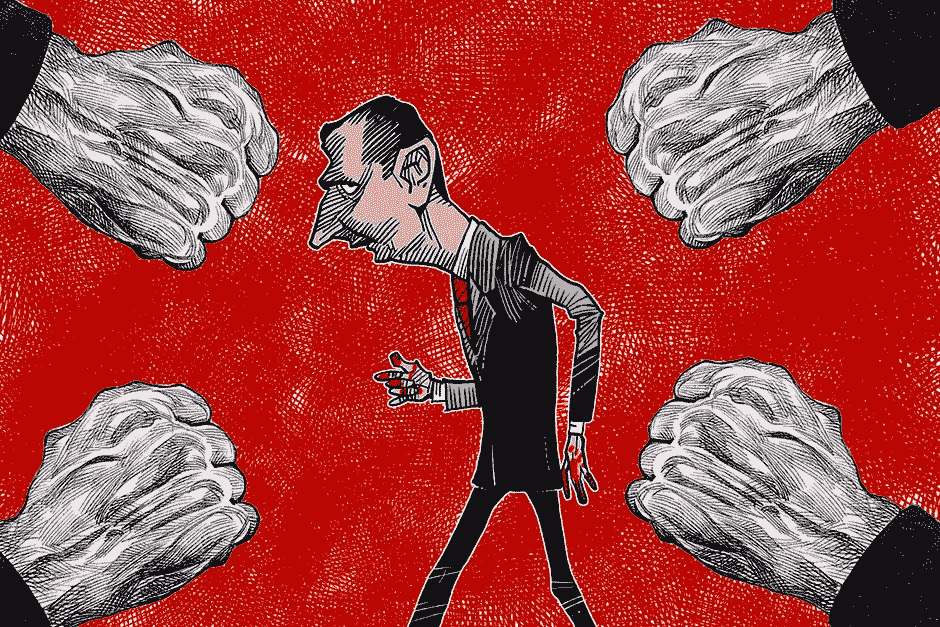

# 当团队成员离开时，他们不是叛徒，而是未来的盟友

> 原文：<https://medium.com/swlh/when-a-team-member-leaves-they-are-not-a-traitor-they-are-a-future-ally-349fbe08fef0>

Image Credit: behance.net/Ramachandrababu

eam 成员总是离开公司，我敢打赌你自己也见过。人来人往是生活的一部分。不正常的是看到一个队员被当成汉奸离开。

前几天，我的一个朋友在脸书联系了我。他们刚刚在一家新公司获得了大幅提升，我非常高兴…