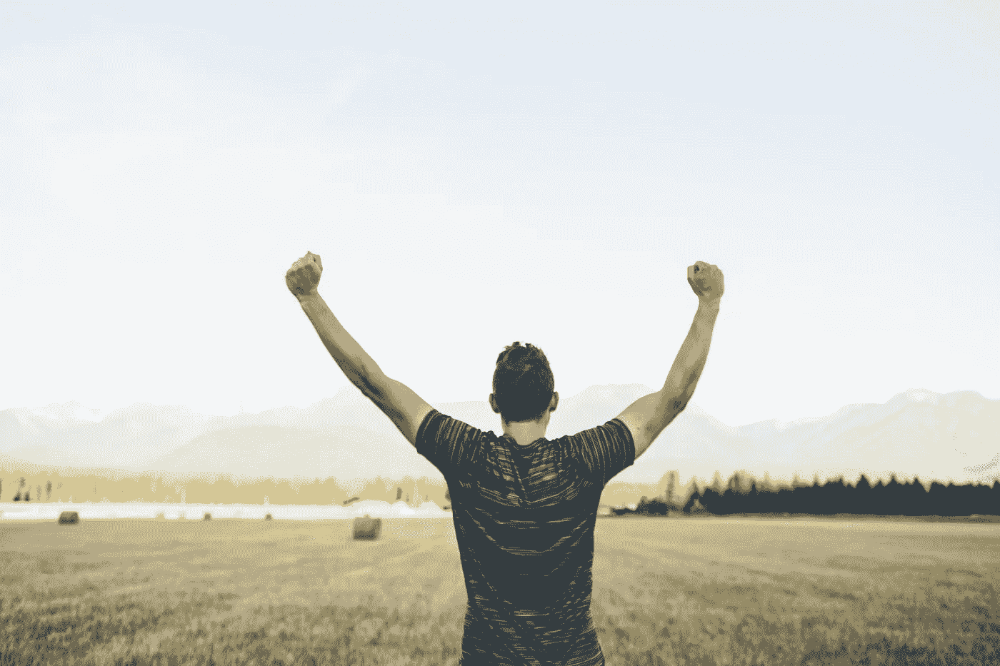

# 当博客改变了我的社交生活

> 原文：<https://medium.com/swlh/when-blogging-changed-my-social-life-b72f587cf0b5>

Photo by [Japheth Mast](https://unsplash.com/@japhethmast?utm_source=unsplash&utm_medium=referral&utm_content=creditCopyText)

在 GPS 时代之前，我是被选中的人。

当我们(家人或朋友)在探索南印度内陆时迷路时，我是最受欢迎的问路人。老实说，我喜欢和陌生人的互动。乡村的土地带给人们最好的东西。